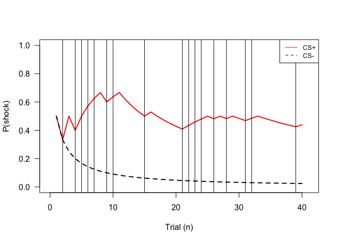
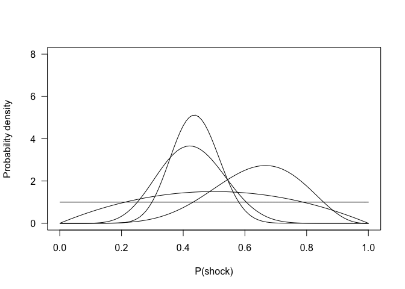
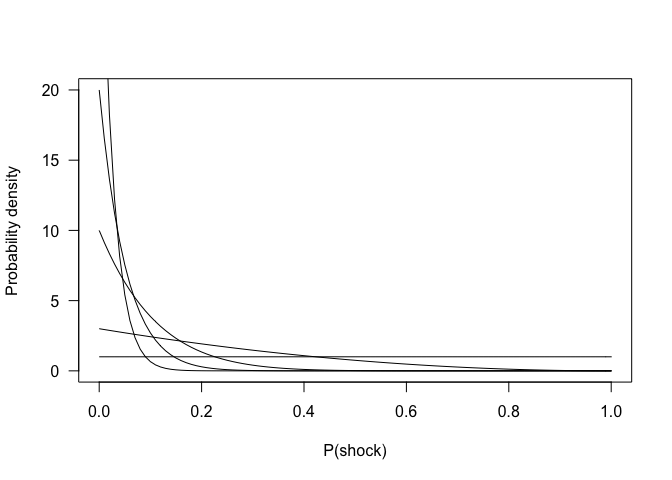
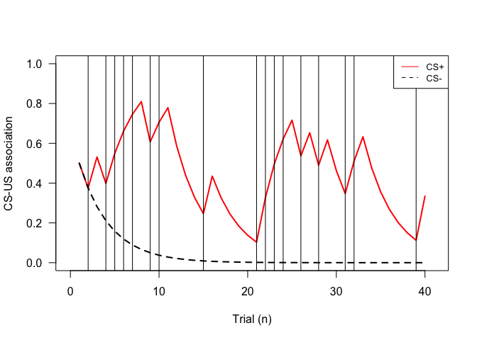
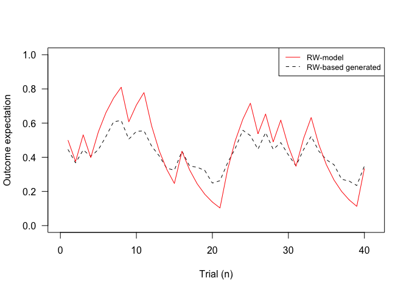

-   [Probabilistic model](#probabilistic-model)
-   [Rescorla-Wagner model](#rescorla-wagner-model)

This material is based on published paper by [Tzovara et
al.(2018)](https://journals.plos.org/ploscompbiol/article/authors?id=10.1371/journal.pcbi.1006243)
and made to learn about probabilistic models of pavlovian conditioning.

## Probabilistic model

    set.seed(250)

    ntrials             <- 40
    reinforcement_rate  <- 0.5
    CSplus              <- rbinom(ntrials, 1, reinforcement_rate)
    CSminus             <- rbinom(ntrials, 1, 0)

    pnames              <- c('alpha', 'beta') 
    p_CSplus            <- data.frame(matrix(NA, nrow = ntrials, ncol = 2))
    colnames(p_CSplus)  <- pnames
    p_CSminus           <- data.frame(matrix(NA, nrow = ntrials, ncol = 2))
    colnames(p_CSminus) <- pnames

    # init values
    p_CSplus[1, ]       <- c(1, 1)
    p_CSminus[1, ]      <- c(1, 1)

    for (i in 2:ntrials) {
      p_CSplus[i, 1] <- p_CSplus[i-1, 1] + CSplus[i-1]
      p_CSplus[i, 2] <- p_CSplus[i-1, 2] - CSplus[i-1] + 1
      
      p_CSminus[i, 1] <- p_CSminus[i-1, 1] + CSminus[i-1]
      p_CSminus[i, 2] <- p_CSminus[i-1, 2] - CSminus[i-1] + 1
    }

    E_beta <- function(alpha, beta) {
      return(alpha / (alpha + beta))
    }

    E_CSplus  <- mapply(E_beta, alpha = p_CSplus$alpha, beta = p_CSplus$beta)
    E_CSminus <- mapply(E_beta, alpha = p_CSminus$alpha, beta = p_CSminus$beta)

    {
    plot(x=1,
         y=1, 
         xlim=c(0, ntrials + 1),
         ylim=c(0,1),
         xlab='Trial (n)',
         ylab="P(shock)",
         las=1,
         type='n')

    lines(x = 1:ntrials, y = E_CSplus, lwd = 2, lty = 1, col = "red")
    lines(x = 1:ntrials, y = E_CSminus, lwd = 2, lty = 2, col = "black")
    abline(v = which(CSplus==1) , col="black", lwd=1, lty=1)
    legend('topright', 
           legend=c("CS+", 'CS-'),
           col=c("red", "black"), 
           lty=c(1, 2),
           cex=0.8)
    }

    {
    x <- seq(0, 1, length = 51)
    plot(x=1,
         y=1, 
         xlim=c(0,1),
         ylim=c(0,8),
         xlab='P(shock)',
         ylab="Probability density",
         las=1,
         type='n')

    for (i in c(1, 3, 10, 20, 40)) {
      curve(dbeta(x, p_CSplus$alpha[i], p_CSplus$beta[i]), add=TRUE)
    }
    }

    {
    x <- seq(0, 1, length = 51)
    plot(x=1,
         y=1, 
         xlim=c(0,1),
         ylim=c(0,20),
         xlab='P(shock)',
         ylab="Probability density",
         las=1,
         type='n')

    for (i in c(1, 3, 10, 20, 40)) {
      curve(dbeta(x, p_CSminus$alpha[i], p_CSminus$beta[i]), add=TRUE)
    }
    }

## Rescorla-Wagner model

### Simulate RW model

Simulate RW model for specific learning rate parameter and a random
sequence of US presentations for CS+.

    learning_rate <- .25

    RW_CSplus           <- data.frame(matrix(NA, nrow = ntrials, ncol = 1))
    colnames(RW_CSplus) <- 'V'
    RW_CSminus          <- data.frame(matrix(NA, nrow = ntrials, ncol = 1))
    colnames(RW_CSminus)<- 'V'

    # init values 
    RW_CSplus$V[1]      <- 0.5
    RW_CSminus$V[1]     <- 0.5

    for (i in 2:ntrials) {
      RW_CSplus$V[i] <- RW_CSplus$V[i-1] + learning_rate*(CSplus[i-1] - RW_CSplus$V[i-1]) 
      RW_CSminus$V[i]<- RW_CSminus$V[i-1] + learning_rate*(CSminus[i-1] - RW_CSminus$V[i-1])
    }
    {
    plot(x=1,
         y=1, 
         xlim=c(0, ntrials + 1),
         ylim=c(0,1),
         xlab='Trial (n)',
         ylab="CS-US association",
         las=1,
         type='n')

    lines(x = 1:ntrials, y = RW_CSplus$V, lwd = 2, lty = 1, col = "red")
    lines(x = 1:ntrials, y = RW_CSminus$V, lwd = 2, lty = 2, col = "black")

    abline(v = which(CSplus==1) , col="black", lwd=1, lty=1)

    legend('topright', 
           legend=c("CS+", 'CS-'),
           col=c("red", "black"), 
           lty=c(1, 2),
           cex=0.8)
    }

### Simulate mapping of the RW model to ANS response

    offset      <- .2
    scalingpar  <- .5
    betas       <- matrix(c(offset, scalingpar), nrow = 2, ncol = 1)
    X           <- matrix(1, nrow = ntrials, ncol = 2)
    X[ ,2]      <- RW_CSplus$V
    Y           <- X%*%betas
    sigma       <- 0.02
    set.seed(25)
    Ygen        <- rnorm(ntrials, Y, sigma)  

    {
    plot(x=1,
         y=1, 
         xlim=c(0, ntrials + 1),
         ylim=c(0,1),
         xlab='Trial (n)',
         ylab="Outcome expectation",
         las=1,
         type='n')
    lines(Ygen, lty = 2)
    lines(RW_CSplus$V, col='red')

    legend('topright', 
           legend=c("RW-model", 'RW-based generated'),
           col=c("red", "black"), 
           lty=c(1, 2),
           cex=0.8)
    }

#### Recover the parameters using Nelder-Mead optim

    errorFunc <- function(p, Y, US) {
      
      if (p['alpha']<0 || p['alpha']>1)
        return(1e6)
      else 
        V     <- matrix(NA, nrow = 40, ncol = 1)
        V[1]  <- 0.5
        
        for (i in 2:40){
          V[i] <- V[i-1] + p['alpha']*(US[i-1] - V[i-1])
        }
        
        pred <- p['b0'] + p['b1']*V
        rss <- sum((Y - pred)^2)
        return(rss)
    }

    sPar        <- c(0, 0, 0.5)
    names(sPar) <- c('b0', 'b1', 'alpha')
    sim_lm      <- optim(par = sPar, fn = errorFunc, Y = Ygen, US = CSplus)
    print(sim_lm$par)

    ##        b0        b1     alpha 
    ## 0.2091692 0.4710852 0.2751996

    origPar     <- c(offset, scalingpar, learning_rate)
    names(origPar) <- c('b0', 'b1', 'alpha')
    print(origPar)

    ##    b0    b1 alpha 
    ##  0.20  0.50  0.25
