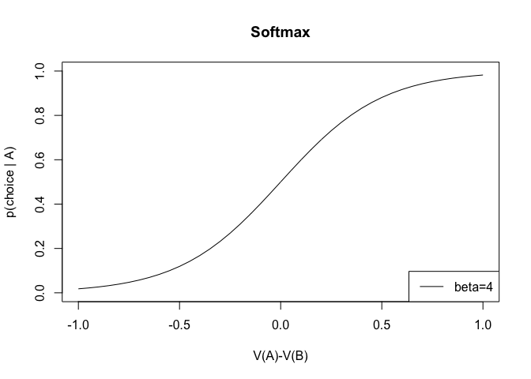
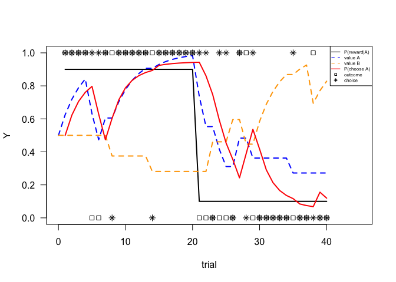
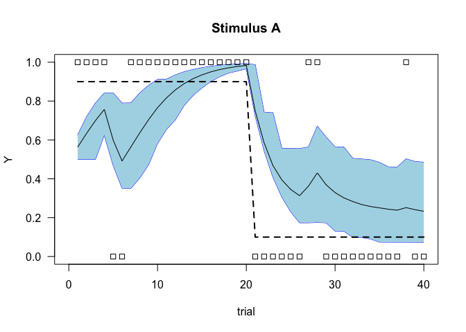
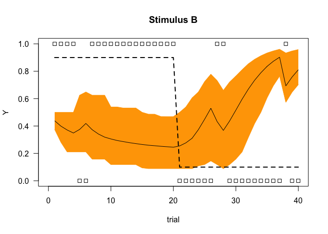
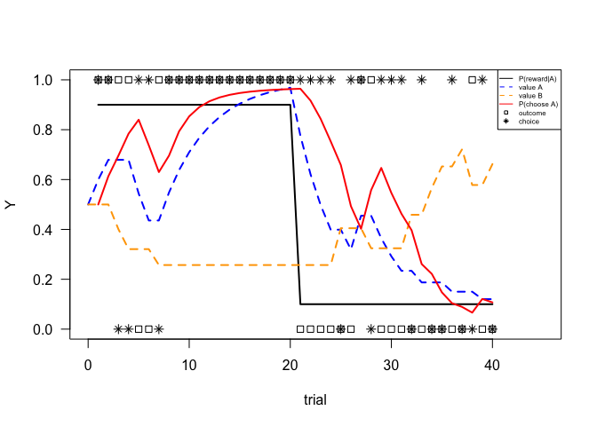
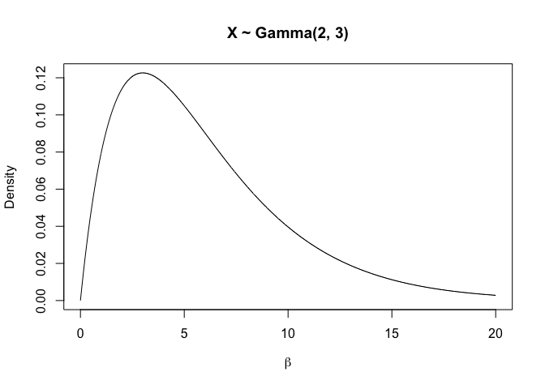

-   [Reinforcement learning tutorial](#reinforcement-learning-tutorial)
    -   [Softmax function to model the choice between 2
        options](#softmax-function-to-model-the-choice-between-2-options)
    -   [Simulate some choice behaviour using Rescorla-Wagner model with
        a softmax link
        function](#simulate-some-choice-behaviour-using-rescorla-wagner-model-with-a-softmax-link-function)
    -   [Recover parameters using maximum a posteriori instead of
        maximum
        likelihood](#recover-parameters-using-maximum-a-posteriori-instead-of-maximum-likelihood)

# Reinforcement learning tutorial

This tutorial is based on the tutorial provided by [Hanneke den
Ouden](http://www.hannekedenouden.ruhosting.nl/RLtutorial/Instructions.html).

## Softmax function to model the choice between 2 options

    softmax <- function(Vs, B) {
      p <- apply(X = Vs, 
                 MARGIN = 1,
                 FUN = function(Vs, B) exp(B*Vs) / sum(exp(B*Vs)),
                 B = B)

      p <- t(p)
      return(p)
    }

    {
    V       <- matrix(0, nrow = 40+1, 2)
    V[ ,2]  <- seq(from=-1, to=1, by=0.05)
    B       <- 4
    Ps      <- softmax(V, B)

    x       <- V[ ,1] - V[ ,2]
    y       <- Ps[, 1]
    plot(x, y, type='l',
         ylim=c(0,1),
         xlab='V(A)-V(B)',
         ylab='p(choice | A)',
         main = 'Softmax')
    legend('bottomright', legend=sprintf('beta=%i', B), lty=1)
    }

## Simulate some choice behaviour using Rescorla-Wagner model with a softmax link function

Prepare a function to simulate the evolution of values for each of the
two stimuli (A, B) over 40 trials in a reversal learning task, given
fixed learning rate (*α*) and temperature parameters (*β*).

    RLsim <- function(p, R) {
      n       <- dim(R)[1]
      # store values of each stimulus over trials
      V       <- matrix(NA, nrow=n, ncol=2)
      # initial values
      v       <- c(0.5, 0.5)
      # store probabilities of choice for each stimulus over trials
      P       <- matrix(NA, nrow=n, ncol=2)
      # store choices over trials
      choice  <- matrix(NA, nrow=n, ncol=1)
      # store prediction error over trials
      PE      <- matrix(NA, nrow=n, ncol=1)
      for (i in 1:n) {
        # softmax function to link values to choice probability
        P[i, ]    <- exp(p['beta']*v) / sum(exp(p['beta']*v))
        # probability of choosing A
        choice[i] <- rbinom(1, 1, P[i, 1])
        stim      <- 2-choice[i]

        # RW update
        PE[i]     <- R[i, stim] - v[stim] 
        # update value of the chosen stimulus
        v[stim]   <- v[stim] + p['alpha']*PE[i]
        V[i, ]    <- v 
      }
      out <- list('P'=P, 'V'=V, 'PE'=PE, 'choice'=choice)
      return(out)
    }

Specify the reward function that is fixed.

    # determine reward function
    p   <- 0.9
    s1  <- rep(p, 20)
    s2  <- rep(1-p, 20)
    # reward probability for stimulus A
    Rp  <- matrix(rep(c(s1,s2), 1))
    # Rp  <- matrix(rep(0.9, 40))
    set.seed(20)
    R   <- matrix(NA, nrow=40, ncol=2)
    R[ ,1] <- apply(X = Rp, MARGIN = 1, FUN = rbinom, n=1, size=1)
    R[ ,2] <- 1 - R[,1] 
    # specify model parameters
    par <- NA
    par['alpha'] <- 0.25
    par['beta']  <- 4

Plot exemplary data based on the simulation.

    {
    out <- RLsim(par, R)
    n <- dim(R)[1]
    plot(x=1,
         y=1, 
         xlim=c(0, n+5),
         ylim=c(0, 1),
         xlab='trial',
         ylab="Y",
         las=1,
         type='n')
    lines(x=1:n, y=Rp, lty=1, lwd=2, col='black')
    lines(x=0:n, y=c(0.5, out$V[ ,1]), lty=2, lwd=2, col='blue')
    lines(x=0:n, y=c(0.5, out$V[ ,2]), lty=2, lwd=2, col='orange')
    lines(x=1:n, y=out$P[ ,1], lty=1, lwd=2, col='red')
    points(x=1:n, y=R[ ,1], pch=0)
    points(x=1:n, y=out$choice, pch=8)
    legend('topright', 
           legend=c('P(reward|A)', 'value A', 'value B', 'P(choose A)', 'outcome', 'choice'),
           cex=.5,
           lty=c(1, 2, 2, 1, NA, NA),
           col=c('black', 'blue', 'orange', 'red', 'black', 'black'),
           pch=c(NA, NA, NA, NA, 0, 8))
    }

Run bootstrapping samples to see 95% interval of the evolution of value
for each stimulus in the task given the fixed parameters.

    nboot <- 1000
    outboot <- list('V_A', 'V_B')
    outboot$V_A <- matrix(NA, nrow = nboot, ncol=40)
    outboot$V_B <- matrix(NA, nrow = nboot, ncol=40)

    for (i in 1:nboot) {
      out <- RLsim(par, R)
      outboot$V_A[i, ] <- out$V[, 1]
      outboot$V_B[i, ] <- out$V[, 2]
    }

    V_A_lb <- apply(X = outboot$V_A, MARGIN = 2, FUN = quantile, prob= 0.025)
    V_A_ex <- apply(X = outboot$V_A, MARGIN = 2, FUN = mean)
    V_A_ub <- apply(X = outboot$V_A, MARGIN = 2, FUN = quantile, prob= 0.975)
    V_B_lb <- apply(X = outboot$V_B, MARGIN = 2, FUN = quantile, prob= 0.025)
    V_B_ub <- apply(X = outboot$V_B, MARGIN = 2, FUN = quantile, prob= 0.975)
    V_B_ex <- apply(X = outboot$V_B, MARGIN = 2, FUN = mean)

    {
    plot(x=1,
         y=1, 
         xlim=c(0, 40),
         ylim=c(0, 1),
         xlab='trial',
         ylab="Y",
         las=1,
         main = 'Stimulus A',
         type='n')

    lines(x=1:40, y=V_A_ub, lty=1, col='blue')
    lines(x=1:40, y=V_A_lb, lty=1, col='blue')
    polygon(c(1:40,rev(1:40)),c(V_A_lb,rev(V_A_ub)),col="light blue", border = NA)
    lines(x=1:40, y=V_A_ex, lty=1, col='black')
    lines(x=1:40, y=Rp, lty=2, lwd=2, col='black')
    points(x=1:n, y=R[ ,1], pch=0)
    }

    {
    plot(x=1,
         y=1, 
         xlim=c(0, 40),
         ylim=c(0, 1),
         xlab='trial',
         ylab="Y",
         las=1,
         main = 'Stimulus B',
         type='n')

    lines(x=1:40, y=V_B_ub, lty=1, col='orange')
    lines(x=1:40, y=V_B_lb, lty=1, col='orange')
    polygon(c(1:40,rev(1:40)),c(V_B_lb,rev(V_B_ub)),col="orange", border = NA)
    lines(x=1:40, y=V_B_ex, lty=1, col='black')
    lines(x=1:n, y=Rp, lty=2, lwd=2, col='black')
    points(x=1:n, y=R[ ,1], pch=0)
    }

Check whether it is possible to recover the underlying parameters from a
single dataset.

Specify the error function based on the RL model.

    errorFunc <- function(par, dat) {
      
      # constrain the values of the parameters
      if (par['alpha'] > 1 || par['alpha'] < 0 || par['beta'] > 100) {
        return(1e6)
      }
      
      # reward function
      R       <- dat$R
      # observed choices (0 - stim B, 1- stim A)
      choice  <- dat$choice
      
      n       <- dim(R)[1]
      # store values of each stimulus over trials
      V       <- matrix(NA, nrow = n, ncol = 2)
      # initial values
      v       <- c(0.5, 0.5)
      # store probabilities of choice for each stimulus over trials
      P       <- matrix(NA, nrow = n, ncol = 2)
      # store prediction error over trials
      PE      <- matrix(NA, nrow = n, ncol = 1)
      for (i in 1:n) {
        # softmax function to link values to choice probability
        # probability of choosing A
        P[i,]   <- exp(par['beta'] * v) / sum(exp(par['beta'] * v))
        
        stim    <- 2 - choice[i]
        
        # RW update
        PE[i]   <- R[i, stim] - v[stim]
        # update value of the chosen stimulus
        v[stim] <- v[stim] + par['alpha'] * PE[i]
        V[i,]   <- v
      }
      
      llik <- sum(log(P[which(dat$choice == 0), 2])) + 
                sum(log(P[which(dat$choice == 1), 1]))
      return(-llik)
    }

    dat <- list('choice'=out$choice, 'R'=R)
    parS    <- list('alpha' = 0.5, 'beta' = 3)
    fitres  <- optim(par = parS, fn = errorFunc, dat = dat)
    fitres

    ## $par
    ##     alpha      beta 
    ## 0.1988823 4.6291699 
    ## 
    ## $value
    ## [1] 17.6166
    ## 
    ## $counts
    ## function gradient 
    ##      123       NA 
    ## 
    ## $convergence
    ## [1] 0
    ## 
    ## $message
    ## NULL

    {
    outsim <- RLsim(fitres$par, dat$R)
    n <- dim(outsim$V)[1]
    plot(x=1,
         y=1, 
         xlim=c(0, n+5),
         ylim=c(0, 1),
         xlab='trial',
         ylab="Y",
         las=1,
         type='n')
    lines(x=1:n, y=Rp, lty=1, lwd=2, col='black')
    lines(x=0:n, y=c(0.5, outsim$V[ ,1]), lty=2, lwd=2, col='blue')
    lines(x=0:n, y=c(0.5, outsim$V[ ,2]), lty=2, lwd=2, col='orange')
    lines(x=1:n, y=outsim$P[ ,1], lty=1, lwd=2, col='red')
    points(x=1:n, y=R[ ,1], pch=0)
    points(x=1:n, y=outsim$choice, pch=8)
    legend('topright', legend=c('P(reward|A)', 'value A', 'value B', 'P(choose A)', 'outcome', 'choice'),
           cex=.5,
           lty=c(1, 2, 2, 1, NA, NA),
           col=c('black', 'blue', 'orange', 'red', 'black', 'black'),
           pch=c(NA, NA, NA, NA, 0, 8))
    }

## Recover parameters using maximum a posteriori instead of maximum likelihood

We will use prior distribution of the temperature paramter using gamma
probability distribution *gamma(2,3)*.

Visualize the gamma pdf.

    x <- seq(from=0, to=20, by=0.01)
    plot(x, dgamma(x, shape=2, scale=3), type='l',
         xlab = expression(beta),
         ylab = 'Density',
         main = 'X ~ Gamma(2, 3)')

Update the error function to include pior distribution.

    errorFunc_prior <- function(par, dat) {
      
      # constrain the values of the parameter alpha
      if (par['alpha'] > 1 || par['alpha'] < 0) {
        return(1e6)
      }
      
      # reward function
      R       <- dat$R
      # observed choices (0 - stim B, 1- stim A)
      choice  <- dat$choice
      
      n       <- dim(R)[1]
      # store values of each stimulus over trials
      V       <- matrix(NA, nrow = n, ncol = 2)
      # initial values
      v       <- c(0.5, 0.5)
      # store probabilities of choice for each stimulus over trials
      P       <- matrix(NA, nrow = n, ncol = 2)
      # store prediction error over trials
      PE      <- matrix(NA, nrow = n, ncol = 1)
      for (i in 1:n) {
        # softmax function to link values to choice probability
        # probability of choosing A
        P[i,]   <- exp(par['beta'] * v) / sum(exp(par['beta'] * v))
        
        stim    <- 2 - choice[i]
        
        # RW update
        PE[i]   <- R[i, stim] - v[stim]
        # update value of the chosen stimulus
        v[stim] <- v[stim] + par['alpha'] * PE[i]
        V[i,]   <- v
      }
      
      llik <- sum(log(P[which(dat$choice == 0), 2])) + 
                sum(log(P[which(dat$choice == 1), 1])) +
              log(dgamma(par['beta'], shape=2, scale=3))
      return(-llik)
    }

    dat <- list('choice'=out$choice, 'R'=R)
    parS    <- list('alpha' = 0.5, 'beta' = 1)
    fitres  <- optim(par = parS, 
                     fn = errorFunc_prior, dat = dat, hessian=TRUE)
    fitres

    ## $par
    ##     alpha      beta 
    ## 0.2167928 4.2027356 
    ## 
    ## $value
    ## [1] 19.79882
    ## 
    ## $counts
    ## function gradient 
    ##       77       NA 
    ## 
    ## $convergence
    ## [1] 0
    ## 
    ## $message
    ## NULL
    ## 
    ## $hessian
    ##            alpha      beta
    ## alpha 172.821127 8.2122582
    ## beta    8.212258 0.6863239

Get var-cov matrix from the inverse of the hessian matrix.

    library(MASS)
    ginv(fitres$hessian)

    ##            [,1]       [,2]
    ## [1,]  0.0134126 -0.1604894
    ## [2,] -0.1604894  3.3773856
