-   [Introduction](#introduction)
    -   [Likelihood function](#likelihood-function)
    -   [Prior (description of credibilities): the beta
        distribution](#prior-description-of-credibilities-the-beta-distribution)
    -   [Posterior beta](#posterior-beta)
    -   [Example 6.4.2](#example-6.4.2)
-   [Exercises](#exercises)
    -   [Exercises 6.1a](#exercises-6.1a)
    -   [Exercises 6.1b](#exercises-6.1b)
    -   [Exercises 6.1c](#exercises-6.1c)
    -   [Exercises 6.1d](#exercises-6.1d)
    -   [Exercise 6.2a](#exercise-6.2a)
    -   [Exercise 6.2b](#exercise-6.2b)
    -   [Exercise 6.3](#exercise-6.3)
    -   [Exercise 6.5a](#exercise-6.5a)
    -   [Exercise 6.5b](#exercise-6.5b)

These are my notes of Chapter 06 in [Doing Bayesian Data Analysis by J.
Kruschke](https://sites.google.com/site/doingbayesiandataanalysis/).

# Introduction

> In a Bayesian analysis, we begin with some prior allocation of
> credibility over possible probabilities of the coin coming up heads.
> Then, we observe some data that consist of a set of results from
> flipping the coin. Then, we infer the posterior distribution of
> credibility using Bayes’ rule. Bayes’ rule requires us to specify the
> likelihood function and that is the topic of the next section.

## Likelihood function

Bernoulli distribution:
*p*(*y*|*θ*) = *θ**y*(1 − *θ*)(1 − *y*)
*p*(*y* = 1|*θ*) = *θ* reduces such that the parameter *θ* can be
interpreted as the underlying probability of heads for the coin flip.

> Think of the data value y as fixed by an observation, and the value of
> θ as variable. The equation then specifies the probability of the
> fixed y value as a function of candidate values of θ. Different values
> of θ yield different probabilities of the datum y. When thought of in
> this way, the equation is the likelihood function of θ.

> Notice that the likelihood function is a function of a continuous
> value θ, whereas the Bernoulli distribution is a discrete distribution
> over the two values of y. The likelihood function, although it
> specifies a probability at each value of θ, is not a probability
> distribution. In particular, it does not integrate to 1.

> In Bayesian inference, the function p(y|θ) is usually thought of with
> the data, y, known and fixed, and the parameter, θ, uncertain and
> variable. Therefore, p(y|θ) is usually called the likelihood function
> for θ.

If we denote the number of heads as
*z* = ∑*i**y**i* and the number of tails as
*N* − *z* = ∑*i*(1 − *y**i*), then:

$\\tag{by assumption of independence} p(y\_i|\\theta) = \\prod{p(y\_i|\\theta)}$

$\\tag{from the first equation} p(y\_i|\\theta) = \\prod{\\theta^{y\_1}(1-\\theta)^{(1-y\_i)}}$

$\\tag{by algebra} p(y\_i|\\theta) = \\theta^{\\sum\_i{y\_i}}(1-\\theta)^{\\sum\_i{(1-y\_i)}}$

$\\tag{6.2} p(y\_i|\\theta) = \\theta^z(1-\\theta)^{N-z}$

## Prior (description of credibilities): the beta distribution

> We need a mathematical description of the prior allocation of
> credibilities. That is, we need a mathematical formula that describes
> the prior probability for each value of the parameter θ on the
> interval \[0, 1\].

> In principle, we could use any probability density function supported
> on the interval \[0, 1\]. When we intend to apply Bayes’ rule
> (Equation 5.7, p. 106), however, there are two desiderata for
> mathematical tractability.

> First, it would be convenient if the product of p(y|θ) and p(θ), which
> is in the numerator of Bayes’ rule, results in a function of the same
> form as p(θ). When this is the case, the prior and posterior beliefs
> are described using the same form of function. This quality allows us
> to include subsequent additional data and derive another posterior
> distribution, again of the same form as the prior. Therefore, no
> matter how much data we include, we always get a posterior of the same
> functional form. Second, we desire the denominator of Bayes’ rule
> (Equation 5.9, p. 107), namely ∫*d**θ* *p*(*y*|*θ*)*p*(*θ*), to be
> solvable analytically. This quality also depends on how the form of
> the function p(θ) relates to the form of the function p(y|θ). When the
> forms of p(y|θ) and p(θ) combine so that the posterior distribution
> has the same form as the prior distribution, then p(θ) is called a
> conjugate prior for p(y|θ). Notice that the prior is conjugate only
> with respect to a particular likelihood function.

Beta distribution *b**e**t**a*(*θ*|*a*, *b*) (in R: dbeta(theta,a,b)):
*p*(*θ*|*a*, *b*) = *b**e**t**a*(*θ*|*a*, *b*) = *θ*(*a* − 1) (1 − *θ*)(*b* − 1)/*B*(*a*, *b*)

Beta function *B*(*a*, *b*) (in R: beta(a,b)):
*B*(*a*, *b*) = ∫01*d**θ* *θ*(*a* − 1) (1 − *θ*)(*b* − 1)

“The beta function is not a function of θ because θ has been “integrated
out,” the function only involves the variables a and b."

Simple R script to compute numerical integrals:

    betafunction <- function(theta, a, b) {theta^(a-1)*(1-theta)^(b-1)}
    b1 <- integrate(betafunction, lower = 0, upper = 1, a = 4, b = 4)
    b2 <- beta(4,4)

> We would like to specify a beta distribution that describes our prior
> beliefs about θ. You can think of a and b in the prior as if they were
> previously observed data, in which there were a heads and b tails in a
> total of n = a+b flips. For example, if we have no prior knowledge
> other than the knowledge that the coin has a head side and a tail
> side, that’s tantamount to having previously observed one head and one
> tail, which corresponds to a = 1 and b = 1.

> It is useful to know the central tendency and spread of the beta
> distribution expressed in terms of a and b. It turns out that the mean
> of the beta(θ|a, b) distribution is μ = a/(a + b) and the mode is ω =
> (a − 1)/(a + b − 2) for a &gt; 1 and b &gt; 1. Thus, when a = b, the
> mean and mode are 0.5. When a &gt; b, the mean and mode are greater
> than 0.5, and when a &lt; b, the mean and mode are less than 0.5. The
> spread of the beta distribution is related to the “concentration” κ =
> a + b (κ is Greek letter kappa).

## Posterior beta

$\\tag{Bayes' rule} p(\\theta | z,N) = p(z,N|\\theta)p(\\theta) / p(z,N)$

$\\tag{by definitions of Bernoulli and beta distributions} p(\\theta | z,N) = \\theta^z(1-\\theta)^{(N-z)} \\; \\frac{\\theta^{a-1}(1-\\theta)^{(b-1)}}{B(a,b)} \\; / p(z,N)$

$\\tag{by re-arranging factors} p(\\theta | z,N) = \\theta^z(1-\\theta)^{(N-z)} \\; \\theta^{a-1}(1-\\theta)^{(b-1)} \\; / \[B(a,b)p(z,N)\]$

$\\tag{by collecting powers} p(\\theta | z,N) = \\theta^{((z+a)-1)}(1-\\theta)^{((N-z+b)-1)}\\; / \[B(a,b)p(z,N)\]$

$\\tag{equation} p(\\theta | z,N) = \\theta^{((z+a)-1)}(1-\\theta)^{((N-z+b)-1)}\\; / B(z+a, N-z+b)$

If the prior distribution is beta(θ|a, b), and the data have z heads in
N flips, then the posterior distribution is:
*b**e**t**a*(*θ*|*z* + *a*, *N* − *z* + *b*)

## Example 6.4.2

    theta   <- seq(0, 1, length=1000)
    pTheta  <- c( rep(1,200), seq(1,100,length=50), seq(100,1,length=50), rep(1,200),
                  rep(1,200), seq(1,100,length=50), seq(100,1,length=50), rep(1,200) ) 
    # normalize
    pTheta  <- pTheta/sum(pTheta) 
    plot(theta, pTheta, type='h', main='Prior', xlab='theta', ylab = 'p(theta)')

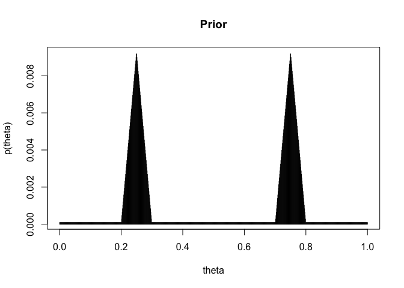

    z   <- 14
    N   <- z + 13
    lik <- dbinom(z, N, theta)
    plot(theta, lik, type='h', main='Likelihood', xlab='theta', ylab = 'p(D|theta)')

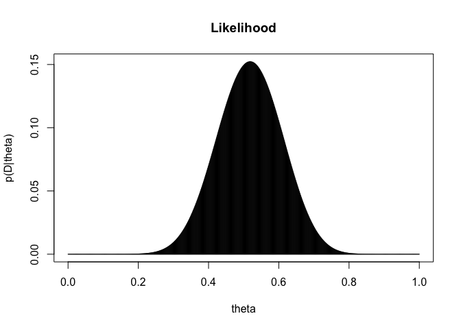

    pThetaData <- lik*pTheta
    # normalize 
    pThetaData <- pThetaData / sum(pThetaData)
    plot(theta, pThetaData, type='h', main='Posterior', xlab='theta', ylab = 'p(theta|D)')

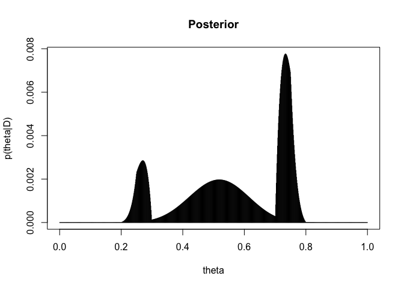

# Exercises

## Exercises 6.1a

    theta   <- seq(0, 1, length=1000)
    pTheta  <- dbeta(theta, 4, 4)
    pTheta  <- pTheta / sum(pTheta)
    plot(theta, pTheta, type='h', main='Prior', xlab='theta', ylab = 'p(theta)')

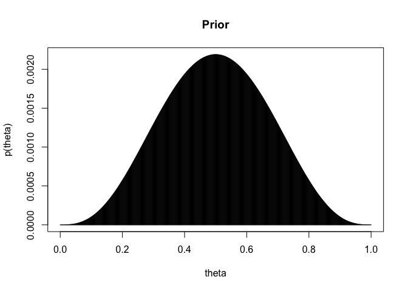

    lik        <- dbinom(1,1,theta)
    plot(theta, lik, type='h', main='Likelihood', xlab='theta', ylab = 'p(theta)')

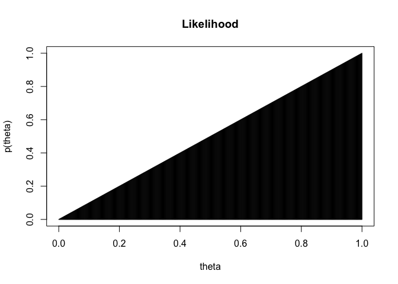

    pThetaData <-  lik * pTheta
    pThetaData <- pThetaData / sum(pThetaData)
    plot(theta, pThetaData, type='h', main='Posterior', xlab='theta', ylab = 'p(theta|D)')

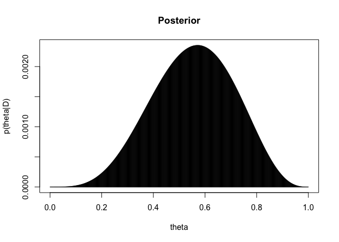

    # Update 
    pTheta     <- pThetaData

## Exercises 6.1b

    lik        <- dbinom(1,1,theta)
    pThetaData <-  lik * pTheta
    pThetaData <- pThetaData / sum(pThetaData)
    plot(theta, pThetaData, type='h', main='Posterior', xlab='theta', ylab = 'p(theta|D)')

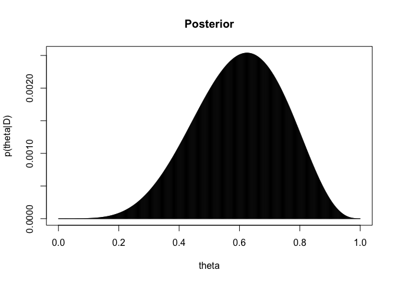

    # Update 
    pTheta     <- pThetaData

## Exercises 6.1c

    lik        <- dbinom(0,1,theta)
    pThetaData <-  lik * pTheta
    pThetaData <- pThetaData / sum(pThetaData)
    plot(theta, pThetaData, type='h', main='Posterior', xlab='theta', ylab = 'p(theta|D)')

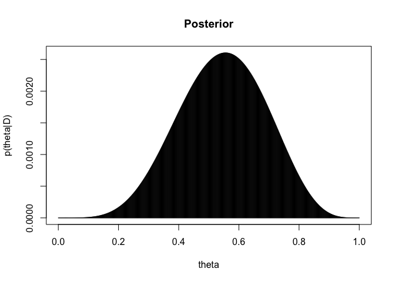

    # Update 
    pTheta     <- pThetaData

## Exercises 6.1d

    theta   <- seq(0, 1, length=1000)
    pTheta  <- dbeta(theta, 4, 4)
    pTheta  <- pTheta / sum(pTheta)

    lik        <- dbinom(0,1,theta)
    pThetaData <-  lik * pTheta
    pThetaData <- pThetaData / sum(pThetaData)

    # Update 
    pTheta     <- pThetaData
    lik        <- dbinom(1,1,theta)
    pThetaData <-  lik * pTheta
    pThetaData <- pThetaData / sum(pThetaData)
    # Update 
    pTheta     <- pThetaData
    lik        <- dbinom(1,1,theta)
    pThetaData <-  lik * pTheta
    pThetaData <- pThetaData / sum(pThetaData)
    plot(theta, pThetaData, type='h', main='Posterior', xlab='theta', ylab = 'p(theta|D)')

## Exercise 6.2a

    pThetaData <- dbeta(theta, 1+58, 100-58 + 1)
    pThetaData <- pThetaData / sum(pThetaData)

    sortedProbMass <- sort(pThetaData, decreasing=TRUE)
    HDIheightIdx   <- min(which(cumsum(sortedProbMass) >= 0.95))
    HDIheight      <- sortedProbMass[HDIheightIdx]
    HDI            <- pThetaData[pThetaData >= HDIheight]
    HDIindx        <- c(which(pThetaData==HDI[1]), 
                        which(pThetaData==tail(HDI, n=1)))
    HDItheta       <- theta[HDIindx]

    plot(theta, 
         pThetaData,
         type='l', main='Posterior', xlab='theta', ylab = 'p(theta|D)')
    lines(theta[HDIindx[1]:HDIindx[2]], 
         pThetaData[HDIindx[1]:HDIindx[2]],
         type='h', col='skyblue')
    text(theta[HDIindx[1]], 
         pThetaData[HDIindx[1]], 
         toString(round(theta[HDIindx[1]], digits=2)))
    text(theta[HDIindx[2]], 
         pThetaData[HDIindx[2]], 
         toString(round(theta[HDIindx[2]], digits=2)))

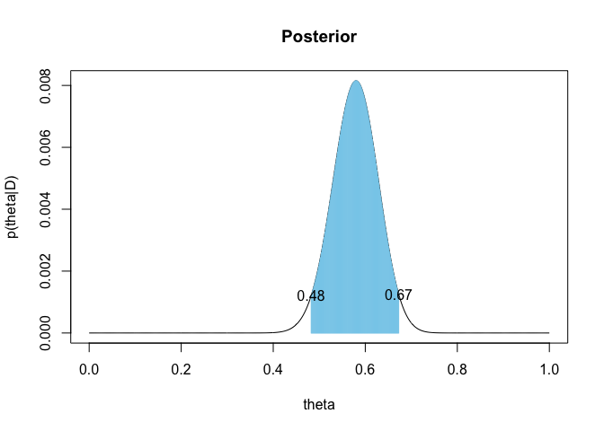

## Exercise 6.2b

    pThetaData <- dbeta(theta, 59 + 57, 43 + 100 - 57)
    pThetaData <- pThetaData / sum(pThetaData)

    sortedProbMass <- sort(pThetaData, decreasing=TRUE)
    HDIheightIdx   <- min(which(cumsum(sortedProbMass) >= 0.95))
    HDIheight      <- sortedProbMass[HDIheightIdx]
    HDI            <- pThetaData[pThetaData >= HDIheight]
    HDIindx        <- c(which(pThetaData==HDI[1]), 
                        which(pThetaData==tail(HDI, n=1)))
    HDItheta       <- theta[HDIindx]

    plot(theta, 
         pThetaData,
         type='l', main='Posterior', xlab='theta', ylab = 'p(theta|D)')
    lines(theta[HDIindx[1]:HDIindx[2]], 
         pThetaData[HDIindx[1]:HDIindx[2]],
         type='h', col='skyblue')
    text(theta[HDIindx[1]], 
         pThetaData[HDIindx[1]], 
         toString(round(theta[HDIindx[1]], digits=2)))
    text(theta[HDIindx[2]], 
         pThetaData[HDIindx[2]], 
         toString(round(theta[HDIindx[2]], digits=2)))

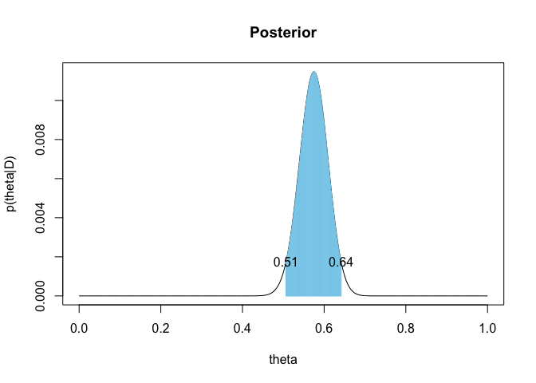

## Exercise 6.3

    theta   <- seq(0, 1, length=1000)
    pRadio  <- dbeta(theta, 1 + 40, 1 + 10)
    pRadio  <- pRadio / sum(pRadio)

    plot(theta, 
         pRadio,
         type='l', main='Radio', xlab='theta', ylab = 'p(theta|D)')

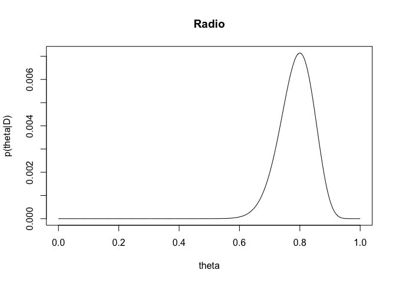

    pOM  <- dbeta(theta, 1 + 15, 1 + 35)
    pOM  <- pOM / sum(pOM)

    plot(theta, 
         pOM,
         type='l', main='Ocean Mountain', xlab='theta', ylab = 'p(theta|D)')

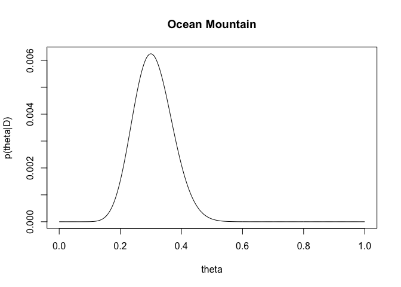 \#\#
Exercise 6.4

    theta   <- seq(0, 1, length=1000)
    pTheta  <- dbeta(theta, 4+0.01, 1+0.01)
    plot(theta, pTheta, type='h', main='Posterior', xlab='theta', ylab = 'p(theta|D)')

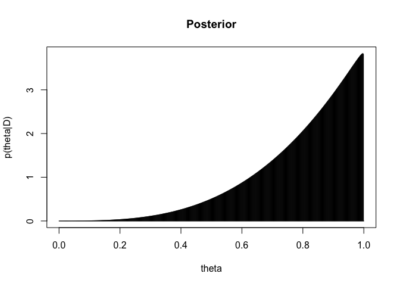

## Exercise 6.5a

    theta   <- seq(0, 1, length=1000)
    pTheta  <- dbeta(theta, 100 + 9, 100 + 1)
    plot(theta, pTheta, type='h', main='Posterior', xlab='theta', ylab = 'p(theta|D)')

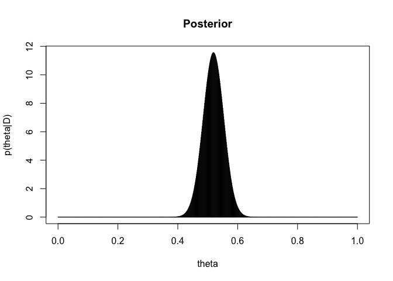

    # prediction for the next flip
    show(109/(109 + 101))

    ## [1] 0.5190476

## Exercise 6.5b

    theta   <- seq(0, 1, length=1000)
    pTheta  <- dbeta(theta, 0.01 + 9, 0.01 + 1)
    plot(theta, pTheta, type='h', main='Posterior', xlab='theta', ylab = 'p(theta|D)')

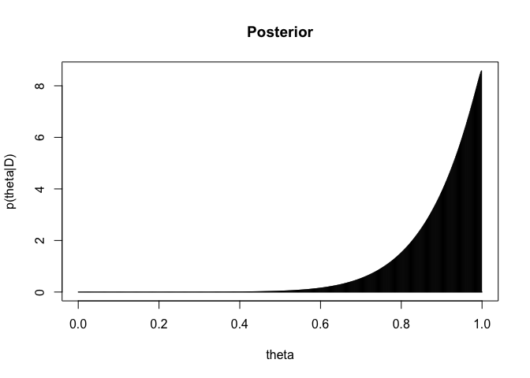

    # prediction for the next flip
    show(9.01/(9.01 + 1.01))

    ## [1] 0.8992016
