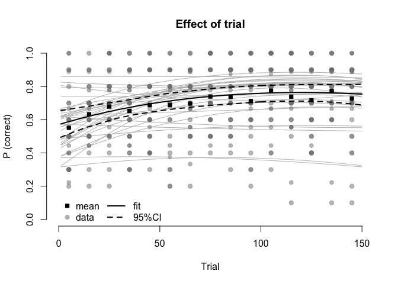
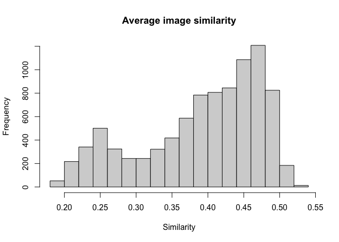

    replicate_nth <- function(x, n) {
      return(rep(x[n], length(x)))
    }
    scale_0_1 <- function(x) {
      return((x - min(x)) / (max(x) - min(x)))
    }

Choice task
===========

Task info
---------

In the task, participants are asked to choose between two images on
every trial. Each and every image is associated with a specific number
of points in a non-random way, i.e., its number of points depends on how
much the image loads on a certain property.

Participants are instructed to figure out how the points are allocated
to images and choose the image that will give them more points. The
number of collected points throughout the session is later converted
into a monetary bonus.

After every choice, participants receive feedback. The number of points
of each image is displayed.

The session includes 150 trials.

Descriptives
------------

    # load the data
    df_choice     <- readRDS(file.path(dat_dir,
                                       "df_choice.Rds"))
    # manipulate variables crucial for later analyses
    df_choice     <- df_choice %>%
                    # change character vars to factor
                    mutate_if(is.character, as.factor) %>%
                    # create new variables
                    mutate(
                    # create var of absolute difference in loading of trial images
                      loadingAbs_diff = 
                        abs(loadingleft - loadingright),
                    # create var of absolute difference in reward of trial images
                      reward_diff = 
                        abs(rewardleft - rewardright),
                    # create var of average reward of trial images 
                      reward_mean = 
                        (rewardleft + rewardright) / 2,
                    # create var of reward based on chosen image
                      reward_chosen = 
                        ifelse(response=="ArrowRight", 
                               rewardright, rewardleft),
                    # maximum reward available on a trial
                      reward_max = pmax(rewardleft, rewardright),
                    # reward difference of chosen - unchosen
                      reward_diff_chosen = case_when(
                        response=="ArrowRight" ~ rewardright - rewardleft, 
                        response=="ArrowLeft" ~ rewardleft - rewardright
                      )
                     )

Show the structure of the data frame:

    glimpse(df_choice, width = 100)

    ## Rows: 4,650
    ## Columns: 21
    ## $ id                 <fct> 001, 001, 001, 001, 001, 001, 001, 001, 001, 001, 001, 001, 001, 001, …
    ## $ age                <dbl> 27, 27, 27, 27, 27, 27, 27, 27, 27, 27, 27, 27, 27, 27, 27, 27, 27, 27…
    ## $ sex                <fct> Male, Male, Male, Male, Male, Male, Male, Male, Male, Male, Male, Male…
    ## $ trialid            <dbl> 1, 2, 3, 4, 5, 6, 7, 8, 9, 10, 11, 12, 13, 14, 15, 16, 17, 18, 19, 20,…
    ## $ imageleft          <fct> stimuli/crumb.png, stimuli/scale.png, stimuli/wrench.png, stimuli/scre…
    ## $ imageright         <fct> stimuli/teabag.png, stimuli/anchor.png, stimuli/net.png, stimuli/chive…
    ## $ rewardleft         <dbl> 6, 59, 97, 31, 57, 47, 2, 28, 71, 14, 2, 3, 73, 42, 3, 86, 35, 19, 61,…
    ## $ rewardright        <dbl> 15, 68, 38, 4, 35, 81, 29, 54, 8, 34, 70, 83, 80, 61, 87, 53, 1, 1, 26…
    ## $ loadingleft        <dbl> 0.146566659, 1.362458706, 2.262031078, 0.719512224, 1.326524377, 1.087…
    ## $ loadingright       <dbl> 0.3378196955, 1.5802731514, 0.8809413910, 0.0902693570, 0.8229967952, …
    ## $ isCorrect          <dbl> 1, 1, 0, 1, 1, 1, 1, 1, 1, 1, 1, 1, 0, 1, 1, 1, 1, 1, 1, 1, 1, 0, 1, 1…
    ## $ nResponses         <dbl> 1, 1, 1, 1, 1, 1, 1, 1, 1, 1, 1, 1, 1, 1, 1, 1, 1, 1, 1, 1, 1, 1, 1, 1…
    ## $ response           <fct> ArrowRight, ArrowRight, ArrowRight, ArrowLeft, ArrowLeft, ArrowRight, …
    ## $ RT                 <dbl> 4028, 3592, 2990, 1729, 2429, 1844, 1339, 1805, 916, 751, 775, 813, 17…
    ## $ taskid             <fct> CHOICE, CHOICE, CHOICE, CHOICE, CHOICE, CHOICE, CHOICE, CHOICE, CHOICE…
    ## $ loadingAbs_diff    <dbl> 0.1912530, 0.2178144, 1.3810897, 0.6292429, 0.5035276, 0.7966778, 0.63…
    ## $ reward_diff        <dbl> 9, 9, 59, 27, 22, 34, 27, 26, 63, 20, 68, 80, 7, 19, 84, 33, 34, 18, 3…
    ## $ reward_mean        <dbl> 10.5, 63.5, 67.5, 17.5, 46.0, 64.0, 15.5, 41.0, 39.5, 24.0, 36.0, 43.0…
    ## $ reward_chosen      <dbl> 15, 68, 38, 31, 57, 81, 29, 54, 71, 34, 70, 83, 73, 61, 87, 86, 35, 19…
    ## $ reward_max         <dbl> 15, 68, 97, 31, 57, 81, 29, 54, 71, 34, 70, 83, 80, 61, 87, 86, 35, 19…
    ## $ reward_diff_chosen <dbl> 9, 9, -59, 27, 22, 34, 27, 26, 63, 20, 68, 80, -7, 19, 84, 33, 34, 18,…

Total number of participants who completed the task: 31.

### Task properties

#### Between-subjects variability of reward differences

Check whether there is between subject variability of reward
differences.

Important note about the design: in the task, there are trials where
images have the same number of points. As a result, for some trials,
there is no correct/incorrect response (`isCorrect` var has a value of
`NA`).

    hist(df_choice$reward_diff, breaks=1000,
         main="Distribution of reward differences",
         xlab="Difference")

    plot(reward_diff ~ id, data=df_choice, frame=FALSE,
         main="Between subjects variability",
         ylab="Reward (absolute difference)",
         xlab="Subject id")

#### Reward over time

Check whether the reward over time resembles random sampling.

    boxplot(reward_mean ~ trialid, data=df_choice, frame=FALSE,
            ylab="Average reward of images",
            xlab="Trial",
            outline=FALSE)

    boxplot(reward_diff ~ trialid, data=df_choice, frame=FALSE,
            ylab="Reward difference between images",
            xlab="Trial",
            outline=FALSE)

### Data preproc

Run some basic data pre-processing to remove trials that are unusable.

#### Number of button presses

Show how many times a person pressed a button before they pressed one of
the actual response buttons (“arrow left”/ “arrow right”). (It is
technically possible that a person pressed another button before
providing an answer to a trial.)

    count(df_choice, nResponses)

    ## # A tibble: 6 x 2
    ##   nResponses     n
    ##        <dbl> <int>
    ## 1          1  4636
    ## 2          2     9
    ## 3          3     2
    ## 4          4     1
    ## 5          5     1
    ## 6         17     1

Keep the trials where `nResponses` above 1 since participants could
still process the images.

#### Reaction time

Range of RT is between 16 and 6.772810^{4} ms.

    hist(df_choice$RT, breaks=500,
         main="Distribution of reaction times",
         xlab="Reaction time (ms)")

    RT_cutoff <- c(250, 5000)
    n_a <- sum(df_choice$RT<RT_cutoff[1], na.rm=T)
    n_b <- sum(df_choice$RT>RT_cutoff[2] | df_choice$nResponses>1, na.rm=T)

Remove trials where participants could have not processed the images,
i.e. when `RT` faster than 250 ms. For these trials, `isCorrect` and
`RT` were replaced with `NA`. This lead to the loss of 4 trials.

Additionally, trials where `RT` is slower than 5000 and `nResponses`
above 1 were removed for the reaction time analyses. This lead to the
loss of 215 trials (only for RT analysis).

    df_choice <- df_choice %>% 
                  mutate(
                    isCorrect_adj = replace(isCorrect, RT<RT_cutoff[1], NA),
                    RT_adj = replace(RT, RT<RT_cutoff[1] | 
                                    RT>RT_cutoff[2] | 
                                    nResponses>1, NA),
                  )

    hist(df_choice$RT_adj, breaks=100,
         main="Distribution of reaction times",
         xlab="Reaction time (ms)")

Subjects performance
--------------------

Check average performance per subject:

    # compute average per subject
    # control for NAs
    df_choice_agg <- df_choice %>% group_by(id) %>%
                      summarise(
                        sum_correct = sum(isCorrect_adj, na.rm=TRUE),
                        n_trials = sum(is.na(isCorrect_adj)==FALSE),
                        proportion = sum_correct / n_trials,
                        ) %>%
                      mutate(
                        n_ = 150
                      )
    n_trials <- range(df_choice_agg$n_trials)

    # compute group mean 
    mdl_choice <- glm(proportion ~ 1, data=df_choice_agg, 
                  weights = n_trials,
                  family = binomial(logit))
    choice_m   <- inv.logit(summary(mdl_choice)$coefficients[1])

    {
    plot(proportion ~ 1, data=df_choice_agg,  
         type='o',
         frame=FALSE,
         xlab="Subject", 
         xaxt="n",
         ylab="Proportion correct",
         main="Performance",
         ylim=c(0,1),
         pch=19,
         cex=n_trials/n_*1.5)
    axis(1, at=1:nrow(df_choice_agg), labels=levels(df_choice_agg$id))
    abline(h=choice_m, lty=2)
    legend("bottomleft", 
           legend=format(n_trials), 
           pch=19, 
           pt.cex=n_trials/150*1.5,
           title="N trials",
           bty="n")
    legend("topright", 
           legend="Weighted mean", 
           lty=2, 
           bty="n")
    }

### Bayesian mean tracker

Use Beta distribution to summarize performance of individual subjects
with bayesian analysis. The two parameters of the Beta distribution, *α*
and *β*, can be interpreted as the number of “successes” and “failures”
in a sequence of Bernoulli trials. Here, “success” is a correct response
in the choice task. Expected prior probability is computed as:
*α*/(*α* + *β*).

    df_choice <- df_choice %>% group_by(id) %>% 
      mutate(alpha = accumulate(
                      .x = isCorrect_adj[-1],
                      function(i, x) sum(i, x, na.rm=T),
                      # init with alpha=1 and deal with NA if present
                      .init = sum(1, isCorrect[1], na.rm=T)
                      ),
             beta = accumulate(
                      .x = isCorrect_adj[-1],
                      function(i, x) sum(i, 1-x, na.rm=T),
                      # init with beta=1 and deal with NA if present
                      .init = sum(1, 1-isCorrect[1], na.rm=T)
                      ),
             bmtracker = alpha / (alpha+beta),
             ) %>% ungroup() 

    dat_lines   <- matrix(
                  data=df_choice$bmtracker,
                  nrow=max(df_choice$trialid)
                  )
    matplot(dat_lines, 
         type='l', frame=FALSE, 
         lty=1, 
         col='grey',
         ylim=c(0,1),
         xlim=c(0,150),
         ylab="Posterior P(correct)", 
         xlab="Trial",
         main="Bayesian mean tracker")

    x_tracker <-df_choice$bmtracker[df_choice$trialid==150]
    y_p_correct <-df_choice_agg$proportion
    {
    plot(x_tracker, y_p_correct, type='p', pch=19, frame=FALSE,
         ylim=c(0,1), xlim=c(0,1),
         xlab="Bayesian mean tracker (posterior at trial nr 150)",
         ylab="Overall proportion correct",
         main="")
    abline(a=0, b=1)
    legend("topleft", 
           legend="Identity line", 
           lty=1, 
           bty="n")
    }

Correlation between proportion correct and BMT is 1.

    # get function to compute HDI for beta distribution
    hdi_beta <- function(alpha, beta, hdi=.95, theta=seq(from=0, to=1, by=.01)) {
      pTheta <- dbeta(theta, shape1 = alpha, shape2 = beta)
      pTheta <- pTheta / sum(pTheta)
      
      sortedProbMass <- sort(pTheta, decreasing=TRUE)
      HDIheightIdx   <- min(which(cumsum(sortedProbMass) >= hdi))
      HDIheight      <- sortedProbMass[HDIheightIdx]
      HDI            <- pTheta[pTheta >= HDIheight]
      HDIindx        <- c(which(pTheta==HDI[1]), 
                          which(pTheta==tail(HDI, n=1)))
      HDItheta       <- theta[HDIindx]

      return(HDItheta)
    }

    # add 95% HDI
    df_choice <- df_choice %>% rowwise() %>%
              mutate(bhdi_lwr = hdi_beta(alpha, beta)[1], 
                     bhdi_upr = hdi_beta(alpha, beta)[2]) %>%
              ungroup()

Use baysian mean tracker to add 95%HDI to the mean performance of
subjects:

    x <- 1:nlevels(df_choice$id)
    y <- df_choice$bmtracker[df_choice$trialid==150]
    hdi_lwr <- df_choice$bhdi_lwr[df_choice$trialid==150]
    hdi_upr <- df_choice$bhdi_upr[df_choice$trialid==150]
    {
    plot(x, y, type='p', pch=19, frame=FALSE,
         ylim=c(0,1),
         xaxt="n",
         xlab="Subject id",
         ylab="Posterior P(correct)",
         main="Posterior at trial 150")
    axis(1, at=1:nrow(df_choice_agg), labels=levels(df_choice_agg$id))
    abline(h=.45, lty=2)
    abline(h=.55, lty=2)
    arrows(x, hdi_lwr, x, hdi_upr, length=0.05, angle=90, code=3)
    #legend
    arrows(1, .1, 1, .2, length=0.05, angle=90, code=3)
    text(1, .15, labels = "95%HDI", pos=4)
    }

### Sliding-window/ rolling mean

Use sliding-window (bin of 5, no overlap) to see how performance
develops over time.

    # bin trials in non-overlapping windows of 5 trials
    df_choice <- df_choice %>%
      mutate(
        trialid_bin = 
          .bincode(trialid, c(0, seq(10, 150, by=10))),
        trialid_bin_plot = 
          trialid_bin*10 - 5,
        trialid_bin_5 = 
          .bincode(trialid, c(0, seq(5, 150, by=5))),
        trialid_bin_5_plot = trialid_bin_5*5 - 2.5,
        .after="trialid"
      )

    df_choice_agg_5 <- df_choice %>%
                    group_by(id, trialid_bin_5_plot) %>%
                    summarise(sum_correct = sum(isCorrect_adj, na.rm=TRUE),
                              n_items = sum(is.na(isCorrect_adj)==FALSE),
                              proportion = sum_correct / n_items,
                              RT_adj = mean(RT_adj, na.rm=TRUE),
                              reward_mean = mean(reward_mean),
                              reward_diff = mean(reward_diff),
                              reward_max = mean(reward_max),
                              .groups="keep")
    agg_5_m <- df_choice_agg_5 %>% group_by(trialid_bin_5_plot) %>%
                    summarise(proportion = mean(proportion),
                              RT_adj = mean(RT_adj))

    dat_lines   <- matrix(
                  data=df_choice_agg_5$proportion,
                  nrow=length(unique(df_choice_agg_5$trialid_bin_5_plot))
                  )
    xmat_lines   <- matrix(
                  data=df_choice_agg_5$trialid_bin_5_plot,
                  nrow=length(unique(df_choice_agg_5$trialid_bin_5_plot))
                  )
    {
    plot(x, y, type='n', frame=FALSE,
         ylim=c(0,1),
         xlim=c(0,150),
         xlab="Trial",
         ylab="P(correct)",
         main="Bin of 5 trial (no-overlap)")
    # matlines(xmat_lines, dat_lines, 
    #          lty=1, 
    #          col='grey')
    points(proportion ~ trialid_bin_5_plot, data=df_choice_agg_5, 
           pch=19, 
           col=grey(level=.5, alpha=.5),
           cex=n_items/5
    )
    points(proportion ~ trialid_bin_5_plot, data=agg_5_m,
           type='o',
           lwd=1.5,
           cex=1.1,
           pch=19,
           col='black')
    }

Plot additionally individual subjects:

    # i know this can be done with xyplot in lattice package 
    # but I prefer a simpler plot
    {
    l_mat <- matrix(1:32, ncol=8, byrow=T)
    l_mat <- cbind(33, l_mat)
    l_mat <- rbind(l_mat, c(36, rep(34,8)))
    l_mat <- rbind(c(37, rep(35,8)), l_mat)
    layout(l_mat, heights=c(2, 5, 5, 5, 5, 1), 
           widths=c(1, 5, 5, 5, 5, 5, 5, 5, 5))
    #layout.show(max(l_mat))
    par(mar=c(3, 3, 1, 0.5))
    for (id in levels(df_choice_agg_5$id)) {
      plot(proportion ~ trialid_bin_5_plot, 
           data=df_choice_agg_5[df_choice_agg_5$id==id, ],
           frame=FALSE, 
           type='l',
           ylim=c(0,1),
           ylab="",
           xlab=""
           )
      title(id)
      abline(h=.5, lty=2)
    }
    plot(1, 1, type="n", frame=F, 
         xlim=c(0,150), ylim=c(0,1))
    title("id")
    abline(h=.5, lty=2)
    text(x=75, y=.7, labels = "chance")

    # y-axis
    par(mar=c(2, 0.5, 0.5, 0.5))
    plot(1, 1, type="n", axes=F, ann=F)
    mtext(text="Proportion correct", side=2, line=-1, at=1)
    # x-axis
    par(mar=c(0.5, 3, 0.5, 0.5))
    plot(1, 1, type="n", axes=F, ann=F)
    mtext(text="Trial", side=1, line=-1, at=1)
    # title
    par(mar=c(0.5, 3, .5, 0.5))
    plot(1, 1, type="n", axes=F, ann=F)
    mtext(text="Individual participants", side=1, line=-1, at=1)
    }

    {
    plot(1, 1, type='n', frame=FALSE,
         ylim=c(0,5000),
         xlim=c(0,150),
         xlab="Trial",
         ylab="RT",
         main="Bin of 5 trial (no-overlap)")
    points(RT_adj ~ trialid_bin_5_plot, data=df_choice_agg_5, 
           pch=19, 
           col=grey(level=.5, alpha=.5)
    )
    points(RT_adj ~ trialid_bin_5_plot, data=agg_5_m,
           type='o',
           lwd=1.5,
           cex=1.1,
           pch=19,
           col='black')
    }

##### Relation in the first couple of trials

Explore whether there is a relation between reward in the first 5 trials
and subsequent performance, i.e. those who experienced clues about
reward allocation in the first couple of trials could exhibit increased
performance in subsequent trials. Explored predictors: mean reward of
images, difference between images, maximum reward in a trial.

    # average reward in the first 5 trials
    x_reward_mean  <- df_choice_agg_5$reward_mean[
      df_choice_agg_5$trialid_bin_5_plot==2.5]
    x_reward_diff  <- df_choice_agg_5$reward_diff[
      df_choice_agg_5$trialid_bin_5_plot==2.5]
    x_reward_max  <- df_choice_agg_5$reward_max[
      df_choice_agg_5$trialid_bin_5_plot==2.5]
    # proportion correct in the next 5 trials (6-10)
    y_proportion   <- df_choice_agg_5$proportion[
      df_choice_agg_5$trialid_bin_5_plot==7.5]
    y_weights      <- df_choice_agg_5$n_items[
      df_choice_agg_5$trialid_bin_5_plot==7.5]

    # fit GLM 
    m <- glm(y_proportion ~ 1 + x_reward_max, 
             family = binomial(link="logit"), 
             weights = y_weights)
    # extract parameters, fit, and CI
    x           <- seq(min(x_reward_max), max(x_reward_max), length.out = 100)
    betas       <- matrix(c(coef(m)[[1]], coef(m)[[2]]), nrow = 2, ncol = 1)
    X           <- matrix(1, nrow = length(x), ncol = 2)
    X[ ,2]      <- x
    y_hat       <- X%*%betas
    vcovmat     <- vcov(m)
    # variance of the model at x*
    y_var       <- apply(X, 1, function(x) t(x)%*%vcovmat%*%x)
    CI_lower    <- inv.logit(y_hat-1.96*sqrt(y_var))
    CI_upper    <- inv.logit(y_hat+1.96*sqrt(y_var))
    y_hat       <- inv.logit(y_hat)
    {
    matplot(x, cbind(CI_lower, y_hat, CI_upper), frame=FALSE, 
            xlim=c(45, 80), 
            ylim=c(0,1),
            xlab="Reward max (trials 1-5)",
            ylab="P(correct) (trials 5-6)",
            lty=c(2,1,2), 
            type='l',
            col='black')
    points(x_reward_max, y_proportion, 
           pch=19)
    }

    # fit GLM 
    m <- glm(y_proportion ~ 1 + x_reward_mean, 
             family = binomial(link="logit"), 
             weights = y_weights)
    # extract parameters, fit, and CI
    x           <- seq(min(x_reward_mean), max(x_reward_mean), length.out = 100)
    betas       <- matrix(c(coef(m)[[1]], coef(m)[[2]]), nrow = 2, ncol = 1)
    X           <- matrix(1, nrow = length(x), ncol = 2)
    X[ ,2]      <- x
    y_hat       <- X%*%betas
    vcovmat     <- vcov(m)
    # variance of the model at x*
    y_var       <- apply(X, 1, function(x) t(x)%*%vcovmat%*%x)
    CI_lower    <- inv.logit(y_hat-1.96*sqrt(y_var))
    CI_upper    <- inv.logit(y_hat+1.96*sqrt(y_var))
    y_hat       <- inv.logit(y_hat)
    {
    matplot(x, cbind(CI_lower, y_hat, CI_upper), frame=FALSE, 
            xlim=c(30,60), 
            ylim=c(0,1),
            xlab="Reward mean (trials 1-5)",
            ylab="P(correct) (trials 5-6)",
            lty=c(2,1,2), 
            type='l',
            col='black')
    points(x_reward_mean, y_proportion, 
           pch=19)
    }

    # fit GLM 
    m <- glm(y_proportion ~ 1 + x_reward_diff, 
             family = binomial(link="logit"), 
             weights = y_weights)
    # extract parameters, fit, and CI
    x           <- seq(min(x_reward_diff), max(x_reward_diff), length.out = 100)
    betas       <- matrix(c(coef(m)[[1]], coef(m)[[2]]), nrow = 2, ncol = 1)
    X           <- matrix(1, nrow = length(x), ncol = 2)
    X[ ,2]      <- x
    y_hat       <- X%*%betas
    vcovmat     <- vcov(m)
    # variance of the model at x*
    y_var       <- apply(X, 1, function(x) t(x)%*%vcovmat%*%x)
    CI_lower    <- inv.logit(y_hat-1.96*sqrt(y_var))
    CI_upper    <- inv.logit(y_hat+1.96*sqrt(y_var))
    y_hat       <- inv.logit(y_hat)
    {
    matplot(x, cbind(CI_lower, y_hat, CI_upper), frame=FALSE, 
            xlim=c(5, 50), 
            ylim=c(0,1),
            xlab="Reward difference (trials 1-5)",
            ylab="P(correct) (trials 5-6)",
            lty=c(2,1,2), 
            type='l',
            col='black')
    points(x_reward_diff, y_proportion, 
           pch=19)
    }

Generalized Linear Mixed Models
-------------------------------

Run GLMMs to quantify the probability of being correct in the task.

### Effect of trial (centered & scaled)

    # normalize the trial position with mean 0 and std of 1
    df_choice     <- df_choice %>%
                    mutate(
                      trialid_z = 
                        as.vector(scale(trialid, center = T, scale = T)),
                       .after="trialid")

#### Linear trend

Start with the linear trend of improvement across trials. The plot below
suggests that the linear trend is not accurate.

    fname <- "mdl_choice_01a.rda"
    if (file.exists(file.path(mdls_dir, fname))) {
      load(file.path(mdls_dir, fname))
    } else {
      mdl_choice_01a <- glmer(isCorrect_adj ~ 1 + trialid_z +
                            (1 + trialid_z | id),
                          data=df_choice, 
                          family=binomial(link="logit"))
      save(mdl_choice_01a, file=file.path(mdls_dir, fname))
    }

    summary(mdl_choice_01a)

    ## Generalized linear mixed model fit by maximum likelihood (Laplace Approximation) ['glmerMod']
    ##  Family: binomial  ( logit )
    ## Formula: isCorrect_adj ~ 1 + trialid_z + (1 + trialid_z | id)
    ##    Data: df_choice
    ## 
    ##      AIC      BIC   logLik deviance df.resid 
    ##   5254.0   5286.2  -2622.0   5244.0     4559 
    ## 
    ## Scaled residuals: 
    ##     Min      1Q  Median      3Q     Max 
    ## -3.0604 -0.9732  0.4915  0.6291  1.4679 
    ## 
    ## Random effects:
    ##  Groups Name        Variance Std.Dev. Corr
    ##  id     (Intercept) 0.35607  0.5967       
    ##         trialid_z   0.07007  0.2647   0.34
    ## Number of obs: 4564, groups:  id, 31
    ## 
    ## Fixed effects:
    ##             Estimate Std. Error z value Pr(>|z|)    
    ## (Intercept)  0.93352    0.11276   8.278  < 2e-16 ***
    ## trialid_z    0.25443    0.05915   4.302  1.7e-05 ***
    ## ---
    ## Signif. codes:  0 '***' 0.001 '**' 0.01 '*' 0.05 '.' 0.1 ' ' 1
    ## 
    ## Correlation of Fixed Effects:
    ##           (Intr)
    ## trialid_z 0.281

    r.squaredGLMM(mdl_choice_01a)

    ## Warning: The null model is correct only if all variables used by the original model remain unchanged.

    ##                    R2m        R2c
    ## theoretical 0.01709602 0.12973931
    ## delta       0.01272437 0.09656344

    df_choice_agg <- df_choice %>%
                    group_by(id, trialid_bin) %>%
                    summarise(sum_correct = sum(isCorrect_adj, na.rm=TRUE),
                              n_items = sum(is.na(isCorrect_adj)==FALSE),
                              proportion = sum_correct / n_items,
                              .groups = "keep") %>%
                    mutate(trialid_bin_plot = trialid_bin*10 - 5)
    proportion_m <- df_choice_agg %>% group_by(trialid_bin_plot) %>%
                    summarise(m = mean(proportion))
    # model fit
    fe <- fixef(mdl_choice_01a)
    re <- ranef(mdl_choice_01a)$id
    b0 <- fe[["(Intercept)"]]
    b1 <- fe[["trialid_z"]]
    df_choice <- df_choice %>%
                  mutate(fit_trial_linear = 
                           map_dbl(trialid_z, 
                               function(t, b0, b1){
                                 return(inv.logit(b0 + b1*t))
                               }, 
                               b0=b0,
                               b1=b1
                              ),
                         sfit_trial_linear = 
                           map2_dbl(id, trialid_z,
                               function(i, t, b0, b1, re){
                                 sfit <- b0 + b1*t + 
                                   re[i, "(Intercept)"] + re[i, "trialid_z"]*t
                                 return(inv.logit(sfit))
                               },
                               b0=b0, 
                               b1=b1, 
                               re=re)
                        ) 

    {
    plot(1, 1,   
         type='n',
         frame=FALSE,
         xlab="Trial", 
         ylab="Proportion correct",
         main="Effect of trial",
         ylim=c(0,1),
         xlim=c(0,150)
         )
    points(proportion ~ trialid_bin_plot, data=df_choice_agg,
           pch=19, 
           col=grey(level=.5, alpha=.5),
           cex=(n_items/10)*1.5)
    points(m ~ trialid_bin_plot, data=proportion_m, 
           pch=15)
    lines(fit_trial_linear ~ trialid,
          data=df_choice[1:max(df_choice$trialid), ],
          lty=1, 
          lwd=2)
    legend("bottomleft", 
           legend=c("mean", "data"), 
           pch=c(15, 19), 
           col=c("black", "grey"),
           bty="n")
    }

#### Quadratic trend

Continue with a quadratic trend to account for low performance at the
beginning and the end of the task.

    fname <- "mdl_choice_01b.rda"
    if (file.exists(file.path(mdls_dir, fname))) {
      load(file.path(mdls_dir, fname))
    } else {
      mdl_choice_01b <- glmer(isCorrect_adj ~ 1 + trialid_z + I(trialid_z^2) +
                            (1 + trialid_z + I(trialid_z^2) | id),
                          data=df_choice, 
                          family=binomial(link="logit"))
      save(mdl_choice_01b, file=file.path(mdls_dir, fname))
    }

    summary(mdl_choice_01b)

    ## Generalized linear mixed model fit by maximum likelihood (Laplace Approximation) ['glmerMod']
    ##  Family: binomial  ( logit )
    ## Formula: isCorrect_adj ~ 1 + trialid_z + I(trialid_z^2) + (1 + trialid_z +      I(trialid_z^2) | id)
    ##    Data: df_choice
    ## 
    ##      AIC      BIC   logLik deviance df.resid 
    ##   5246.4   5304.3  -2614.2   5228.4     4555 
    ## 
    ## Scaled residuals: 
    ##     Min      1Q  Median      3Q     Max 
    ## -2.7802 -0.9002  0.4821  0.6213  1.4672 
    ## 
    ## Random effects:
    ##  Groups Name           Variance Std.Dev. Corr       
    ##  id     (Intercept)    0.40595  0.6371              
    ##         trialid_z      0.06013  0.2452    0.50      
    ##         I(trialid_z^2) 0.02268  0.1506   -0.37 -0.81
    ## Number of obs: 4564, groups:  id, 31
    ## 
    ## Fixed effects:
    ##                Estimate Std. Error z value Pr(>|z|)    
    ## (Intercept)     1.04860    0.12597   8.324  < 2e-16 ***
    ## trialid_z       0.23816    0.05607   4.247 2.16e-05 ***
    ## I(trialid_z^2) -0.11451    0.04722  -2.425   0.0153 *  
    ## ---
    ## Signif. codes:  0 '***' 0.001 '**' 0.01 '*' 0.05 '.' 0.1 ' ' 1
    ## 
    ## Correlation of Fixed Effects:
    ##             (Intr) trld_z
    ## trialid_z    0.364       
    ## I(trld_z^2) -0.447 -0.327

    r.squaredGLMM(mdl_choice_01b)

    ## Warning: The null model is correct only if all variables used by the original model remain unchanged.

    ##                    R2m        R2c
    ## theoretical 0.01770672 0.13266369
    ## delta       0.01316521 0.09863744

    # model fit
    fe <- fixef(mdl_choice_01b)
    re <- ranef(mdl_choice_01b)$id
    b0 <- fe[["(Intercept)"]]
    b1 <- fe[["trialid_z"]]
    b2 <- fe[["I(trialid_z^2)"]]
    df_choice <- df_choice %>%
                  mutate(fit_trial_quad = 
                           map_dbl(trialid_z, 
                               function(t, b0, b1, b2){
                                 return(inv.logit(b0 + b1*t + b2*t^2 ))
                               }, 
                               b0=b0,
                               b1=b1,
                               b2=b2
                              ),
                         sfit_trial_quad = 
                           map2_dbl(id, trialid_z,
                               function(i, t, b0, b1, b2, re){
                                 sfit <- b0 + b1*t + b2*t^2 + 
                                   re[i, "(Intercept)"] + re[i, "trialid_z"]*t +
                                   re[i, "I(trialid_z^2)"]*t^2
                                 return(inv.logit(sfit))
                               },
                               b0=b0, 
                               b1=b1, 
                               b2=b2,
                               re=re)
                        ) 

    {
    plot(1, 1,   
         type='n',
         frame=FALSE,
         xlab="Trial", 
         ylab="Proportion correct",
         main="Effect of trial",
         ylim=c(0,1),
         xlim=c(0,150)
         )
    points(proportion ~ trialid_bin_plot, data=df_choice_agg,
           pch=19, 
           col=grey(level=.5, alpha=.5),
           cex=(n_items/10)*1.5)
    points(m ~ trialid_bin_plot, data=proportion_m, 
           pch=15)
    lines(fit_trial_quad ~ trialid,
          data=df_choice[1:max(df_choice$trialid), ],
          lty=1, 
          lwd=2)
    legend("bottomleft", 
           legend=c("mean", "data"), 
           pch=c(15, 19), 
           col=c("black", "grey"),
           bty="n")
    }

    anova(mdl_choice_01a, mdl_choice_01b)

    ## Data: df_choice
    ## Models:
    ## mdl_choice_01a: isCorrect_adj ~ 1 + trialid_z + (1 + trialid_z | id)
    ## mdl_choice_01b: isCorrect_adj ~ 1 + trialid_z + I(trialid_z^2) + (1 + trialid_z + 
    ## mdl_choice_01b:     I(trialid_z^2) | id)
    ##                npar    AIC    BIC  logLik deviance  Chisq Df Pr(>Chisq)   
    ## mdl_choice_01a    5 5254.0 5286.2 -2622.0   5244.0                        
    ## mdl_choice_01b    9 5246.4 5304.3 -2614.2   5228.4 15.615  4   0.003581 **
    ## ---
    ## Signif. codes:  0 '***' 0.001 '**' 0.01 '*' 0.05 '.' 0.1 ' ' 1

    mdl_choice_01b_disp <- testDispersion(mdl_choice_01b)

    mdl_choice_01b_disp_sim <- simulateResiduals(mdl_choice_01b, plot=T)

    # bootstrap CI
    fname <- "boot_choice_01b.rda"
    if (file.exists(file.path(mdls_dir, fname))) {
      load(file.path(mdls_dir, fname))
    } else {
      boot_choice_01b   <- bootMer(mdl_choice_01b, 
                                   fixef, nsim=1000, 
                                   re.form=NA)
      save(boot_choice_01b, file=file.path(mdls_dir,
                                           fname))
    }

#### Plot

Create a final plot using the best model, i.e., the model with a
quadratic trend of trial effect.

    # bootstrap data 
    xvals     <- scale(1:150, center=TRUE, scale=TRUE)
    boot_dat  <- apply(X=boot_choice_01b$t, MARGIN=1, 
                       function(x) x["(Intercept)"] + 
                         xvals*x["trialid_z"] + 
                         x["I(trialid_z^2)"]*xvals^2)
    boot_dat  <- inv.logit(boot_dat)
    boot_dat_lwr  <- apply(boot_dat, 1, 
                       function(x) as.numeric(quantile(x, 
                                                       probs=.025,
                                                       na.rm=TRUE)))
    boot_dat_upr  <- apply(boot_dat, 1, 
                       function(x) as.numeric(quantile(x, 
                                                       probs=.975,
                                                       na.rm=TRUE)))

    df_choice <- df_choice %>% group_by(id) %>%
                mutate(fit_trial_quad_ci_lwr = boot_dat_lwr,
                       fit_trial_quad_ci_upr = boot_dat_upr) %>%
                ungroup()

    dat_lines   <- matrix(
                  data=df_choice$sfit_trial_quad,
                  nrow=max(df_choice$trialid)
                  )
    {
    plot(1, 1,   
         type='n',
         frame=FALSE,
         xlab="Trial", 
         ylab="P (correct)",
         main="Effect of trial",
         ylim=c(0,1),
         xlim=c(0,150)
         )
    matlines(y=dat_lines, 
             col='grey', 
             lty=1, lwd=1)
    points(proportion ~ trialid_bin_plot, data=df_choice_agg,
           pch=19, 
           col=grey(level=.5, alpha=.5),
           cex=(n_items/10))
    points(m ~ trialid_bin_plot, data=proportion_m, 
           pch=15)
    lines(fit_trial_quad ~ trialid,
          data=df_choice[1:max(df_choice$trialid), ],
          lty=1, 
          lwd=2)
    lines(fit_trial_quad_ci_upr ~ trialid,
          data=df_choice[1:max(df_choice$trialid), ],
          lty=2, 
          lwd=2)
    lines(fit_trial_quad_ci_lwr ~ trialid,
          data=df_choice[1:max(df_choice$trialid), ],
          lty=2, 
          lwd=2)
    legend(x=0, y=.15,
           legend=c("mean", "data"), 
           pch=c(15, 19), 
           col=c("black", "grey"),
           bty="n")
    legend(x=20, y=.15, 
           legend=c("fit", "95%CI"), 
           lwd=2,
           lty=c(1, 2), 
           col=c("black", "black"),
           bty="n")
    }

#### Change over time as dependent on the reward in the first couple of trials

Explore in the context of GLMMs whether the improvement over time
depends on the reward experienced in the first couple of trials.
Different models were run but none of them suggests such a relation.

    df_choice <- df_choice %>% 
      group_by(id) %>%
      mutate(reward_mean_cummean = cummean(reward_mean),
             reward_diff_cummean = cummean(reward_diff), 
             reward_max_cummean = cummean(reward_max),
             reward_mean_cummean_nth = replicate_nth(reward_mean_cummean, 4),
             reward_diff_cummean_nth = replicate_nth(reward_diff_cummean, 4),
             reward_max_cummean_nth = replicate_nth(reward_max_cummean, 4),
      ) %>% ungroup() %>%
      mutate(reward_mean_cummean_nth_z = 
               as.vector(scale(reward_mean_cummean_nth, center = T, scale = T)),
             reward_diff_cummean_nth_z = 
               as.vector(scale(reward_diff_cummean_nth, center = T, scale = T)),
             reward_max_cummean_nth_z = 
               as.vector(scale(reward_max_cummean_nth, center = T, scale = T)),
             )

    fname <- "mdl_choice_01c.rda"
    if (file.exists(file.path(mdls_dir, fname))) {
      load(file.path(mdls_dir, fname))
    } else {
    mdl_choice_01c <- glmer(isCorrect_adj ~ 1 + trialid_z + I(trialid_z^2) +
                              reward_diff_cummean_nth_z + 
                              trialid_z:reward_diff_cummean_nth_z + 
                              I(trialid_z^2):reward_diff_cummean_nth_z +
                            (1 + trialid_z + I(trialid_z^2) | id),
                          data=df_choice, 
                          family=binomial(link="logit"))
      save(mdl_choice_01c, file=file.path(mdls_dir, fname))
    }

    summary(mdl_choice_01c)

    ## Generalized linear mixed model fit by maximum likelihood (Laplace Approximation) ['glmerMod']
    ##  Family: binomial  ( logit )
    ## Formula: isCorrect_adj ~ 1 + trialid_z + I(trialid_z^2) + reward_diff_cummean_nth_z +      trialid_z:reward_diff_cummean_nth_z + I(trialid_z^2):reward_diff_cummean_nth_z +  
    ##     (1 + trialid_z + I(trialid_z^2) | id)
    ##    Data: df_choice
    ## 
    ##      AIC      BIC   logLik deviance df.resid 
    ##   5251.6   5328.7  -2613.8   5227.6     4552 
    ## 
    ## Scaled residuals: 
    ##     Min      1Q  Median      3Q     Max 
    ## -2.7679 -0.8960  0.4819  0.6180  1.4655 
    ## 
    ## Random effects:
    ##  Groups Name           Variance Std.Dev. Corr       
    ##  id     (Intercept)    0.40135  0.6335              
    ##         trialid_z      0.05999  0.2449    0.51      
    ##         I(trialid_z^2) 0.02251  0.1500   -0.38 -0.82
    ## Number of obs: 4564, groups:  id, 31
    ## 
    ## Fixed effects:
    ##                                          Estimate Std. Error z value Pr(>|z|)    
    ## (Intercept)                               1.04829    0.12538   8.361  < 2e-16 ***
    ## trialid_z                                 0.23831    0.05605   4.252 2.12e-05 ***
    ## I(trialid_z^2)                           -0.11397    0.04718  -2.416   0.0157 *  
    ## reward_diff_cummean_nth_z                 0.06349    0.12494   0.508   0.6113    
    ## trialid_z:reward_diff_cummean_nth_z       0.01105    0.05595   0.198   0.8434    
    ## I(trialid_z^2):reward_diff_cummean_nth_z  0.01927    0.04684   0.411   0.6808    
    ## ---
    ## Signif. codes:  0 '***' 0.001 '**' 0.01 '*' 0.05 '.' 0.1 ' ' 1
    ## 
    ## Correlation of Fixed Effects:
    ##             (Intr) trld_z I(t_^2) rw____ t_:___
    ## trialid_z    0.364                             
    ## I(trld_z^2) -0.454 -0.332                      
    ## rwrd_dff___  0.006 -0.001 -0.010               
    ## trld_z:____ -0.001  0.021  0.004   0.367       
    ## I(_^2):____ -0.010  0.005  0.034  -0.449 -0.354

    show(anova(mdl_choice_01b, mdl_choice_01c))

    ## Data: df_choice
    ## Models:
    ## mdl_choice_01b: isCorrect_adj ~ 1 + trialid_z + I(trialid_z^2) + (1 + trialid_z + 
    ## mdl_choice_01b:     I(trialid_z^2) | id)
    ## mdl_choice_01c: isCorrect_adj ~ 1 + trialid_z + I(trialid_z^2) + reward_diff_cummean_nth_z + 
    ## mdl_choice_01c:     trialid_z:reward_diff_cummean_nth_z + I(trialid_z^2):reward_diff_cummean_nth_z + 
    ## mdl_choice_01c:     (1 + trialid_z + I(trialid_z^2) | id)
    ##                npar    AIC    BIC  logLik deviance  Chisq Df Pr(>Chisq)
    ## mdl_choice_01b    9 5246.4 5304.3 -2614.2   5228.4                     
    ## mdl_choice_01c   12 5251.6 5328.7 -2613.8   5227.6 0.7953  3     0.8506

### Effect of reward / loading

Test whether the performance in the task depends on the reward
difference between images.

    df_choice     <- df_choice %>% 
                    mutate(reward_diff_grand_mean=
                             mean(reward_diff)) %>%
                    group_by(id) %>%
                    # demean
                    mutate(reward_diff_between = 
                             mean(reward_diff),
                          reward_diff_within =
                              reward_diff - 
                              reward_diff_between) %>%
                    # normalize within
                    mutate(reward_diff_within_z =
                          as.vector(scale(reward_diff))) %>%
                    ungroup() %>%
                    mutate(reward_diff_between_z = 
                             as.vector(scale(reward_diff_between)))

    if (file.exists(file.path(mdls_dir, "mdl_choice_02a.rda"))) {
      load(file.path(mdls_dir, "mdl_choice_02a.rda"))
    } else {
      mdl_choice_02a <- glmer(isCorrect_adj ~ 1 + reward_diff_between_z + 
                       reward_diff_within_z + 
                      (1 + reward_diff_within_z | id),
                      data = df_choice,
                      family = binomial(link="logit"))
      save(mdl_choice_02a, file=file.path(mdls_dir, "mdl_choice_02a.rda"))
    }

    summary(mdl_choice_02a)

    ## Generalized linear mixed model fit by maximum likelihood (Laplace Approximation) ['glmerMod']
    ##  Family: binomial  ( logit )
    ## Formula: isCorrect_adj ~ 1 + reward_diff_between_z + reward_diff_within_z +      (1 + reward_diff_within_z | id)
    ##    Data: df_choice
    ## 
    ##      AIC      BIC   logLik deviance df.resid 
    ##   4951.6   4990.1  -2469.8   4939.6     4558 
    ## 
    ## Scaled residuals: 
    ##      Min       1Q   Median       3Q      Max 
    ## -13.5074  -0.9992   0.3934   0.6969   2.0385 
    ## 
    ## Random effects:
    ##  Groups Name                 Variance Std.Dev. Corr
    ##  id     (Intercept)          0.5464   0.7392       
    ##         reward_diff_within_z 0.2413   0.4912   0.99
    ## Number of obs: 4564, groups:  id, 31
    ## 
    ## Fixed effects:
    ##                       Estimate Std. Error z value Pr(>|z|)    
    ## (Intercept)            1.07971    0.13911   7.762 8.39e-15 ***
    ## reward_diff_between_z -0.02109    0.05935  -0.355    0.722    
    ## reward_diff_within_z   0.75757    0.09979   7.592 3.15e-14 ***
    ## ---
    ## Signif. codes:  0 '***' 0.001 '**' 0.01 '*' 0.05 '.' 0.1 ' ' 1
    ## 
    ## Correlation of Fixed Effects:
    ##             (Intr) rwrd_dff_b_
    ## rwrd_dff_b_ -0.003            
    ## rwrd_dff_w_  0.904 -0.002

Print descriptives for interpretation:

    group_mean <- df_choice$reward_diff_grand_mean[1]
    group_std  <- sd(df_choice$reward_diff_between)
    # approximate within subjects std with  a linear model
    tmp_lm     <- lm(reward_diff_within ~ reward_diff_within_z, 
                  data=df_choice)
    within_std <- coef(tmp_lm)[["reward_diff_within_z"]]
    show(data.frame(group_mean, group_std, within_std))

    ##   group_mean group_std within_std
    ## 1   30.61097  1.664562   22.22546

    r.squaredGLMM(mdl_choice_02a)

    ## Warning: The null model is correct only if all variables used by the original model remain unchanged.

    ##                   R2m       R2c
    ## theoretical 0.1207855 0.2928085
    ## delta       0.1047244 0.2538729

    mdl_choice_02a_disp       <- testDispersion(mdl_choice_02a)

    mdl_choice_02a_disp_sim   <- simulateResiduals(mdl_choice_02a, plot = T) 

    # bootstrap CI
    if (file.exists(file.path(mdls_dir, "boot_choice_02a.rda"))) {
      load(file.path(mdls_dir, "boot_choice_02a.rda"))
    } else {
      boot_choice_02a   <- bootMer(mdl_choice_02a, 
                                   fixef, nsim=1000, 
                                   re.form=NA)
      save(boot_choice_02a, file=file.path(mdls_dir,
                                           "boot_choice_02a.rda"))
    }

Explore whether a model with quadratic trend is better (only the model
without correlated random effects was able to converge). It turns out
that it is not. So the model with linear trend remains.

    if (file.exists(file.path(mdls_dir, "mdl_choice_02b.rda"))) {
      load(file.path(mdls_dir, "mdl_choice_02b.rda"))
    } else {
      mdl_choice_02b <- glmer(isCorrect_adj ~ 1 + 
                   reward_diff_between_z + 
                   reward_diff_within_z + I(reward_diff_within_z^2) + 
                   (1 + reward_diff_within_z + I(reward_diff_within_z^2) || id),
                data = df_choice,
                family = binomial(link="logit"))
      save(mdl_choice_02b, file=file.path(mdls_dir, "mdl_choice_02b.rda"))
    }

    anova(mdl_choice_02a, mdl_choice_02b)

    ## Data: df_choice
    ## Models:
    ## mdl_choice_02a: isCorrect_adj ~ 1 + reward_diff_between_z + reward_diff_within_z + 
    ## mdl_choice_02a:     (1 + reward_diff_within_z | id)
    ## mdl_choice_02b: isCorrect_adj ~ 1 + reward_diff_between_z + reward_diff_within_z + 
    ## mdl_choice_02b:     I(reward_diff_within_z^2) + (1 + reward_diff_within_z + I(reward_diff_within_z^2) || 
    ## mdl_choice_02b:     id)
    ##                npar    AIC    BIC  logLik deviance Chisq Df Pr(>Chisq)
    ## mdl_choice_02a    6 4951.6 4990.1 -2469.8   4939.6                    
    ## mdl_choice_02b    7 4993.0 5038.0 -2489.5   4979.0     0  1          1

#### Plot

Plot the effect of reward difference on the performance in the task.

    # model fit
    fe <- fixef(mdl_choice_02a)
    re <- ranef(mdl_choice_02a)$id
    b0 <- fe[["(Intercept)"]]
    b1 <- fe[["reward_diff_between_z"]]
    b2 <- fe[["reward_diff_within_z"]]

    # group fit
    x0      <- (0 - group_mean)/within_std
    x100    <- (100 - group_mean)/within_std
    xvals_z <- seq(from=x0, 
                   to=x100, 
                   length.out = 100)
    xvals_plot <- group_mean + within_std*xvals_z
    y_fit   <- inv.logit(b0 + b2*xvals_z)
    # subject fit
    df_choice_lines <- df_choice %>% 
      select(id, reward_diff_between, 
           reward_diff_between_z, 
           reward_diff_within, 
           reward_diff_within_z) %>%
      group_by(id) %>% 
      nest() %>%  
      mutate(reward_diff_sfit = map2(data, id, function(data,id,fe,re){
        x_min_z <- min(data$reward_diff_within_z)
        x_max_z <- max(data$reward_diff_within_z)
        xvals_z <- seq(x_min_z, x_max_z, length.out = 100)
        xvals_plot <- data$reward_diff_between[1] + 
          xvals_z*sd(data$reward_diff_within)
        sfit <- fe[["(Intercept)"]] + 
                fe[["reward_diff_between_z"]]*data$reward_diff_between_z[1] + 
                fe[["reward_diff_within_z"]]*xvals_z + 
                re[id, "(Intercept)"] + 
                re[id, "reward_diff_within_z"]*xvals_z
        sfit <- inv.logit(sfit)
        reward_diff_sfit <- tibble(xvals_plot, sfit)
        return(reward_diff_sfit)
      },
      fe=fe,
      re=re)) %>% 
      select(id, reward_diff_sfit) %>%
      unnest(reward_diff_sfit)
    # raw subject data
    df_choice_points <- df_choice %>% rowwise() %>%
      mutate(xvals = reward_diff_between + reward_diff_within,
             xvals_bin = .bincode(xvals, c(-1, seq(10, 100, by=10))),
             xvals_bin_plot = xvals_bin * 10 - 5) %>%
      ungroup() %>% group_by(id, xvals_bin_plot) %>%
      summarise(sum_correct = sum(isCorrect_adj, na.rm=TRUE),
                            n_items = sum(is.na(isCorrect_adj)==FALSE),
                            proportion = sum_correct / n_items,
                            .groups='keep')

    # bootstrap data 
    boot_dat  <- apply(X=boot_choice_02a$t, MARGIN=1, 
                       function(x) x["(Intercept)"] + 
                         xvals_z*x["reward_diff_within_z"])
    boot_dat  <- inv.logit(boot_dat)
    boot_dat_lwr  <- apply(boot_dat, 1, 
                       function(x) as.numeric(quantile(x, 
                                                       probs=.025,
                                                       na.rm=TRUE)))
    boot_dat_upr  <- apply(boot_dat, 1, 
                       function(x) as.numeric(quantile(x, 
                                                       probs=.975,
                                                       na.rm=TRUE)))

    dat_lines   <- matrix(
                    data=df_choice_lines$sfit,
                    ncol=nlevels(df_choice_lines$id)
                  )
    {
    plot(1, 1,   
         type='n',
         frame=FALSE,
         xlab="Reward difference", 
         ylab="P (correct)",
         main="Effect of reward difference",
         ylim=c(0,1),
         xlim=c(0,100)
         )
    matlines(y=dat_lines, 
             col='grey', 
             lty=1, lwd=1)
    points(proportion ~ xvals_bin_plot, data=df_choice_points,
           pch=19, 
           col=grey(level=.5, alpha=.5),
           cex=(n_items/max(n_items))*1.5)
    lines(xvals_plot, y_fit, lty=1, lwd=2)
    lines(xvals_plot, boot_dat_upr, lty=2, lwd=2)
    lines(xvals_plot, boot_dat_lwr, lty=2, lwd=2)
    legend("bottomleft", 
           legend=c("data", "fit", "95%CI"), 
           pch=c(19, NA, NA),
           lwd=c(NA, 2, 2),
           lty=c(NA, 1, 2), 
           col=c("grey", "black", "black"),
           bty="n")
    }

### Effect of trial and reward difference (interaction)

Explore whether there is an interaction between trial position and
reward difference.

    if (file.exists(file.path(mdls_dir, "mdl_choice_03a.rda"))) {
      load(file.path(mdls_dir, "mdl_choice_03a.rda"))
      load(file.path(mdls_dir, "mdl_choice_03b.rda"))
    } else {
      mdl_choice_03a <-glmer(isCorrect_adj ~ 1 + 
                               reward_diff_between_z + 
                               reward_diff_within_z + 
                               trialid_z + 
                               I(trialid_z^2) + 
                               reward_diff_within_z:trialid_z + 
                               reward_diff_within_z:I(trialid_z^2) + 
                               (1 | id)+ 
                               (0 + trialid_z | id) +
                               (0 + I(trialid_z^2) | id) + 
                               (0 + reward_diff_within_z +
                               reward_diff_within_z:trialid_z | id),
                      data = df_choice,
                 family=binomial)

      mdl_choice_03b <-glmer(isCorrect_adj ~ 1 + 
                               reward_diff_between_z + 
                               (1 | id)+ 
                               (0 + trialid_z | id) +
                               (0 + I(trialid_z^2) | id) + 
                               (0 + reward_diff_within_z +
                               reward_diff_within_z:trialid_z | id),
                      data = df_choice,
                 family=binomial)

    save(mdl_choice_03a, file=file.path(mdls_dir, "mdl_choice_03a.rda"))
    save(mdl_choice_03b, file=file.path(mdls_dir, "mdl_choice_03b.rda"))

    }

    summary(mdl_choice_03a)

    ## Generalized linear mixed model fit by maximum likelihood (Laplace Approximation) ['glmerMod']
    ##  Family: binomial  ( logit )
    ## Formula: isCorrect_adj ~ 1 + reward_diff_between_z + reward_diff_within_z +      trialid_z + I(trialid_z^2) + reward_diff_within_z:trialid_z +  
    ##     reward_diff_within_z:I(trialid_z^2) + (1 | id) + (0 + trialid_z |      id) + (0 + I(trialid_z^2) | id) + (0 + reward_diff_within_z +      reward_diff_within_z:trialid_z | id)
    ##    Data: df_choice
    ## 
    ##      AIC      BIC   logLik deviance df.resid 
    ##   4879.6   4963.1  -2426.8   4853.6     4551 
    ## 
    ## Scaled residuals: 
    ##     Min      1Q  Median      3Q     Max 
    ## -9.9123 -0.8436  0.3551  0.6740  1.8555 
    ## 
    ## Random effects:
    ##  Groups Name                           Variance Std.Dev. Corr
    ##  id     (Intercept)                    0.57505  0.7583       
    ##  id.1   trialid_z                      0.08439  0.2905       
    ##  id.2   I(trialid_z^2)                 0.01152  0.1073       
    ##  id.3   reward_diff_within_z           0.25427  0.5042       
    ##         reward_diff_within_z:trialid_z 0.05049  0.2247   0.86
    ## Number of obs: 4564, groups:  id, 31
    ## 
    ## Fixed effects:
    ##                                     Estimate Std. Error z value Pr(>|z|)    
    ## (Intercept)                          1.29998    0.14968   8.685  < 2e-16 ***
    ## reward_diff_between_z               -0.03481    0.14445  -0.241 0.809583    
    ## reward_diff_within_z                 0.94661    0.11414   8.294  < 2e-16 ***
    ## trialid_z                            0.32632    0.06632   4.921 8.63e-07 ***
    ## I(trialid_z^2)                      -0.15554    0.04646  -3.348 0.000815 ***
    ## reward_diff_within_z:trialid_z       0.25872    0.06137   4.216 2.49e-05 ***
    ## reward_diff_within_z:I(trialid_z^2) -0.13821    0.04597  -3.007 0.002643 ** 
    ## ---
    ## Signif. codes:  0 '***' 0.001 '**' 0.01 '*' 0.05 '.' 0.1 ' ' 1
    ## 
    ## Correlation of Fixed Effects:
    ##             (Intr) rwrd_dff_b_ rwrd_dff_w_ trld_z I(_^2) r___:_
    ## rwrd_dff_b_  0.007                                             
    ## rwrd_dff_w_  0.109  0.007                                      
    ## trialid_z    0.024  0.008       0.039                          
    ## I(trld_z^2) -0.264  0.001      -0.122       0.087              
    ## rwrd_df__:_  0.030  0.005       0.494       0.182  0.081       
    ## r___:I(_^2) -0.095  0.000      -0.424       0.065  0.248  0.145

    anova(mdl_choice_03a, mdl_choice_03b)

    ## Data: df_choice
    ## Models:
    ## mdl_choice_03b: isCorrect_adj ~ 1 + reward_diff_between_z + (1 | id) + (0 + trialid_z | 
    ## mdl_choice_03b:     id) + (0 + I(trialid_z^2) | id) + (0 + reward_diff_within_z + 
    ## mdl_choice_03b:     reward_diff_within_z:trialid_z | id)
    ## mdl_choice_03a: isCorrect_adj ~ 1 + reward_diff_between_z + reward_diff_within_z + 
    ## mdl_choice_03a:     trialid_z + I(trialid_z^2) + reward_diff_within_z:trialid_z + 
    ## mdl_choice_03a:     reward_diff_within_z:I(trialid_z^2) + (1 | id) + (0 + trialid_z | 
    ## mdl_choice_03a:     id) + (0 + I(trialid_z^2) | id) + (0 + reward_diff_within_z + 
    ## mdl_choice_03a:     reward_diff_within_z:trialid_z | id)
    ##                npar    AIC    BIC  logLik deviance  Chisq Df Pr(>Chisq)    
    ## mdl_choice_03b    8 4940.9 4992.4 -2462.5   4924.9                         
    ## mdl_choice_03a   13 4879.6 4963.1 -2426.8   4853.6 71.388  5  5.268e-14 ***
    ## ---
    ## Signif. codes:  0 '***' 0.001 '**' 0.01 '*' 0.05 '.' 0.1 ' ' 1

Show the effect size:

    r.squaredGLMM(mdl_choice_03a)

    ## Warning: The null model is correct only if all variables used by the original model remain unchanged.

    ##                   R2m       R2c
    ## theoretical 0.1691647 0.3597452
    ## delta       0.1307554 0.2780640

    # bootstrap CI 
    if (file.exists(file.path(mdls_dir, "boot_choice_03a.rda"))) {
      load(file.path(mdls_dir, "boot_choice_03a.rda"))
    } else {
      boot_choice_03a   <- bootMer(mdl_choice_03a, 
                                   fixef, nsim=1000, 
                                   re.form=NA)
      save(boot_choice_03a, file=file.path(mdls_dir,
                                           "boot_choice_03a.rda"))
    }

#### Plot

Plot an illustration how the effect of reward difference depends on
trial position.

    # model fit
    fe <- fixef(mdl_choice_03a)
    b0 <- fe[["(Intercept)"]]
    b1 <- fe[["reward_diff_between_z"]]
    b2 <- fe[["reward_diff_within_z"]]
    b3 <- fe[["trialid_z"]]
    b4 <- fe[["I(trialid_z^2)"]]
    b5 <- fe[["reward_diff_within_z:trialid_z"]]
    b6 <- fe[["reward_diff_within_z:I(trialid_z^2)"]]

    # group fit
    x0      <- (0 - group_mean)/within_std
    x100    <- (100 - group_mean)/within_std
    xvals_z <- seq(from=x0, 
                   to=x100, 
                   length.out = 100)
    xvals_plot <- group_mean + within_std*xvals_z
    y_fit_fun  <- function(trial) {
      y <- b0 + b2*xvals_z + b3*trial + b4*(trial^2) +
         b5*xvals_z*trial + b6*xvals_z*(trial^2)
      y <- inv.logit(y)
      return(y)
    }
    y_fit_boot_fun <- function(x, trial){
      y <- x[["(Intercept)"]] + 
        x[["reward_diff_within_z"]]*xvals_z + 
        x[["trialid_z"]]*trial +
        x[["I(trialid_z^2)"]]*(trial^2) +
        x[["reward_diff_within_z:trialid_z"]]*xvals_z*trial + 
        x[["reward_diff_within_z:I(trialid_z^2)"]]*xvals_z*(trial^2)
      y <- inv.logit(y)
      return(y)
    }

    # plot layout
    trial_z <- range(df_choice$trialid_z)
    trial_z <- c(trial_z[1], 0, trial_z[2])
    t_names <- c("1", "75", "150")
    {
    l_mat <- matrix(1:3, ncol=1, byrow=T)
    l_mat <- cbind(4, l_mat)
    l_mat <- rbind(l_mat, c(6, 5))
    layout(l_mat, heights=c(5, 5, 5, 1), 
           widths=c(.5, 5, 5, 5))
    #layout.show(max(l_mat))
    par(mar=c(3, 1, 2, 0.5))
    for (i in 1:3){
      boot_dat  <- apply(X=boot_choice_03a$t,
                         MARGIN=1,
                         FUN=y_fit_boot_fun,
                         trial=trial_z[i])
      boot_dat_lwr  <- apply(boot_dat, 1,
                       function(x) as.numeric(quantile(x,
                                                       probs=.025,
                                                       na.rm=TRUE)))
      boot_dat_upr  <- apply(boot_dat, 1,
                         function(x) as.numeric(quantile(x,
                                                         probs=.975,
                                                         na.rm=TRUE)))
      y_fit <- y_fit_fun(trial_z[i])
      plot(xvals_plot, y_fit, frame=FALSE, 
           type='l', 
           lwd=2,
           ylim=c(0,1), 
           xlim=c(0,100))
      lines(xvals_plot, boot_dat_lwr, lty=2, lwd=2)
      lines(xvals_plot, boot_dat_upr, lty=2, lwd=2)
      title(paste0("Trial: ", t_names[i]))
    }
    # yaxis
    par(mar=c(2, 2, 0.5, 0.5))
    plot(1, 1, type="n", axes=F, ann=F)
    mtext(text="P (correct)", side=2, line=-1, at=1)
    # x axis
    par(mar=c(0.5, 3, 0.5, 0.5))
    plot(1, 1, type="n", axes=F, ann=F)
    mtext(text="Reward", side=1, line=-1, at=1)
    }

Memory task
===========

On the next day, i.e., after the choice task, participants were invited
again to perform a surprise memory recognition test.

In this task, they see images some of which are the same as those shown
yesterday, while other images are new, i.e., they were never presented
in the task yesterday. Participants see one image at the time and their
task is to decide whether the image is old (i.e., it was presented
yesterday) or the image is new (i.e., it was NOT presented yesterday) –
yes/no response.

The old/new images have their associated reward weight.

The experiment includes a total of 300 trials (150 old and 150 new
images) and there are no breaks in between.

    df_memory     <- readRDS(file.path(dat_dir,
                                       "df_memory.Rds"))
    df_memory     <- df_memory %>%
                    mutate_if(is.character, as.factor)

Show the structure of the data frame:

    ## Rows: 9,000
    ## Columns: 13
    ## $ id         <fct> 001, 001, 001, 001, 001, 001, 001, 001, 001, 001, 001, 001, 001, 001, 001, 001…
    ## $ age        <dbl> 27, 27, 27, 27, 27, 27, 27, 27, 27, 27, 27, 27, 27, 27, 27, 27, 27, 27, 27, 27…
    ## $ sex        <fct> Male, Male, Male, Male, Male, Male, Male, Male, Male, Male, Male, Male, Male, …
    ## $ trialid    <dbl> 1, 2, 3, 4, 5, 6, 7, 8, 9, 10, 11, 12, 13, 14, 15, 16, 17, 18, 19, 20, 21, 22,…
    ## $ image      <fct> stimuli/sword.png, stimuli/ready_meal.png, stimuli/pole.png, stimuli/bison.png…
    ## $ reward     <dbl> 58, 2, 39, 1, 44, 49, 32, 1, 67, 61, 9, 70, 65, 73, 52, 36, 2, 48, 59, 65, 78,…
    ## $ loading    <dbl> 1.34586966, 0.04679269, 0.89763737, 0.01250138, 1.02779984, 1.14536452, 0.7369…
    ## $ oldnew     <dbl> 0, 1, 1, 1, 0, 0, 0, 0, 0, 1, 1, 0, 1, 1, 0, 1, 1, 0, 0, 1, 0, 0, 0, 1, 0, 1, …
    ## $ nResponses <dbl> 1, 1, 1, 1, 1, 1, 1, 1, 1, 1, 1, 1, 1, 1, 1, 1, 1, 1, 1, 1, 1, 1, 1, 1, 1, 1, …
    ## $ isCorrect  <dbl> 1, 1, 0, 1, 0, 1, 0, 1, 0, 1, 1, 1, 1, 1, 1, 1, 0, 0, 0, 1, 1, 1, 1, 1, 1, 1, …
    ## $ response   <fct> ArrowRight, ArrowLeft, ArrowRight, ArrowLeft, ArrowLeft, ArrowRight, ArrowLeft…
    ## $ RT         <dbl> 3162, 1690, 3312, 1697, 1244, 1274, 2414, 1040, 1555, 1154, 2130, 978, 957, 91…
    ## $ taskid     <fct> MEMORY, MEMORY, MEMORY, MEMORY, MEMORY, MEMORY, MEMORY, MEMORY, MEMORY, MEMORY…

Descriptives
------------

Number of participants who completed the task: 30.

### Task properties

Explore task properties to know how the trials were generated.

#### Between subjects-variability of reward

Check if there is between-subjects variability of image reward.

    hist(df_memory$reward, breaks=100,
         main="Distribution of reward",
         xlab="Reward (all items)")

    plot(reward ~ id, data=df_memory, frame=FALSE,
         main="Between subjects variability (all items)",
         ylab="Reward ",
         xlab="Subject id")

    plot(reward ~ id, data=df_memory[df_memory$oldnew==0, ], frame=FALSE,
         main="Between subjects variability (new items)",
         ylab="Reward ",
         xlab="Subject id")

    plot(reward ~ id, data=df_memory[df_memory$oldnew==1, ], frame=FALSE,
         main="Between subjects variability (old items)",
         ylab="Reward ",
         xlab="Subject id")

#### Reward: old vs new

Check whether old/ new images differ with respect to their average
reward loading.

    boxplot(reward ~ oldnew, data=df_memory, frame=FALSE,
         main="Reward:old vs new (all subjects)",
         ylab="Reward ",
         xlab="Items",
         names=c("new", "old"))

#### Reward over time

Check whether the presentation of images is randomized or perhaps there
is a weird pattern in how average reward changes over time.

    temp_medians <- df_memory %>% group_by(oldnew, trialid) %>%
      summarise(m = median(reward), .groups='keep')
    {
    plot(1, 1, frame=FALSE, type='n',
         ylim=c(0,100), xlim=c(0,300),
         xlab="Trial", ylab="Reward",
         main="Median of reward across participants")
    points(m ~ trialid, data=temp_medians[temp_medians$oldnew==0, ],
           type='l',
           pch=19,
           col='blue',
           cex=.2)
    points(m ~ trialid, data=temp_medians[temp_medians$oldnew==1, ],
           type='l',
           pch=19,
           col='red',
           cex=.2)
    legend("topright", 
           legend=c('new', 'old'), 
           pch=19, col=c('blue', 'red'), bty = "n")
    }

#### Image similarity

Explore how similar images are.

    # load similarity_mat
    load(file.path(dat_dir, "spose_similarity.rda"))

    # recode images from wide to long
    df_choice_longer <- df_choice %>%
                        pivot_longer(cols=c(imageleft, imageright), 
                                    names_to="position", 
                                    values_to="image") %>%
                        mutate(position = recode(position, 
                                                "imageleft"="left",
                                               "imageright"="right"),
                               image = as.character(image),
                               image = map_chr(image, function(x){
                                 return(substr(x, start=9, stop=nchar(x)-4))
                               }))
    # recode reward from wide to long
    df_choice_longer <- df_choice %>%
                        pivot_longer(cols=c(rewardleft, rewardright), 
                                    names_to="position", 
                                    values_to="reward") %>%
                        mutate(position = recode(position, 
                                                "rewardleft"="left",
                                               "rewardright"="right")) %>%
                        select(id, trialid, position, reward) %>%
                        inner_join(df_choice_longer, by=c("id",
                                                        "trialid", 
                                                        "position")) %>%
                        select(-c(rewardleft, rewardright))
    # select variables
    df_choice_longer <- df_choice_longer %>%
                        select(id, 
                               trialid, 
                               taskid, 
                               reward,
                               reward_diff, 
                               reward_diff_chosen,
                               reward_mean, 
                               isCorrect_adj, 
                               RT_adj,
                               response, 
                               image, 
                               position)

    # recode images (remove stimuli/ and .png extension)
    df_memory <- df_memory %>%
      mutate(image = as.character(image),
             image = map_chr(image, function(x){
                                 return(substr(x, start=9, stop=nchar(x)-4))
                               }),
             oldnew_z = if_else(oldnew==0, -.5, .5))

    df_memory <- df_memory %>%
      mutate(
        # compute average image similarity to images in the choice task
        similarity2choice = map2_dbl(id, image, function(id, im){
          v <- df_choice_longer$image[df_choice_longer$id==as.character(id)]
          return(mean(unlist(similarity_mat[im, v])))
          }),
        # compute average image similarity to old images in the memory task
        similarity2old = map2_dbl(id, image, 
                                  function(id, im){
          v <- df_memory$image[df_memory$id==id & df_memory$oldnew==1]
          return(mean(unlist(similarity_mat[im, v])))
        })
      )

##### Similarity to all images in the choice task

First explore, the image similarity to the images presented in the
choice task.

    hist(df_memory$similarity2choice, 
         main="Average image similarity", 
         xlab="Similarity")

    boxplot(similarity2choice ~ oldnew, data=df_memory, 
           frame=FALSE,
           main="Similarity of images",
           ylab="Average similarity to images in choice task ",
           xlab="Items",
           names=c("new", "old"))

Run beta regression to see if similarity depends on reward weight.

    mdl <- betareg(similarity2choice ~ 1 + reward + I(reward^2), 
                   data=df_memory[df_memory$oldnew==0, ],
                   link="logit")
    summary(mdl)

    ## 
    ## Call:
    ## betareg(formula = similarity2choice ~ 1 + reward + I(reward^2), data = df_memory[df_memory$oldnew == 0, ], link = "logit")
    ## 
    ## Standardized weighted residuals 2:
    ##      Min       1Q   Median       3Q      Max 
    ## -10.2787  -0.5257   0.0434   0.5488   7.5065 
    ## 
    ## Coefficients (mean model with logit link):
    ##               Estimate Std. Error z value Pr(>|z|)    
    ## (Intercept) -1.145e+00  3.848e-03 -297.45   <2e-16 ***
    ## reward       2.320e-02  1.887e-04  122.94   <2e-16 ***
    ## I(reward^2) -1.229e-04  2.065e-06  -59.53   <2e-16 ***
    ## 
    ## Phi coefficients (precision model with identity link):
    ##       Estimate Std. Error z value Pr(>|z|)    
    ## (phi)  448.154      9.438   47.48   <2e-16 ***
    ## ---
    ## Signif. codes:  0 '***' 0.001 '**' 0.01 '*' 0.05 '.' 0.1 ' ' 1 
    ## 
    ## Type of estimator: ML (maximum likelihood)
    ## Log-likelihood: 1.066e+04 on 4 Df
    ## Pseudo R-squared: 0.9265
    ## Number of iterations: 19 (BFGS) + 2 (Fisher scoring)

    {
    xvals <- 0:100
    fe    <- coef(mdl)
    mfit  <- fe["(Intercept)"] + 
      xvals*fe["reward"] + 
      fe["I(reward^2)"]*xvals^2
    mfit <- inv.logit(mfit)
    rs   <- mdl$pseudo.r.squared

    plot(1, 1, frame=FALSE,
         ylim=c(0.1,.6), 
         xlim=c(0,100),
         xlab="Reward (new item)",
         ylab="Similarity (all items in choice task)",
         main="Image similarity vs reward")
    points(similarity2choice ~ reward, data=df_memory[df_memory$oldnew==0, ],
         pch=19,
         col=grey(.5, .5))
    lines(xvals, mfit,col="red")
    text(x=90, y=.1, labels=bquote(R^2==.(round(rs,3))))
    }

    mdl <- betareg(similarity2choice ~ 1 + reward + I(reward^2), 
                   data=df_memory[df_memory$oldnew==1, ],
                   link="logit")
    summary(mdl)

    ## 
    ## Call:
    ## betareg(formula = similarity2choice ~ 1 + reward + I(reward^2), data = df_memory[df_memory$oldnew == 1, ], link = "logit")
    ## 
    ## Standardized weighted residuals 2:
    ##     Min      1Q  Median      3Q     Max 
    ## -9.9977 -0.5624  0.0153  0.5630  8.1143 
    ## 
    ## Coefficients (mean model with logit link):
    ##               Estimate Std. Error z value Pr(>|z|)    
    ## (Intercept) -1.133e+00  3.577e-03 -316.63   <2e-16 ***
    ## reward       2.342e-02  1.793e-04  130.60   <2e-16 ***
    ## I(reward^2) -1.274e-04  2.010e-06  -63.38   <2e-16 ***
    ## 
    ## Phi coefficients (precision model with identity link):
    ##       Estimate Std. Error z value Pr(>|z|)    
    ## (phi)   501.98      10.57   47.48   <2e-16 ***
    ## ---
    ## Signif. codes:  0 '***' 0.001 '**' 0.01 '*' 0.05 '.' 0.1 ' ' 1 
    ## 
    ## Type of estimator: ML (maximum likelihood)
    ## Log-likelihood: 1.091e+04 on 4 Df
    ## Pseudo R-squared: 0.9335
    ## Number of iterations: 30 (BFGS) + 3 (Fisher scoring)

    {
    xvals <- 0:100
    fe    <- coef(mdl)
    mfit  <- fe["(Intercept)"] + 
      xvals*fe["reward"] + 
      fe["I(reward^2)"]*xvals^2
    mfit <- inv.logit(mfit)
    rs   <- mdl$pseudo.r.squared

    plot(1, 1, frame=FALSE,
         ylim=c(0.1,.6), 
         xlim=c(0,100),
         xlab="Reward (old item)",
         ylab="Similarity (all items in choice task)",
         main="Image similarity vs reward")
    points(similarity2choice ~ reward, data=df_memory[df_memory$oldnew==1, ],
         pch=19,
         col=grey(.5, .5))
    lines(xvals, mfit,col="red")
    text(x=90, y=.1, labels=bquote(R^2==.(round(rs,3))))
    }

##### Similarity to old images in the memory task

Explore the similarity of images in the memory task to old images in the
memory task.

    hist(df_memory$similarity2old, 
         main="Average image similarity", 
         xlab="Similarity")

    boxplot(similarity2old ~ oldnew, data=df_memory, 
           frame=FALSE,
           main="Similarity of images",
           ylab="Average similarity to old images in memory task ",
           xlab="Items",
           names=c("new", "old"))

    plot(similarity2choice ~ similarity2old, data=df_memory, frame=FALSE, 
         pch=19, 
         col=grey(.5, .5), 
         main="Similarity (choice vs memory)")

    mdl <- betareg(similarity2old ~ 1 + reward + I(reward^2), 
                   data=df_memory[df_memory$oldnew==0, ],
                   link="logit")
    summary(mdl)

    ## 
    ## Call:
    ## betareg(formula = similarity2old ~ 1 + reward + I(reward^2), data = df_memory[df_memory$oldnew == 0, ], link = "logit")
    ## 
    ## Standardized weighted residuals 2:
    ##      Min       1Q   Median       3Q      Max 
    ## -10.5048  -0.5420   0.0292   0.5690   7.3950 
    ## 
    ## Coefficients (mean model with logit link):
    ##               Estimate Std. Error z value Pr(>|z|)    
    ## (Intercept) -1.144e+00  4.119e-03 -277.59   <2e-16 ***
    ## reward       2.300e-02  2.020e-04  113.86   <2e-16 ***
    ## I(reward^2) -1.200e-04  2.211e-06  -54.26   <2e-16 ***
    ## 
    ## Phi coefficients (precision model with identity link):
    ##       Estimate Std. Error z value Pr(>|z|)    
    ## (phi)  390.737      8.228   47.49   <2e-16 ***
    ## ---
    ## Signif. codes:  0 '***' 0.001 '**' 0.01 '*' 0.05 '.' 0.1 ' ' 1 
    ## 
    ## Type of estimator: ML (maximum likelihood)
    ## Log-likelihood: 1.035e+04 on 4 Df
    ## Pseudo R-squared: 0.9168
    ## Number of iterations: 27 (BFGS) + 2 (Fisher scoring)

    {
    xvals <- 0:100
    fe    <- coef(mdl)
    mfit  <- fe["(Intercept)"] + 
      xvals*fe["reward"] + 
      fe["I(reward^2)"]*xvals^2
    mfit <- inv.logit(mfit)
    rs   <- mdl$pseudo.r.squared

    plot(1, 1, frame=FALSE,
         ylim=c(0.1,.6), 
         xlim=c(0,100),
         xlab="Reward (new item)",
         ylab="Similarity (old items in memory task)",
         main="Image similarity vs reward")
    points(similarity2choice ~ reward, data=df_memory[df_memory$oldnew==1, ],
         pch=19,
         col=grey(.5, .5))
    lines(xvals, mfit,col="red")
    text(x=90, y=.1, labels=bquote(R^2==.(round(rs,3))))
    }

    plot(similarity2old ~ id, 
         data=df_memory[df_memory$oldnew==0, ], 
         frame=FALSE,
         xlab="Subject id",
         ylab="Similarity (new to old)",
         main="Between subjects variability in image similarity")

### Data preproc

Run some data pre-processing to remove unusable trials.

#### Number of button presses

Show how many times a person pressed a button before they pressed one of
the actual response buttons (“arrow left”/ “arrow right”). (It is
technically possible that a person pressed another button before
providing an answer to a trial.)

    count(df_memory, nResponses)

    ## # A tibble: 4 x 2
    ##   nResponses     n
    ##        <dbl> <int>
    ## 1          1  8982
    ## 2          2    14
    ## 3          3     2
    ## 4          5     2

#### Reaction time

Range of RT is between 0 and 2.08110^{5} ms.

    hist(df_memory$RT, breaks=100,
         main="Distribution of reaction times",
         xlab="Reaction time (ms)")

    RT_cutoff <- c(250, 5000)
    n_a <- sum(df_memory$RT<RT_cutoff[1], na.rm=T)
    n_b <- sum(df_memory$RT>RT_cutoff[2] | df_memory$nResponses>1, na.rm=T)

Remove trials where participants could have not processed the images,
i.e. when `RT` faster than 250 ms. For these trials, `isCorrect` and
`RT` were replaced with `NA`. This lead to the loss of 114 trials.

Additionally, trials where `RT` is slower than 5000 and `nResponses`
above 1 were removed for the reaction time analyses. This lead to the
loss of 323 trials.

    df_memory <- df_memory %>% 
                  mutate(
                    isCorrect_adj = replace(isCorrect, RT<RT_cutoff[1], NA),
                    RT_adj = replace(RT, RT<RT_cutoff[1] | 
                                    RT>RT_cutoff[2] | 
                                    nResponses>1, NA),
                  )

    hist(df_choice$RT_adj, breaks=100,
         main="Distribution of reaction times",
         xlab="Reaction time (ms)")

#### Exclude participants based on their performance in the choice task

To this end, select those whose performance is above 55% according to
the fit based on GLMM on the effect of trial in the last trial (nr 150).

    indx <- df_choice %>% 
      filter(trialid==150 & sfit_trial_quad>.55) %>%
      select(id)
    df_memory <- df_memory %>% 
      filter(id %in% indx$id) %>% droplevels()

Final number of participants: 27.

Subjects performance
--------------------

Explore overall subjects performance in the task.

    # compute average per subject
    # control for NAs
    p_correct <- df_memory %>% group_by(id, oldnew) %>%
                summarise(sum_correct = sum(isCorrect_adj, na.rm=TRUE),
                          n_items = sum(is.na(isCorrect_adj)==FALSE),
                          proportion = sum_correct / n_items,
                          .groups="keep")
    {
    plot(1, 1, frame=FALSE, type='n',
         ylim=c(0,1), xlim=c(0, nlevels(df_memory$id)),
         xaxt="n",
         xlab="Subject id", ylab="Proportion correct")
    axis(side=1, at=1:nlevels(df_memory$id), labels=levels(df_memory$id))
    points(proportion ~ id, data=p_correct[p_correct$oldnew==0, ],
          type='o', 
          pch=19,
          cex=n_items/150,
          col='blue')
    abline(h=mean(p_correct$proportion[p_correct$oldnew==0]), 
           col="blue")
    points(proportion ~ id, data=p_correct[p_correct$oldnew==1, ],
          type='o', 
          pch=19,
          cex=n_items/150,
          col='red')
    abline(h=mean(p_correct$proportion[p_correct$oldnew==1]), 
           col="red")
    legend("bottomleft", 
           legend=c('new', 'old'), 
           pch=19, col=c('blue', 'red'),
           bty="n")
    legend("topleft", 
           title="N trials", 
           legend=as.character(range(p_correct$n_items)),
           pch=19, 
           col='grey', 
           pt.cex=range(p_correct$n_items)/150,
           bty="n")
    }

### Old vs new

    rho <- cor(p_correct$proportion[p_correct$oldnew==1],
         p_correct$proportion[p_correct$oldnew==0],
         method="spearman")
    {
    plot(p_correct$proportion[p_correct$oldnew==1],
         p_correct$proportion[p_correct$oldnew==0],
         frame=FALSE, 
         ylim=c(0,1), xlim=c(0,1),
         xlab="Proportion correct (old items)",
         ylab="Proportion correct (new items)",
         pch=19)
    text(x=.1, y=.8, labels=paste0("rho= ", round(rho, 2)))
    }

Generalized Linear Mixed Model
------------------------------

Run GLMMs to quantify the performance in the task.

### Old items

#### Preproc

For old items, get their properties from the choice task (trial number,
whether it was chosen, etc.)

    df_memory_old <- df_memory %>% 
                     select(-loading) %>%
                     filter(oldnew==1)

    df_memory_old_merge <- df_memory_old %>%
                          inner_join(y=df_choice_longer, 
                                     by=c("id", "image"),
                                     suffix=c(".memory", ".choice"))

    df_memory_old_merge <- df_memory_old_merge %>%
                           mutate(chosen = 
                             ifelse(response.choice=="ArrowRight" &
                                      position=="right", 1, 0))

    df_memory_old_merge <- df_memory_old_merge %>%
                            mutate(reward.memory_bin = 
                                     .bincode(reward.memory,
                                              c(-1,seq(10,100,by=10))),
                                   reward.memory_bin_plot = 
                                     reward.memory_bin * 10 - 5,
                                   .after="reward.memory") %>%
                            group_by(id) %>%
                            mutate(reward.memory_between = 
                                     mean(reward.memory),
                                   reward.memory_within = 
                                     reward.memory -
                                     reward.memory_between,
                                   reward.memory_within_z = 
                                    as.vector(scale(reward.memory_within,
                                                     center=T, 
                                                     scale=T)),
                                   reward.choice_between = 
                                     mean(reward.choice),
                                   reward.choice_within = 
                                     reward.choice -
                                     reward.choice_between,
                                   reward.choice_within_z = 
                                    as.vector(scale(reward.choice_within,
                                                     center=T, 
                                                     scale=T)),
                                   reward_diff_chosen_between = 
                                     mean(reward_diff_chosen),
                                   reward_diff_chosen_within = 
                                     reward_diff_chosen - reward_diff_chosen_between, 
                                   reward_diff_chosen_within_z = 
                                    as.vector(scale(reward_diff_chosen_within,
                                                     center=T, 
                                                     scale=T)),
                                   trialid.memory_z = 
                                     as.vector(scale(trialid.memory, 
                                                     center=T, 
                                                     scale=T)),
                                   trialid.choice_z = 
                                     as.vector(scale(trialid.choice, 
                                                     center=T, 
                                                     scale=T))
                                   ) %>%
                            ungroup() %>%
                            mutate(reward.memory_between_z = 
                                  as.vector(scale(reward.memory_between,
                                                     center=T, 
                                                     scale=T)),
                                  reward.choice_between_z = 
                                  as.vector(scale(reward.choice_between,
                                                     center=T, 
                                                     scale=T)),
                                  reward_diff_chosen_between_z = 
                                    as.vector(scale(reward_diff_chosen_between,
                                              center=T,
                                              scale=T))
                                  ) %>%
                           droplevels()

#### Models

##### Effect of reward (linear trend)

    fname <- "mdl_memory_01a.rda"
    if (file.exists(file.path(mdls_dir, fname))) {
      load(file.path(mdls_dir, fname))
    } else {
    mdl_memory_01a <- glmer(isCorrect_adj.memory ~ 1 +
                              reward.memory_between_z +
                              reward.memory_within_z +
                              (1 + 
                                 reward.memory_within_z | id),
                       data=df_memory_old_merge,
                       family = binomial(link = "logit"))
    save(mdl_memory_01a, file=file.path(mdls_dir, fname))
    }

    summary(mdl_memory_01a)

    ## Generalized linear mixed model fit by maximum likelihood (Laplace Approximation) ['glmerMod']
    ##  Family: binomial  ( logit )
    ## Formula: isCorrect_adj.memory ~ 1 + reward.memory_between_z + reward.memory_within_z +      (1 + reward.memory_within_z | id)
    ##    Data: df_memory_old_merge
    ## 
    ##      AIC      BIC   logLik deviance df.resid 
    ##   5184.6   5222.4  -2586.3   5172.6     3989 
    ## 
    ## Scaled residuals: 
    ##     Min      1Q  Median      3Q     Max 
    ## -2.6168 -0.9393  0.5235  0.8444  2.1875 
    ## 
    ## Random effects:
    ##  Groups Name                   Variance Std.Dev. Corr 
    ##  id     (Intercept)            0.30097  0.5486        
    ##         reward.memory_within_z 0.02219  0.1490   -0.29
    ## Number of obs: 3995, groups:  id, 27
    ## 
    ## Fixed effects:
    ##                         Estimate Std. Error z value Pr(>|z|)    
    ## (Intercept)              0.21214    0.11086   1.914   0.0557 .  
    ## reward.memory_between_z -0.20738    0.10939  -1.896   0.0580 .  
    ## reward.memory_within_z   0.32842    0.04466   7.354 1.93e-13 ***
    ## ---
    ## Signif. codes:  0 '***' 0.001 '**' 0.01 '*' 0.05 '.' 0.1 ' ' 1
    ## 
    ## Correlation of Fixed Effects:
    ##              (Intr) rwrd.mmry_b_
    ## rwrd.mmry_b_ -0.003             
    ## rwrd.mmry_w_ -0.172 -0.010

Print descriptives for interpretation:

    group_mean <- mean(df_memory_old_merge$reward.memory_between)
    group_std  <- sd(df_memory_old_merge$reward.memory_between)
    # approximate within subjects std with a linear model
    tmp_lm     <- lm(reward.memory_within ~ reward.memory_within_z, 
                  data=df_memory_old_merge)
    within_std <- summary(tmp_lm)$coefficients[2,1]
    show(data.frame(group_mean, group_std, within_std))

    ##   group_mean group_std within_std
    ## 1    42.7921 0.5016349   26.85611

    # model fit
    fe <- fixef(mdl_memory_01a)
    re <- ranef(mdl_memory_01a)$id
    b0 <- fe[["(Intercept)"]]
    b1 <- fe[["reward.memory_between_z"]]
    b2 <- fe[["reward.memory_within_z"]]

    # group fit
    x0      <- (0 - group_mean)/within_std
    x100    <- (100 - group_mean)/within_std
    xvals_z <- seq(from=x0, 
                   to=x100, 
                   length.out = 100)
    xvals_plot <- group_mean + within_std*xvals_z
    y_fit   <- inv.logit(b0 + b2*xvals_z)
    # subject fit
    df_memory_lines <- df_memory_old_merge %>% 
      select(id, reward.memory_between, 
           reward.memory_between_z, 
           reward.memory_within, 
           reward.memory_within_z) %>%
      group_by(id) %>% 
      nest() %>%  
      mutate(reward_sfit_lin = map2(data, id, function(data,id,fe,re){
        x_min_z <- min(data$reward.memory_within_z)
        x_max_z <- max(data$reward.memory_within_z)
        xvals_z <- seq(x_min_z, x_max_z, length.out = 100)
        xvals_plot <- data$reward.memory_between[1] + 
          xvals_z*sd(data$reward.memory_within)
        sfit <- fe[["(Intercept)"]] + 
                fe[["reward.memory_between_z"]]*data$reward.memory_between_z[1] + 
                fe[["reward.memory_within_z"]]*xvals_z + 
                re[id, "(Intercept)"] + 
                re[id, "reward.memory_within_z"]*xvals_z
        sfit <- inv.logit(sfit)
        reward_sfit_lin <- tibble(xvals_plot, sfit)
        return(reward_sfit_lin)
      },
      fe=fe,
      re=re)) %>% 
      select(id, reward_sfit_lin) %>%
      unnest(reward_sfit_lin)
    # raw subject data
    df_memory_points <- df_memory_old_merge %>% rowwise() %>%
      mutate(xvals = reward.memory_between + reward.memory_within,
             xvals_bin = .bincode(xvals, c(-1, seq(10, 100, by=10))),
             xvals_bin_plot = xvals_bin * 10 - 5) %>%
      ungroup() %>% group_by(id, xvals_bin_plot) %>%
      summarise(sum_correct = sum(isCorrect_adj.memory, na.rm=TRUE),
                            n_items = sum(is.na(isCorrect_adj.memory)==FALSE),
                            proportion = sum_correct / n_items,
                            .groups='keep')
    # group mean
    df_memory_m <- df_memory_points %>% group_by(xvals_bin_plot) %>%
      summarise(m = mean(proportion))

    dat_lines   <- matrix(
                    data=df_memory_lines$sfit,
                    ncol=length(unique(df_memory_lines$id))
                  )

    {
    plot(1, 1,   
         type='n',
         frame=FALSE,
         xlab="Reward", 
         ylab="P (correct)",
         main="Old items: effect of reward",
         ylim=c(0,1),
         xlim=c(0,100)
         )
    matlines(y=dat_lines, 
             col='grey', 
             lty=1, lwd=1)
    points(proportion ~ xvals_bin_plot, data=df_memory_points,
           pch=19, 
           col=grey(level=.5, alpha=.5),
           cex=(n_items/max(n_items))*1.5)
    lines(xvals_plot, y_fit, lty=1, lwd=2)
    points(m ~ xvals_bin_plot, data=df_memory_m,
           pch=15, 
           col="black")
    legend("bottomright", 
           legend="mean",
           pch=15,
           col="black",
           bty="n")
    }

Show effect size:

    print(r.squaredGLMM(object=mdl_memory_01a))

    ## Warning: The null model is correct only if all variables used by the original model remain unchanged.

    ##                    R2m       R2c
    ## theoretical 0.04000807 0.1258178
    ## delta       0.03284118 0.1032793

##### Effect of reward (polynomial)

Model with random quadratic term exhibited singular fit.

    fname <- "mdl_memory_01b.rda"
    if (file.exists(file.path(mdls_dir, fname))) {
      load(file.path(mdls_dir, fname))
    } else {
    mdl_memory_01b <- glmer(isCorrect_adj.memory ~ 1 +
                              reward.memory_between_z +
                              reward.memory_within_z +
                              I(reward.memory_within_z^2) +
                              (1 + reward.memory_within_z | id),
                       data=df_memory_old_merge,
                       family = binomial(link = "logit"))
    save(mdl_memory_01b, file=file.path(mdls_dir, fname))
    }

    summary(mdl_memory_01b)

    ## Generalized linear mixed model fit by maximum likelihood (Laplace Approximation) ['glmerMod']
    ##  Family: binomial  ( logit )
    ## Formula: isCorrect_adj.memory ~ 1 + reward.memory_between_z + reward.memory_within_z +      I(reward.memory_within_z^2) + (1 + reward.memory_within_z |      id)
    ##    Data: df_memory_old_merge
    ## 
    ##      AIC      BIC   logLik deviance df.resid 
    ##   5157.6   5201.6  -2571.8   5143.6     3988 
    ## 
    ## Scaled residuals: 
    ##     Min      1Q  Median      3Q     Max 
    ## -3.9569 -0.9313  0.5113  0.8438  1.9020 
    ## 
    ## Random effects:
    ##  Groups Name                   Variance Std.Dev. Corr 
    ##  id     (Intercept)            0.30529  0.5525        
    ##         reward.memory_within_z 0.02284  0.1511   -0.19
    ## Number of obs: 3995, groups:  id, 27
    ## 
    ## Fixed effects:
    ##                             Estimate Std. Error z value Pr(>|z|)    
    ## (Intercept)                  0.02660    0.11679   0.228   0.8198    
    ## reward.memory_between_z     -0.20950    0.11132  -1.882   0.0598 .  
    ## reward.memory_within_z       0.35736    0.04587   7.790 6.68e-15 ***
    ## I(reward.memory_within_z^2)  0.19555    0.03676   5.320 1.04e-07 ***
    ## ---
    ## Signif. codes:  0 '***' 0.001 '**' 0.01 '*' 0.05 '.' 0.1 ' ' 1
    ## 
    ## Correlation of Fixed Effects:
    ##              (Intr) rwrd.mmry_b_ rwrd.mmry_w_
    ## rwrd.mmry_b_ -0.001                          
    ## rwrd.mmry_w_ -0.141 -0.008                   
    ## I(rwr.__^2)  -0.294 -0.005        0.144

    show(anova(mdl_memory_01a, mdl_memory_01b))

    ## Data: df_memory_old_merge
    ## Models:
    ## mdl_memory_01a: isCorrect_adj.memory ~ 1 + reward.memory_between_z + reward.memory_within_z + 
    ## mdl_memory_01a:     (1 + reward.memory_within_z | id)
    ## mdl_memory_01b: isCorrect_adj.memory ~ 1 + reward.memory_between_z + reward.memory_within_z + 
    ## mdl_memory_01b:     I(reward.memory_within_z^2) + (1 + reward.memory_within_z | 
    ## mdl_memory_01b:     id)
    ##                npar    AIC    BIC  logLik deviance  Chisq Df Pr(>Chisq)    
    ## mdl_memory_01a    6 5184.6 5222.4 -2586.3   5172.6                         
    ## mdl_memory_01b    7 5157.6 5201.6 -2571.8   5143.6 29.044  1  7.076e-08 ***
    ## ---
    ## Signif. codes:  0 '***' 0.001 '**' 0.01 '*' 0.05 '.' 0.1 ' ' 1

Effect size:

    print(r.squaredGLMM(object=mdl_memory_01b))

    ## Warning: The null model is correct only if all variables used by the original model remain unchanged.

    ##                    R2m       R2c
    ## theoretical 0.05081599 0.1368507
    ## delta       0.04180754 0.1125904

    mdl_memory_01b_disp       <- testDispersion(mdl_memory_01b)

    mdl_memory_01b_disp_sim   <- simulateResiduals(mdl_memory_01b, plot=T)

    # bootstrap CI
    fname <- "boot_memory_01b.rda"
    if (file.exists(file.path(mdls_dir, fname))) {
      load(file.path(mdls_dir, fname))
    } else {
      boot_memory_01b   <- bootMer(mdl_memory_01b, 
                                   fixef, nsim=1000, 
                                   re.form=NA)
      save(boot_memory_01b, file=file.path(mdls_dir,
                                           fname))
    }

###### Plot

Plot the effect of reward on memory performance in old items based on
quadratic trend.

    # bootstrap data 
    x0      <- (0 - group_mean)/within_std
    x100    <- (100 - group_mean)/within_std
    xvals_z <- seq(from=x0, 
                   to=x100, 
                   length.out = 100)
    boot_dat  <- apply(X=boot_memory_01b$t, MARGIN=1, 
                       function(x) x["(Intercept)"] + 
                         xvals_z*x["reward.memory_within_z"] + 
                         x["I(reward.memory_within_z^2)"]*xvals_z^2)
    boot_dat  <- inv.logit(boot_dat)
    boot_dat_lwr  <- apply(boot_dat, 1, 
                       function(x) as.numeric(quantile(x, 
                                                       probs=.025,
                                                       na.rm=TRUE)))
    boot_dat_upr  <- apply(boot_dat, 1, 
                       function(x) as.numeric(quantile(x, 
                                                       probs=.975,
                                                       na.rm=TRUE)))

    # model fit
    fe <- fixef(mdl_memory_01b)
    re <- ranef(mdl_memory_01b)$id
    b0 <- fe[["(Intercept)"]]
    b1 <- fe[["reward.memory_between_z"]]
    b2 <- fe[["reward.memory_within_z"]]
    b3 <- fe[["I(reward.memory_within_z^2)"]]

    # group fit
    x0      <- (0 - group_mean)/within_std
    x100    <- (100 - group_mean)/within_std
    xvals_z <- seq(from=x0, 
                   to=x100, 
                   length.out = 100)
    xvals_plot <- group_mean + within_std*xvals_z
    y_fit   <- inv.logit(b0 + b2*xvals_z + b3*xvals_z^2)
    # subject fit
    df_memory_lines <- df_memory_old_merge %>% 
      select(id, reward.memory_between, 
           reward.memory_between_z, 
           reward.memory_within, 
           reward.memory_within_z) %>%
      group_by(id) %>% 
      nest() %>%  
      mutate(reward_sfit_lin = map2(data, id, function(data,id,fe,re){
        x_min_z <- min(data$reward.memory_within_z)
        x_max_z <- max(data$reward.memory_within_z)
        xvals_z <- seq(x_min_z, x_max_z, length.out = 100)
        xvals_plot <- data$reward.memory_between[1] + 
          xvals_z*sd(data$reward.memory_within)
        sfit <- fe[["(Intercept)"]] + 
                fe[["reward.memory_between_z"]]*data$reward.memory_between_z[1] + 
                fe[["reward.memory_within_z"]]*xvals_z + 
                fe[["I(reward.memory_within_z^2)"]]*xvals_z^2 +
                re[id, "(Intercept)"] + 
                re[id, "reward.memory_within_z"]*xvals_z
        sfit <- inv.logit(sfit)
        reward_sfit_lin <- tibble(xvals_plot, sfit)
        return(reward_sfit_lin)
      },
      fe=fe,
      re=re)) %>% 
      select(id, reward_sfit_lin) %>%
      unnest(reward_sfit_lin)
    # raw subject data
    df_memory_points <- df_memory_old_merge %>% rowwise() %>%
      mutate(xvals = reward.memory_between + reward.memory_within,
             xvals_bin = .bincode(xvals, c(-1, seq(10, 100, by=10))),
             xvals_bin_plot = xvals_bin * 10 - 5) %>%
      ungroup() %>% group_by(id, xvals_bin_plot) %>%
      summarise(sum_correct = sum(isCorrect_adj.memory, na.rm=TRUE),
                            n_items = sum(is.na(isCorrect_adj.memory)==FALSE),
                            proportion = sum_correct / n_items,
                            .groups='keep')
    # group mean
    df_memory_m <- df_memory_points %>% group_by(xvals_bin_plot) %>%
      summarise(m = mean(proportion))

    dat_lines   <- matrix(
                    data=df_memory_lines$sfit,
                    ncol=length(unique(df_memory_lines$id))
                  )

    {
    plot(1, 1,   
         type='n',
         frame=FALSE,
         xlab="Reward", 
         ylab="P (correct)",
         main="Old items: effect of reward",
         ylim=c(0,1),
         xlim=c(0,100)
         )
    matlines(y=dat_lines, 
             col='grey', 
             lty=1, lwd=1)
    points(proportion ~ xvals_bin_plot, data=df_memory_points,
           pch=19, 
           col=grey(level=.5, alpha=.5),
           cex=(n_items/max(n_items))*1.5)
    lines(xvals_plot, y_fit, lty=1, lwd=2)
    lines(xvals_plot, boot_dat_lwr, lty=2, lwd=2)
    lines(xvals_plot, boot_dat_upr, lty=2, lwd=2)
    points(m ~ xvals_bin_plot, data=df_memory_m,
           pch=15, 
           col="black")
    legend("bottomright", 
           legend="mean",
           pch=15,
           col="black",
           bty="n")
    }

##### Effect of trial position in the choice task

Explore whether performance in the memory task for old items can be
explained by the item trial position in the choice task. Note that all
old items comes from the second half of the choice task.

    boxplot(trialid.choice ~ id, data=df_memory_old_merge,
         frame=FALSE, 
         xlab="Subject id", 
         xlim=c(0,30),
         ylab="Trial",
         ylim=c(0, 150),
         main="Between-subjects variability of choice task trial")

    fname <- "mdl_memory_01c.rda"
    if (file.exists(file.path(mdls_dir, fname))) {
      load(file.path(mdls_dir, fname))
    } else {
    mdl_memory_01c <- glmer(isCorrect_adj.memory ~ 1 +
                              trialid.choice_z + 
                              (1 |id),
                       data=df_memory_old_merge,
                       family = binomial(link = "logit"))
    save(mdl_memory_01c, file=file.path(mdls_dir, fname))
    }

    summary(mdl_memory_01c)

    ## Generalized linear mixed model fit by maximum likelihood (Laplace Approximation) ['glmerMod']
    ##  Family: binomial  ( logit )
    ## Formula: isCorrect_adj.memory ~ 1 + trialid.choice_z + (1 | id)
    ##    Data: df_memory_old_merge
    ## 
    ##      AIC      BIC   logLik deviance df.resid 
    ##   5278.5   5297.3  -2636.2   5272.5     3992 
    ## 
    ## Scaled residuals: 
    ##     Min      1Q  Median      3Q     Max 
    ## -2.0278 -1.0007  0.5531  0.8981  1.5761 
    ## 
    ## Random effects:
    ##  Groups Name        Variance Std.Dev.
    ##  id     (Intercept) 0.3232   0.5685  
    ## Number of obs: 3995, groups:  id, 27
    ## 
    ## Fixed effects:
    ##                  Estimate Std. Error z value Pr(>|z|)  
    ## (Intercept)       0.20997    0.11435   1.836   0.0663 .
    ## trialid.choice_z  0.07126    0.03311   2.153   0.0314 *
    ## ---
    ## Signif. codes:  0 '***' 0.001 '**' 0.01 '*' 0.05 '.' 0.1 ' ' 1
    ## 
    ## Correlation of Fixed Effects:
    ##             (Intr)
    ## trild.chc_z 0.002

Effect size:

    print(r.squaredGLMM(mdl_memory_01c))

    ## Warning: The null model is correct only if all variables used by the original model remain unchanged.

    ##                     R2m        R2c
    ## theoretical 0.001394777 0.09072904
    ## delta       0.001155799 0.07518372

##### Effect of trial position x reward interaction

Surprisingly, there is an effect of trial position in the choice task.
Explore whether it interacts with reward weight. It does not.

    fname <- "mdl_memory_01d.rda"
    if (file.exists(file.path(mdls_dir, fname))) {
      load(file.path(mdls_dir, fname))
    } else {
    mdl_memory_01d <- glmer(isCorrect_adj.memory ~ 1 +
                              trialid.choice_z + 
                              reward.memory_between_z +
                              reward.memory_within_z + 
                              I(reward.memory_within_z^2) + 
                              trialid.choice_z:reward.memory_within_z + 
                              trialid.choice_z:I(reward.memory_within_z^2) +
                              (1 +
                              reward.memory_within_z | id),
                       data=df_memory_old_merge,
                       family = binomial(link = "logit"))
    save(mdl_memory_01d, file=file.path(mdls_dir, fname))
    }

    summary(mdl_memory_01d)

    ## Generalized linear mixed model fit by maximum likelihood (Laplace Approximation) ['glmerMod']
    ##  Family: binomial  ( logit )
    ## Formula: isCorrect_adj.memory ~ 1 + trialid.choice_z + reward.memory_between_z +      reward.memory_within_z + I(reward.memory_within_z^2) + trialid.choice_z:reward.memory_within_z +  
    ##     trialid.choice_z:I(reward.memory_within_z^2) + (1 + reward.memory_within_z |      id)
    ##    Data: df_memory_old_merge
    ## 
    ##      AIC      BIC   logLik deviance df.resid 
    ##   5157.0   5219.9  -2568.5   5137.0     3985 
    ## 
    ## Scaled residuals: 
    ##     Min      1Q  Median      3Q     Max 
    ## -3.7476 -0.9282  0.5057  0.8450  1.9656 
    ## 
    ## Random effects:
    ##  Groups Name                   Variance Std.Dev. Corr 
    ##  id     (Intercept)            0.30567  0.5529        
    ##         reward.memory_within_z 0.02284  0.1511   -0.19
    ## Number of obs: 3995, groups:  id, 27
    ## 
    ## Fixed effects:
    ##                                               Estimate Std. Error z value Pr(>|z|)    
    ## (Intercept)                                   0.025481   0.116884   0.218   0.8274    
    ## trialid.choice_z                              0.115765   0.048643   2.380   0.0173 *  
    ## reward.memory_between_z                      -0.208707   0.111389  -1.874   0.0610 .  
    ## reward.memory_within_z                        0.359208   0.045898   7.826 5.03e-15 ***
    ## I(reward.memory_within_z^2)                   0.196828   0.036810   5.347 8.93e-08 ***
    ## trialid.choice_z:reward.memory_within_z      -0.007192   0.035262  -0.204   0.8384    
    ## trialid.choice_z:I(reward.memory_within_z^2) -0.038694   0.036816  -1.051   0.2933    
    ## ---
    ## Signif. codes:  0 '***' 0.001 '**' 0.01 '*' 0.05 '.' 0.1 ' ' 1
    ## 
    ## Correlation of Fixed Effects:
    ##              (Intr) trld._ rwrd.mmry_b_ rwrd.mmry_w_ I(.__^ t._:._
    ## trild.chc_z  -0.007                                               
    ## rwrd.mmry_b_ -0.001  0.003                                        
    ## rwrd.mmry_w_ -0.139  0.015 -0.008                                 
    ## I(rwr.__^2)  -0.294  0.025 -0.004        0.145                    
    ## trld.c_:.__   0.007 -0.106  0.003        0.002       -0.001       
    ## t._:I(.__^2   0.010 -0.719 -0.004       -0.003       -0.034  0.193

    print(r.squaredGLMM(mdl_memory_01d))

    ## Warning: The null model is correct only if all variables used by the original model remain unchanged.

    ##                    R2m       R2c
    ## theoretical 0.05274763 0.1386985
    ## delta       0.04341322 0.1141539

    mdl_memory_01d_disp       <- testDispersion(mdl_memory_01d)

    mdl_memory_01d_disp_sim   <- simulateResiduals(mdl_memory_01d, plot=T)

##### Effect of the reward difference in the choice task (chosen - unchosen)

Explore whether performance in the memory task depends on the difference
in reward in the choice task, i.e., the difference in reward between
chosen and unchosen image in the choice task. Surprisingly, it does.

    boxplot(reward_diff_chosen ~ id, data=df_memory_old_merge,
         frame=FALSE,
         xlab="Subject id", 
         xlim=c(0,30),
         ylab="Reward difference in choice task",
         ylim=c(-100, 100),
         main="Between-subjects variability of choice task trial")

    fname <- "mdl_memory_01e.rda"
    if (file.exists(file.path(mdls_dir, fname))) {
      load(file.path(mdls_dir, fname))
    } else {
    mdl_memory_01e <- glmer(isCorrect_adj.memory ~ 1 +
                              reward_diff_chosen_between_z +
                              reward_diff_chosen_within_z + 
                              I(reward_diff_chosen_within_z^2) + 
                              (1 + reward_diff_chosen_within_z | id),
                       data=df_memory_old_merge,
                       family = binomial(link = "logit"))
    save(mdl_memory_01e, file=file.path(mdls_dir, fname))
    }

    summary(mdl_memory_01e)

    ## Generalized linear mixed model fit by maximum likelihood (Laplace Approximation) ['glmerMod']
    ##  Family: binomial  ( logit )
    ## Formula: isCorrect_adj.memory ~ 1 + reward_diff_chosen_between_z + reward_diff_chosen_within_z +      I(reward_diff_chosen_within_z^2) + (1 + reward_diff_chosen_within_z |      id)
    ##    Data: df_memory_old_merge
    ## 
    ##      AIC      BIC   logLik deviance df.resid 
    ##   5257.9   5302.0  -2622.0   5243.9     3988 
    ## 
    ## Scaled residuals: 
    ##     Min      1Q  Median      3Q     Max 
    ## -2.3399 -0.9781  0.5388  0.8911  1.8480 
    ## 
    ## Random effects:
    ##  Groups Name                        Variance Std.Dev. Corr 
    ##  id     (Intercept)                 0.33254  0.5767        
    ##         reward_diff_chosen_within_z 0.02178  0.1476   -0.18
    ## Number of obs: 3995, groups:  id, 27
    ## 
    ## Fixed effects:
    ##                                   Estimate Std. Error z value Pr(>|z|)    
    ## (Intercept)                       0.166556   0.118711   1.403 0.160606    
    ## reward_diff_chosen_between_z      0.002534   0.124605   0.020 0.983773    
    ## reward_diff_chosen_within_z      -0.171248   0.044380  -3.859 0.000114 ***
    ## I(reward_diff_chosen_within_z^2)  0.047680   0.026738   1.783 0.074552 .  
    ## ---
    ## Signif. codes:  0 '***' 0.001 '**' 0.01 '*' 0.05 '.' 0.1 ' ' 1
    ## 
    ## Correlation of Fixed Effects:
    ##                  (Intr) rwrd_dff_chsn_b_ rwrd_dff_chsn_w_
    ## rwrd_dff_chsn_b_  0.001                                  
    ## rwrd_dff_chsn_w_ -0.122  0.017                           
    ## I(rw____^2)      -0.215 -0.029            0.023

    r.squaredGLMM(mdl_memory_01e)

    ## Warning: The null model is correct only if all variables used by the original model remain unchanged.

    ##                     R2m        R2c
    ## theoretical 0.009432176 0.10570920
    ## delta       0.007857150 0.08805742

Explore the relation with absolute reward difference:

    plot(reward_diff ~ reward_diff_chosen , data=df_memory_old_merge,
         frame=FALSE,
         xlim=c(-100,100),
         xlab="Reward difference (chosen - unchosen)",
         ylab="Reward difference (absolute)")

For interpretation:

    group_mean <- mean(df_memory_old_merge$reward_diff_chosen_between)
    group_std  <- sd(df_memory_old_merge$reward_diff_chosen_between)
    # approximate within subjects std with a linear model
    tmp_lm     <- lm(reward_diff_chosen_within ~ reward_diff_chosen_within_z, 
                  data=df_memory_old_merge)
    within_std <- summary(tmp_lm)$coefficients[2,1]
    show(data.frame(group_mean, group_std, within_std))

    ##   group_mean group_std within_std
    ## 1    22.9284  7.500072   30.02802

    # model fit
    fe <- fixef(mdl_memory_01e)
    re <- ranef(mdl_memory_01e)$id
    b0 <- fe[["(Intercept)"]]
    b1 <- fe[["reward_diff_chosen_between_z"]]
    b2 <- fe[["reward_diff_chosen_within_z"]]
    b3 <- fe[["I(reward_diff_chosen_within_z^2)"]]

    # group fit
    x0      <- (-100 - group_mean)/within_std
    x100    <- (100 - group_mean)/within_std
    xvals_z <- seq(from=x0, 
                   to=x100, 
                   length.out = 100)
    xvals_plot <- group_mean + within_std*xvals_z
    y_fit   <- inv.logit(b0 + b2*xvals_z + b3*xvals_z^2)
    # subject fit
    df_memory_lines <- df_memory_old_merge %>% 
      select(id, reward_diff_chosen_between, 
           reward_diff_chosen_between_z, 
           reward_diff_chosen_within, 
           reward_diff_chosen_within_z) %>%
      group_by(id) %>% 
      nest() %>%  
      mutate(reward_sfit_lin = map2(data, id, function(data,id,fe,re){
        x_min_z <- min(data$reward_diff_chosen_within_z)
        x_max_z <- max(data$reward_diff_chosen_within_z)
        xvals_z <- seq(x_min_z, x_max_z, length.out = 100)
        xvals_plot <- data$reward_diff_chosen_between[1] + 
          xvals_z*sd(data$reward_diff_chosen_within)
        sfit <- fe[["(Intercept)"]] + 
                fe[["reward_diff_chosen_between_z"]]*
                data$reward_diff_chosen_between_z[1] + 
                fe[["reward_diff_chosen_within_z"]]*xvals_z + 
                fe[["I(reward_diff_chosen_within_z^2)"]]*xvals_z^2 +
                re[id, "(Intercept)"] + 
                re[id, "reward_diff_chosen_within_z"]*xvals_z
        sfit <- inv.logit(sfit)
        reward_sfit_lin <- tibble(xvals_plot, sfit)
        return(reward_sfit_lin)
      },
      fe=fe,
      re=re)) %>% 
      select(id, reward_sfit_lin) %>%
      unnest(reward_sfit_lin)
    # raw subject data
    df_memory_points <- df_memory_old_merge %>% rowwise() %>%
      mutate(xvals = reward_diff_chosen_between + reward_diff_chosen_within,
             xvals_bin = .bincode(xvals, seq(-100, 100, by=10)),
             xvals_bin_plot = xvals_bin * 10 - 105) %>%
      ungroup() %>% group_by(id, xvals_bin_plot) %>%
      summarise(sum_correct = sum(isCorrect_adj.memory, na.rm=TRUE),
                            n_items = sum(is.na(isCorrect_adj.memory)==FALSE),
                            proportion = sum_correct / n_items,
                            .groups='keep')
    # group mean
    df_memory_m <- df_memory_points %>% group_by(xvals_bin_plot) %>%
      summarise(m = mean(proportion, na.rm=TRUE))

    dat_lines   <- matrix(
                    data=df_memory_lines$sfit,
                    ncol=length(unique(df_memory_lines$id))
                  )
    xmat_lines   <- matrix(
                    data=df_memory_lines$xvals_plot,
                    ncol=length(unique(df_memory_lines$id))
                  )

    {
    plot(1, 1,   
         type='n',
         frame=FALSE,
         xlab="Reward", 
         ylab="P (correct)",
         main="Old items: effect of reward",
         ylim=c(0,1),
         xlim=c(-100,100)
         )
    matlines(x=xmat_lines, y=dat_lines, 
             col='grey', 
             lty=1, lwd=1)
    points(proportion ~ xvals_bin_plot, data=df_memory_points,
           pch=19, 
           col=grey(level=.5, alpha=.5),
           cex=(n_items/max(n_items))*1.5)
    lines(xvals_plot, y_fit, lty=1, lwd=2)
    points(m ~ xvals_bin_plot, data=df_memory_m,
           pch=15, 
           col="black")
    legend("bottomright", 
           legend="mean",
           pch=15,
           col="black",
           bty="n")
    }

### New items

#### Preproc

    df_memory_new <- df_memory %>% 
                     select(-loading) %>%
                     filter(oldnew==0)
    # recode isCorrect to indicate the probability of false alarm (FA)
    df_memory_new <- df_memory_new %>%
                      mutate(isCorrect_adj_inv = 
                               recode(isCorrect_adj, "1"=0, "0"=1))

    df_memory_new <- df_memory_new %>%
                           mutate(reward_bin = 
                                     .bincode(reward,
                                              c(-1,seq(10,100,by=10))),
                                  reward_bin_plot = 
                                     reward_bin * 10 - 5,
                                  reward_bin_z = 
                                    as.vector(scale(reward_bin)),
                                   .after="reward") %>%
                            group_by(id) %>%
                            mutate(reward_between = 
                                     mean(reward),
                                   reward_within = 
                                     reward -
                                     reward_between,
                                   reward_within_z = 
                                    as.vector(scale(reward_within,
                                                     center=T, 
                                                     scale=T))) %>%
                            ungroup() %>%
                            mutate(reward_between_z = 
                                  as.vector(scale(reward_between,
                                                     center=T, 
                                                     scale=T)))

#### Models

##### Effect of reward (linear trend)

    fname <- "mdl_memory_02a.rda"
    if (file.exists(file.path(mdls_dir, fname))) {
      load(file.path(mdls_dir, fname))
    } else {
    mdl_memory_02a <- glmer(isCorrect_adj_inv ~ 1 +
                              reward_between_z +
                              reward_within_z +
                              (1 + reward_within_z | id),
                       data=df_memory_new,
                       family = binomial(link = "logit"))
    save(mdl_memory_02a, file=file.path(mdls_dir, fname))
    }

    summary(mdl_memory_02a)

    ## Generalized linear mixed model fit by maximum likelihood (Laplace Approximation) ['glmerMod']
    ##  Family: binomial  ( logit )
    ## Formula: isCorrect_adj_inv ~ 1 + reward_between_z + reward_within_z +      (1 + reward_within_z | id)
    ##    Data: df_memory_new
    ## 
    ##      AIC      BIC   logLik deviance df.resid 
    ##   4274.1   4311.9  -2131.1   4262.1     3985 
    ## 
    ## Scaled residuals: 
    ##     Min      1Q  Median      3Q     Max 
    ## -2.7716 -0.5987 -0.3991  0.7259  5.6701 
    ## 
    ## Random effects:
    ##  Groups Name            Variance Std.Dev. Corr 
    ##  id     (Intercept)     0.7549   0.8689        
    ##         reward_within_z 0.1239   0.3519   -0.02
    ## Number of obs: 3991, groups:  id, 27
    ## 
    ## Fixed effects:
    ##                  Estimate Std. Error z value Pr(>|z|)    
    ## (Intercept)      -0.98939    0.17238  -5.740 9.48e-09 ***
    ## reward_between_z -0.12346    0.17412  -0.709    0.478    
    ## reward_within_z   0.56221    0.07996   7.031 2.05e-12 ***
    ## ---
    ## Signif. codes:  0 '***' 0.001 '**' 0.01 '*' 0.05 '.' 0.1 ' ' 1
    ## 
    ## Correlation of Fixed Effects:
    ##             (Intr) rwrd_b_
    ## rwrd_btwn_z  0.008        
    ## rwrd_wthn_z -0.052 -0.011

Effect size:

    print(r.squaredGLMM(object=mdl_memory_02a))

    ## Warning: The null model is correct only if all variables used by the original model remain unchanged.

    ##                    R2m       R2c
    ## theoretical 0.07327460 0.2685146
    ## delta       0.05580044 0.2044806

Print descriptives for interpretation:

    group_mean <- mean(df_memory_new$reward_between)
    group_std  <- sd(df_memory_new$reward_between)
    # approximate within subjects std with a linear model
    tmp_lm     <- lm(reward_within ~ reward_within_z, 
                  data=df_memory_new)
    within_std <- summary(tmp_lm)$coefficients[2,1]
    show(data.frame(group_mean, group_std, within_std))

    ##   group_mean group_std within_std
    ## 1    43.3479 0.5621029   27.12612

    # model fit
    fe <- fixef(mdl_memory_02a)
    re <- ranef(mdl_memory_02a)$id
    b0 <- fe[["(Intercept)"]]
    b1 <- fe[["reward_between_z"]]
    b2 <- fe[["reward_within_z"]]

    # group fit
    x0      <- (0 - group_mean)/within_std
    x100    <- (100 - group_mean)/within_std
    xvals_z <- seq(from=x0, 
                   to=x100, 
                   length.out = 100)
    xvals_plot <- group_mean + within_std*xvals_z
    y_fit   <- inv.logit(b0 + b2*xvals_z)
    # subject fit
    df_memory_lines <- df_memory_new %>% 
      select(id, reward_between, 
           reward_between_z, 
           reward_within, 
           reward_within_z) %>%
      group_by(id) %>% 
      nest() %>%  
      mutate(reward_sfit_lin = map2(data, id, function(data,id,fe,re){
        x_min_z <- min(data$reward_within_z)
        x_max_z <- max(data$reward_within_z)
        xvals_z <- seq(x_min_z, x_max_z, length.out = 100)
        xvals_plot <- data$reward_between[1] + 
          xvals_z*sd(data$reward_within)
        sfit <- fe[["(Intercept)"]] + 
                fe[["reward_between_z"]]*data$reward_between_z[1] + 
                fe[["reward_within_z"]]*xvals_z + 
                re[id, "(Intercept)"] + 
                re[id, "reward_within_z"]*xvals_z
        sfit <- inv.logit(sfit)
        reward_sfit_lin <- tibble(xvals_plot, sfit)
        return(reward_sfit_lin)
      },
      fe=fe,
      re=re)) %>% 
      select(id, reward_sfit_lin) %>%
      unnest(reward_sfit_lin)
    # raw subject data
    df_memory_points <- df_memory_new %>% rowwise() %>%
      mutate(xvals = reward_between + reward_within,
             xvals_bin = .bincode(xvals, c(-1, seq(10, 100, by=10))),
             xvals_bin_plot = xvals_bin * 10 - 5) %>%
      ungroup() %>% group_by(id, xvals_bin_plot) %>%
      summarise(sum_correct = sum(isCorrect_adj_inv, na.rm=TRUE),
                            n_items = sum(is.na(isCorrect_adj_inv)==FALSE),
                            proportion = sum_correct / n_items,
                            .groups='keep')
    # group mean
    df_memory_m <- df_memory_points %>% group_by(xvals_bin_plot) %>%
      summarise(m = mean(proportion))

    dat_lines   <- matrix(
                    data=df_memory_lines$sfit,
                    ncol=length(unique(df_memory_lines$id))
                  )

    {
    plot(1, 1,   
         type='n',
         frame=FALSE,
         xlab="Reward", 
         ylab="P (FA)",
         main="New items: effect of reward",
         ylim=c(0,1),
         xlim=c(0,100)
         )
    matlines(y=dat_lines, 
             col='grey', 
             lty=1, lwd=1)
    points(proportion ~ xvals_bin_plot, data=df_memory_points,
           pch=19, 
           col=grey(level=.5, alpha=.5),
           cex=(n_items/max(n_items))*1.5)
    lines(xvals_plot, y_fit, lty=1, lwd=2)
    points(m ~ xvals_bin_plot, data=df_memory_m,
           pch=15, 
           col="black")
    legend("bottomright", 
           legend="mean",
           pch=15,
           col="black",
           bty="n")
    }

##### Effect of reward (quadratic trend)

    fname <- "mdl_memory_02b.rda"
    if (file.exists(file.path(mdls_dir, fname))) {
      load(file.path(mdls_dir, fname))
    } else {
    mdl_memory_02b <- glmer(isCorrect_adj_inv ~ 1 +
                              reward_between_z +
                              reward_within_z +
                              I(reward_within_z^2) +
                              (1 + reward_within_z + I(reward_within_z^2) | id),
                       data=df_memory_new,
                       family = binomial(link = "logit"))
    save(mdl_memory_02b, file=file.path(mdls_dir, fname))
    }

    summary(mdl_memory_02b)

    ## Generalized linear mixed model fit by maximum likelihood (Laplace Approximation) ['glmerMod']
    ##  Family: binomial  ( logit )
    ## Formula: isCorrect_adj_inv ~ 1 + reward_between_z + reward_within_z +      I(reward_within_z^2) + (1 + reward_within_z + I(reward_within_z^2) |      id)
    ##    Data: df_memory_new
    ## 
    ##      AIC      BIC   logLik deviance df.resid 
    ##   4238.3   4301.2  -2109.1   4218.3     3981 
    ## 
    ## Scaled residuals: 
    ##     Min      1Q  Median      3Q     Max 
    ## -3.1040 -0.5803 -0.3842  0.7065  4.2888 
    ## 
    ## Random effects:
    ##  Groups Name                 Variance Std.Dev. Corr       
    ##  id     (Intercept)          0.90145  0.9494              
    ##         reward_within_z      0.10492  0.3239    0.20      
    ##         I(reward_within_z^2) 0.01258  0.1121   -0.70 -0.40
    ## Number of obs: 3991, groups:  id, 27
    ## 
    ## Fixed effects:
    ##                      Estimate Std. Error z value Pr(>|z|)    
    ## (Intercept)          -1.24557    0.19200  -6.487 8.74e-11 ***
    ## reward_between_z     -0.08173    0.16806  -0.486    0.627    
    ## reward_within_z       0.53037    0.07447   7.122 1.07e-12 ***
    ## I(reward_within_z^2)  0.26533    0.04637   5.722 1.05e-08 ***
    ## ---
    ## Signif. codes:  0 '***' 0.001 '**' 0.01 '*' 0.05 '.' 0.1 ' ' 1
    ## 
    ## Correlation of Fixed Effects:
    ##             (Intr) rwrd_b_ rwrd_w_
    ## rwrd_btwn_z -0.004                
    ## rwrd_wthn_z  0.144 -0.018         
    ## I(rwrd__^2) -0.504  0.031  -0.180

    print(r.squaredGLMM(mdl_memory_02b))

    ## Warning: The null model is correct only if all variables used by the original model remain unchanged.

    ##                    R2m       R2c
    ## theoretical 0.07381154 0.2698458
    ## delta       0.05822835 0.2128756

    mdl_memory_02b_disp       <- testDispersion(mdl_memory_02b)

    mdl_memory_02b_disp_sim   <- simulateResiduals(mdl_memory_02b, plot=T)

    # bootstrap CI
    fname <- "boot_memory_02b.rda"
    if (file.exists(file.path(mdls_dir, fname))) {
      load(file.path(mdls_dir, fname))
    } else {
      boot_memory_02b   <- bootMer(mdl_memory_02b, 
                                   fixef, nsim=1000, 
                                   re.form=NA)
      save(boot_memory_02b, file=file.path(mdls_dir,
                                           fname))
    }

    # model fit
    fe <- fixef(mdl_memory_02b)
    re <- ranef(mdl_memory_02b)$id
    b0 <- fe[["(Intercept)"]]
    b1 <- fe[["reward_between_z"]]
    b2 <- fe[["reward_within_z"]]
    b3 <- fe[["I(reward_within_z^2)"]]

    # group fit
    x0      <- (0 - group_mean)/within_std
    x100    <- (100 - group_mean)/within_std
    xvals_z <- seq(from=x0, 
                   to=x100, 
                   length.out = 100)
    xvals_plot <- group_mean + within_std*xvals_z
    y_fit   <- inv.logit(b0 + b2*xvals_z + b3*xvals_z^2)
    # subject fit
    df_memory_lines <- df_memory_new %>% 
      select(id, reward_between, 
           reward_between_z, 
           reward_within, 
           reward_within_z) %>%
      group_by(id) %>% 
      nest() %>%  
      mutate(reward_sfit_quad = map2(data, id, function(data,id,fe,re){
        x_min_z <- min(data$reward_within_z)
        x_max_z <- max(data$reward_within_z)
        xvals_z <- seq(x_min_z, x_max_z, length.out = 100)
        xvals_plot <- data$reward_between[1] + 
          xvals_z*sd(data$reward_within)
        sfit <- fe[["(Intercept)"]] + 
                fe[["reward_between_z"]]*data$reward_between_z[1] + 
                fe[["reward_within_z"]]*xvals_z + 
                fe[["I(reward_within_z^2)"]]*xvals_z^2 + 
                re[id, "(Intercept)"] + 
                re[id, "reward_within_z"]*xvals_z + 
                re[id, "I(reward_within_z^2)"]*xvals_z^2
        sfit <- inv.logit(sfit)
        reward_sfit_quad <- tibble(xvals_plot, sfit)
        return(reward_sfit_quad)
      },
      fe=fe,
      re=re)) %>% 
      select(id, reward_sfit_quad) %>%
      unnest(reward_sfit_quad)
    # raw subject data
    df_memory_points <- df_memory_new %>% rowwise() %>%
      mutate(xvals = reward_between + reward_within,
             xvals_bin = .bincode(xvals, c(-1, seq(10, 100, by=10))),
             xvals_bin_plot = xvals_bin * 10 - 5) %>%
      ungroup() %>% group_by(id, xvals_bin_plot) %>%
      summarise(sum_correct = sum(isCorrect_adj_inv, na.rm=TRUE),
                            n_items = sum(is.na(isCorrect_adj_inv)==FALSE),
                            proportion = sum_correct / n_items,
                            .groups='keep')
    # group mean
    df_memory_m <- df_memory_points %>% group_by(xvals_bin_plot) %>%
      summarise(m = mean(proportion))

    dat_lines   <- matrix(
                    data=df_memory_lines$sfit,
                    ncol=length(unique(df_memory_lines$id))
                  )

    # bootstrap data 
    boot_dat  <- apply(X=boot_memory_02b$t, MARGIN=1, 
                       function(x) x["(Intercept)"] + 
                         xvals_z*x["reward_within_z"] + 
                         x["I(reward_within_z^2)"]*xvals_z^2)
    boot_dat  <- inv.logit(boot_dat)
    boot_dat_lwr  <- apply(boot_dat, 1, 
                       function(x) as.numeric(quantile(x, 
                                                       probs=.025,
                                                       na.rm=TRUE)))
    boot_dat_upr  <- apply(boot_dat, 1, 
                       function(x) as.numeric(quantile(x, 
                                                       probs=.975,
                                                       na.rm=TRUE)))

    {
    plot(1, 1,   
         type='n',
         frame=FALSE,
         xlab="Reward", 
         ylab="P (FA)",
         main="New items: effect of reward",
         ylim=c(0,1),
         xlim=c(0,100)
         )
    matlines(y=dat_lines, 
             col='grey', 
             lty=1, lwd=1)
    points(proportion ~ xvals_bin_plot, data=df_memory_points,
           pch=19, 
           col=grey(level=.5, alpha=.5),
           cex=(n_items/max(n_items))*1.5)
    lines(xvals_plot, y_fit, lty=1, lwd=2)
    lines(xvals_plot, boot_dat_lwr, lty=2, lwd=2)
    lines(xvals_plot, boot_dat_upr, lty=2, lwd=2)
    points(m ~ xvals_bin_plot, data=df_memory_m,
           pch=15, 
           col="black")
    legend("bottomright", 
           legend="mean",
           pch=15,
           col="black",
           bty="n")
    }

##### Hit-rate as a covariate

Use the subject fit in the model with quadratic trend on hit rate as a
covariate in the model on new items. To this end compute the mean of the
fit per reward bin and use it as an additional predictor in the glmm.

    # recover subject fit to hit rate
    fe <- fixef(mdl_memory_01b)
    re <- ranef(mdl_memory_01b)$id
    # subject fit
    df_old_sfit <- df_memory_old_merge %>% 
      select(id, reward.memory_between, 
           reward.memory_between_z, 
           reward.memory_within, 
           reward.memory_within_z) %>%
      group_by(id) %>% 
      nest() %>%  
      mutate(reward_sfit_quad = map2(data, id, function(data,id,fe,re){
        x_min_z <- min(data$reward.memory_within_z)
        x_max_z <- max(data$reward.memory_within_z)
        xvals_z <- seq(x_min_z, x_max_z, length.out = 100)
        xvals_plot <- data$reward.memory_between[1] + 
          xvals_z*sd(data$reward.memory_within)
        sfit <- fe[["(Intercept)"]] + 
                fe[["reward.memory_between_z"]]*data$reward.memory_between_z[1] + 
                fe[["reward.memory_within_z"]]*xvals_z + 
                fe[["I(reward.memory_within_z^2)"]]*xvals_z^2 +
                re[id, "(Intercept)"] + 
                re[id, "reward.memory_within_z"]*xvals_z
        sfit <- inv.logit(sfit)
        reward_sfit_quad <- tibble(xvals_plot, sfit)
        return(reward_sfit_quad)
      },
      fe=fe,
      re=re)) %>% 
      select(id, reward_sfit_quad) %>%
      unnest(reward_sfit_quad) %>%
      mutate(reward_bin = .bincode(xvals_plot, c(-1, seq(10, 100, by=10)))) %>%
      group_by(id, reward_bin) %>%
      mutate(sfit_bin = mean(sfit)) %>% ungroup() %>%
      select(id, reward_bin, sfit) %>%
      distinct(id, reward_bin, .keep_all=TRUE)

    df_memory_new_reduced <- df_memory_new %>%
      select(id, reward_bin, reward_bin_plot, reward_bin_z, isCorrect_adj_inv) %>%
      inner_join(df_old_sfit, by=c("id", "reward_bin")) %>%
      group_by(id) %>%
      mutate(sfit_between = mean(sfit),
             sfit_within = sfit - sfit_between,
             sfit_within_z = as.vector(scale(sfit_within))) %>%
      ungroup(id) %>%
      mutate(sfit_between_z = as.vector(scale(sfit_between)),
             reward_bin_z = as.vector(scale(reward_bin)))

    fname1 <- "mdl_memory_03a.rda"
    fname2 <- "mdl_memory_03b.rda"
    fname3 <- "mdl_memory_03c.rda"
    if (file.exists(file.path(mdls_dir, fname1))) {
      load(file.path(mdls_dir, fname1))
      load(file.path(mdls_dir, fname2))
      load(file.path(mdls_dir, fname3))
    } else {
      mdl_memory_03a <- glmer(isCorrect_adj_inv ~ 1 +
                               reward_bin_z +
                               I(reward_bin_z^2) + 
                              (1 + reward_bin_z | id),
                       data=df_memory_new_reduced,
                       family = binomial(link = "logit"))
      mdl_memory_03b <- glmer(isCorrect_adj_inv ~ 1 +
                              sfit_between_z +
                              sfit_within_z + 
                              (1 + reward_bin_z + I(reward_bin_z^2) | id),
                       data=df_memory_new_reduced,
                       family = binomial(link = "logit"))
      mdl_memory_03c <- glmer(isCorrect_adj_inv ~ 1 +
                             reward_bin_z +
                             I(reward_bin_z^2) + 
                              sfit_between_z +
                              sfit_within_z + 
                              (1 + reward_bin_z + I(reward_bin_z^2) | id),
                       data=df_memory_new_reduced,
                       family = binomial(link = "logit"))
      save(mdl_memory_03a, file=file.path(mdls_dir, fname1))
      save(mdl_memory_03b, file=file.path(mdls_dir, fname2))
      save(mdl_memory_03c, file=file.path(mdls_dir, fname3))
    }

    summary(mdl_memory_03a)

    ## Generalized linear mixed model fit by maximum likelihood (Laplace Approximation) ['glmerMod']
    ##  Family: binomial  ( logit )
    ## Formula: isCorrect_adj_inv ~ 1 + reward_bin_z + I(reward_bin_z^2) + (1 +      reward_bin_z | id)
    ##    Data: df_memory_new_reduced
    ## 
    ##      AIC      BIC   logLik deviance df.resid 
    ##   4234.9   4272.6  -2111.4   4222.9     3985 
    ## 
    ## Scaled residuals: 
    ##     Min      1Q  Median      3Q     Max 
    ## -3.4211 -0.5755 -0.3819  0.7441  4.3167 
    ## 
    ## Random effects:
    ##  Groups Name         Variance Std.Dev. Corr
    ##  id     (Intercept)  0.7796   0.8829       
    ##         reward_bin_z 0.1085   0.3294   0.18
    ## Number of obs: 3991, groups:  id, 27
    ## 
    ## Fixed effects:
    ##                   Estimate Std. Error z value Pr(>|z|)    
    ## (Intercept)       -1.20609    0.17942  -6.722 1.79e-11 ***
    ## reward_bin_z       0.53396    0.07528   7.093 1.31e-12 ***
    ## I(reward_bin_z^2)  0.23488    0.04119   5.702 1.19e-08 ***
    ## ---
    ## Signif. codes:  0 '***' 0.001 '**' 0.01 '*' 0.05 '.' 0.1 ' ' 1
    ## 
    ## Correlation of Fixed Effects:
    ##             (Intr) rwrd__
    ## reward_bn_z  0.129       
    ## I(rwrd__^2) -0.224 -0.054

    anova(mdl_memory_03b, mdl_memory_03c)

    ## Data: df_memory_new_reduced
    ## Models:
    ## mdl_memory_03b: isCorrect_adj_inv ~ 1 + sfit_between_z + sfit_within_z + (1 + 
    ## mdl_memory_03b:     reward_bin_z + I(reward_bin_z^2) | id)
    ## mdl_memory_03c: isCorrect_adj_inv ~ 1 + reward_bin_z + I(reward_bin_z^2) + sfit_between_z + 
    ## mdl_memory_03c:     sfit_within_z + (1 + reward_bin_z + I(reward_bin_z^2) | id)
    ##                npar    AIC    BIC  logLik deviance Chisq Df Pr(>Chisq)
    ## mdl_memory_03b    9 4232.7 4289.3 -2107.3   4214.7                    
    ## mdl_memory_03c   11 4234.2 4303.4 -2106.1   4212.2 2.478  2     0.2897

    summary(mdl_memory_03c)

    ## Generalized linear mixed model fit by maximum likelihood (Laplace Approximation) ['glmerMod']
    ##  Family: binomial  ( logit )
    ## Formula: isCorrect_adj_inv ~ 1 + reward_bin_z + I(reward_bin_z^2) + sfit_between_z +      sfit_within_z + (1 + reward_bin_z + I(reward_bin_z^2) | id)
    ##    Data: df_memory_new_reduced
    ## 
    ##      AIC      BIC   logLik deviance df.resid 
    ##   4234.2   4303.4  -2106.1   4212.2     3980 
    ## 
    ## Scaled residuals: 
    ##     Min      1Q  Median      3Q     Max 
    ## -2.7266 -0.5806 -0.3850  0.6763  4.3486 
    ## 
    ## Random effects:
    ##  Groups Name              Variance Std.Dev. Corr       
    ##  id     (Intercept)       0.872938 0.93431             
    ##         reward_bin_z      0.074853 0.27359   0.09      
    ##         I(reward_bin_z^2) 0.009119 0.09549  -0.66  0.08
    ## Number of obs: 3991, groups:  id, 27
    ## 
    ## Fixed effects:
    ##                   Estimate Std. Error z value Pr(>|z|)    
    ## (Intercept)       -0.86067    0.24688  -3.486  0.00049 ***
    ## reward_bin_z      -0.02645    0.24557  -0.108  0.91422    
    ## I(reward_bin_z^2) -0.12135    0.16610  -0.731  0.46505    
    ## sfit_between_z     0.08793    0.16877   0.521  0.60238    
    ## sfit_within_z      0.66230    0.28871   2.294  0.02179 *  
    ## ---
    ## Signif. codes:  0 '***' 0.001 '**' 0.01 '*' 0.05 '.' 0.1 ' ' 1
    ## 
    ## Correlation of Fixed Effects:
    ##             (Intr) rwrd__ I(__^2 sft_b_
    ## reward_bn_z -0.605                     
    ## I(rwrd__^2) -0.713  0.923              
    ## sfit_btwn_z  0.005  0.004 -0.009       
    ## sfit_wthn_z  0.642 -0.963 -0.962  0.003

    mdl_memory_03c_disp       <- testDispersion(mdl_memory_03c)

    mdl_memory_03c_disp_sim   <- simulateResiduals(mdl_memory_03c, plot = T)

Re-run the model when not the fit but actual data are used as a
covariate. In this model, the effect of reward remains. The model
includes uncorrelated random effects.

    df_memory_new_reduced_ <- df_memory_old_merge %>%
      select(id, reward.memory_bin, isCorrect_adj.memory) %>%
      group_by(id, reward.memory_bin) %>%
      summarise(sum_correct = sum(isCorrect_adj.memory, na.rm=TRUE),
                            n_items = sum(is.na(isCorrect_adj.memory)==FALSE),
                            proportion = sum_correct / n_items,
                            .groups='keep') %>%
      rename(reward_bin = reward.memory_bin) %>%
      inner_join(df_memory_new, by=c("id", "reward_bin"), suffix=c(".old", ".new")) %>%
      group_by(id) %>%
      mutate(proportion_between = mean(proportion),
             proportion_within = proportion - proportion_between,
             proportion_within_z = as.vector(scale(proportion_within))) %>%
      ungroup() %>%
      mutate(proportion_between_z = as.vector(scale(proportion_between)))

    fname1 <- "mdl_memory_03a_.rda"
    fname2 <- "mdl_memory_03b_.rda"
    fname3 <- "mdl_memory_03c_.rda"
    if (file.exists(file.path(mdls_dir, fname1))) {
      load(file.path(mdls_dir, fname1))
      load(file.path(mdls_dir, fname2))
      load(file.path(mdls_dir, fname3))
    } else {
      mdl_memory_03a_ <- glmer(isCorrect_adj_inv ~ 1 +
                               reward_bin_z +
                               I(reward_bin_z^2) + 
                              (1 + reward_bin_z | id),
                       data=df_memory_new_reduced_,
                       family = binomial(link = "logit"))
      mdl_memory_03b_ <- glmer(isCorrect_adj_inv ~ 1 +
                              proportion_between_z +
                              proportion_within_z + 
                              (1 + reward_bin_z + I(reward_bin_z^2) || id),
                       data=df_memory_new_reduced_,
                       family = binomial(link = "logit"))
      mdl_memory_03c_ <- glmer(isCorrect_adj_inv ~ 1 +
                             reward_bin_z +
                             I(reward_bin_z^2) + 
                              proportion_between_z +
                              proportion_within_z + 
                              (1 + reward_bin_z + I(reward_bin_z^2) || id),
                       data=df_memory_new_reduced_,
                       family = binomial(link = "logit"))
      save(mdl_memory_03a_, file=file.path(mdls_dir, fname1))
      save(mdl_memory_03b_, file=file.path(mdls_dir, fname2))
      save(mdl_memory_03c_, file=file.path(mdls_dir, fname3))
    }

    anova(mdl_memory_03b_, mdl_memory_03c_)

    ## Data: df_memory_new_reduced_
    ## Models:
    ## mdl_memory_03b_: isCorrect_adj_inv ~ 1 + proportion_between_z + proportion_within_z + 
    ## mdl_memory_03b_:     (1 + reward_bin_z + I(reward_bin_z^2) || id)
    ## mdl_memory_03c_: isCorrect_adj_inv ~ 1 + reward_bin_z + I(reward_bin_z^2) + proportion_between_z + 
    ## mdl_memory_03c_:     proportion_within_z + (1 + reward_bin_z + I(reward_bin_z^2) || 
    ## mdl_memory_03c_:     id)
    ##                 npar    AIC    BIC  logLik deviance  Chisq Df Pr(>Chisq)    
    ## mdl_memory_03b_    6 4276.2 4313.9 -2132.1   4264.2                         
    ## mdl_memory_03c_    8 4234.9 4285.2 -2109.4   4218.9 45.291  2  1.463e-10 ***
    ## ---
    ## Signif. codes:  0 '***' 0.001 '**' 0.01 '*' 0.05 '.' 0.1 ' ' 1

    summary(mdl_memory_03c_)

    ## Generalized linear mixed model fit by maximum likelihood (Laplace Approximation) ['glmerMod']
    ##  Family: binomial  ( logit )
    ## Formula: isCorrect_adj_inv ~ 1 + reward_bin_z + I(reward_bin_z^2) + proportion_between_z +      proportion_within_z + (1 + reward_bin_z + I(reward_bin_z^2) ||      id)
    ##    Data: df_memory_new_reduced_
    ## 
    ##      AIC      BIC   logLik deviance df.resid 
    ##   4234.9   4285.2  -2109.4   4218.9     3983 
    ## 
    ## Scaled residuals: 
    ##     Min      1Q  Median      3Q     Max 
    ## -3.3388 -0.5763 -0.3837  0.7316  4.3173 
    ## 
    ## Random effects:
    ##  Groups Name              Variance  Std.Dev.
    ##  id     (Intercept)       0.7725621 0.87896 
    ##  id.1   reward_bin_z      0.0943682 0.30719 
    ##  id.2   I(reward_bin_z^2) 0.0002988 0.01729 
    ## Number of obs: 3991, groups:  id, 27
    ## 
    ## Fixed effects:
    ##                      Estimate Std. Error z value Pr(>|z|)    
    ## (Intercept)          -1.18392    0.17908  -6.611 3.81e-11 ***
    ## reward_bin_z          0.48545    0.07600   6.388 1.68e-10 ***
    ## I(reward_bin_z^2)     0.20839    0.04232   4.924 8.47e-07 ***
    ## proportion_between_z  0.10063    0.17423   0.578   0.5636    
    ## proportion_within_z   0.10060    0.04941   2.036   0.0417 *  
    ## ---
    ## Signif. codes:  0 '***' 0.001 '**' 0.01 '*' 0.05 '.' 0.1 ' ' 1
    ## 
    ## Correlation of Fixed Effects:
    ##             (Intr) rwrd__ I(__^2 prprtn_b_
    ## reward_bn_z -0.031                        
    ## I(rwrd__^2) -0.234  0.044                 
    ## prprtn_btw_  0.001  0.004  0.002          
    ## prprtn_wth_  0.059 -0.340 -0.256 -0.001

    mdl_memory_03c__disp       <- testDispersion(mdl_memory_03c_)

    mdl_memory_03c__disp_sim   <- simulateResiduals(mdl_memory_03c_, plot = T)

D-prime
-------

    df_memory_reduced <- df_memory %>%
                mutate(reward_bin = 
                         .bincode(reward, c(-1,seq(10,100,by=10)))) %>%
                # recode isCorrect for new items as p(FA)
                mutate(isCorrect_adj_ = 
                         case_when(oldnew == 0 ~ 1-isCorrect_adj,
                                   TRUE ~ isCorrect_adj)) %>%
                group_by(id, reward_bin, oldnew) %>%
                summarise(sum_correct = 
                         sum(isCorrect_adj_),
                       n_items = n(),
                       p_correct = sum_correct / n_items, 
                       .groups = 'keep') %>%
              mutate(p_correct_adj = 
                     case_when(p_correct == 1 ~ 1 - 1/(2*n_items),
                               p_correct == 0 ~ 1/(2*n_items),
                               TRUE ~ p_correct)) %>%
              mutate(Z = qnorm(p_correct_adj)) %>%
              ungroup(oldnew)

    df_memory_dprime <- df_memory_reduced %>%
              select(id, reward_bin, oldnew, Z) %>%
              spread(oldnew, Z) %>%
              rename(zFA = "0", zHR = "1")%>%
              rowwise() %>% mutate(dprime = zHR - zFA) %>%
              ungroup() %>%
              mutate(reward_bin_z = 
                     as.vector(scale(reward_bin, 
                                     center=T, 
                                     scale=T)),
                    reward_bin_plot = reward_bin * 10 - 5)

    dprime_means <- df_memory_dprime %>%
                      group_by(reward_bin_plot) %>%
                      summarise(dprime = mean(dprime, na.rm=T))

    mdl_memory_04a <- lmer(dprime ~ 1 + reward_bin_z +
                         (1 + reward_bin_z || id), 
                       data = df_memory_dprime)
    mdl_memory_04a_null <- lmer(dprime ~ 1 +
                         (1 + reward_bin_z || id),
                       data = df_memory_dprime)

    summary(mdl_memory_04a)

    ## Linear mixed model fit by REML ['lmerMod']
    ## Formula: dprime ~ 1 + reward_bin_z + ((1 | id) + (0 + reward_bin_z | id))
    ##    Data: df_memory_dprime
    ## 
    ## REML criterion at convergence: 449.9
    ## 
    ## Scaled residuals: 
    ##     Min      1Q  Median      3Q     Max 
    ## -3.2328 -0.6066  0.0286  0.6534  2.5601 
    ## 
    ## Random effects:
    ##  Groups   Name         Variance Std.Dev.
    ##  id       (Intercept)  0.33428  0.57817 
    ##  id.1     reward_bin_z 0.00242  0.04919 
    ##  Residual              0.25719  0.50714 
    ## Number of obs: 253, groups:  id, 26
    ## 
    ## Fixed effects:
    ##              Estimate Std. Error t value
    ## (Intercept)   0.72749    0.11786   6.172
    ## reward_bin_z -0.17266    0.03342  -5.166
    ## 
    ## Correlation of Fixed Effects:
    ##             (Intr)
    ## reward_bn_z -0.006

    anova(mdl_memory_04a_null, mdl_memory_04a)

    ## refitting model(s) with ML (instead of REML)

    ## Data: df_memory_dprime
    ## Models:
    ## mdl_memory_04a_null: dprime ~ 1 + ((1 | id) + (0 + reward_bin_z | id))
    ## mdl_memory_04a: dprime ~ 1 + reward_bin_z + ((1 | id) + (0 + reward_bin_z | id))
    ##                     npar    AIC    BIC  logLik deviance  Chisq Df Pr(>Chisq)    
    ## mdl_memory_04a_null    4 469.34 483.47 -230.67   461.34                         
    ## mdl_memory_04a         5 452.44 470.10 -221.22   442.44 18.905  1  1.374e-05 ***
    ## ---
    ## Signif. codes:  0 '***' 0.001 '**' 0.01 '*' 0.05 '.' 0.1 ' ' 1

    xvals_plot <- seq(5,100,by=10)
    xvals <- as.vector(scale(xvals_plot))
    fe    <- fixef(mdl_memory_04a)
    yvals <- fe[1] + fe[2]*xvals
    {
    plot(1, 1, type='n', frame=FALSE,
         ylim=c(-2,3),
         xlim=c(0,100),
         ylab="Dprime",
         xlab="Reward")
    points(dprime ~ reward_bin_plot, data=df_memory_dprime,
           pch=19, 
           col=grey(.5, .5))
    lines(dprime ~ reward_bin_plot, data=dprime_means, 
          type='p',
          pch=15,
          lwd=2)
    lines(xvals_plot, yvals,
          lwd=2)
    }

    res     <- as.vector(residuals(mdl_memory_04a))
    fitvals <- as.vector(fitted(mdl_memory_04a))
    plot(fitvals, res,
         xlab="Fitted",
         ylab="Residuals")

