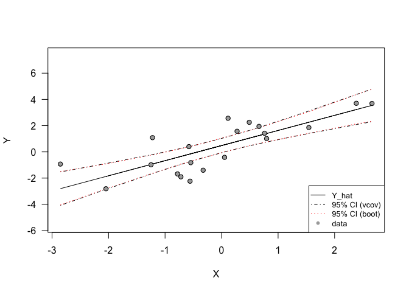
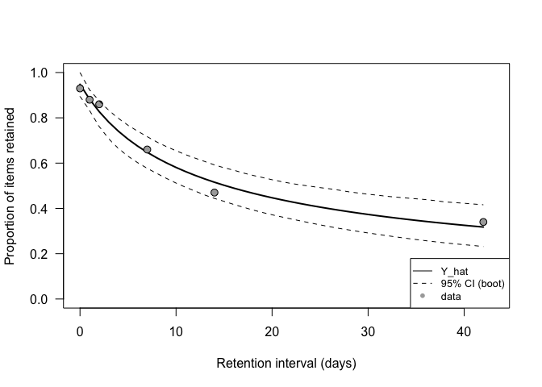

-   [Linear regression example](#linear-regression-example)
    -   [Generate data based on a linear
        model](#generate-data-based-on-a-linear-model)
        -   [Extract confidence intervals of the model based on var-cov
            matrix](#extract-confidence-intervals-of-the-model-based-on-var-cov-matrix)
        -   [Plot the generated model](#plot-the-generated-model)
        -   [Estimate model parameters with optimization based on
            Nelder-Mead](#estimate-model-parameters-with-optimization-based-on-nelder-mead)
        -   [Extract confidence intervals of the model using
            bootstrap](#extract-confidence-intervals-of-the-model-using-bootstrap)
        -   [Compare var-cov matrix](#compare-var-cov-matrix)
        -   [Plot the bootstrapped CI](#plot-the-bootstrapped-ci)
-   [Forgetting example (Carpenter et
    al., 2008)](#forgetting-example-carpenter-et-al.-2008)
    -   [Recover the paramaters using
        optimization](#recover-the-paramaters-using-optimization)
        -   [Extract confidence intervals using
            bootstrap](#extract-confidence-intervals-using-bootstrap)
        -   [Plot the data, model fit, and its confidence
            interval](#plot-the-data-model-fit-and-its-confidence-interval)

> This material is based on Chapter 3 of *Computational modeling of
> cognition and behaviour* by Farrell and Lewandowsky.

# Linear regression example

    rmsd <- function(p, data) {
      pred <- p['b0'] + p['b1']*data['x']
      rmsd <- sqrt(sum((data['y'] - pred)^2) / length(pred))
      return(rmsd)
    }

## Generate data based on a linear model

    library(MASS)

    set.seed(8675309)

    # specify a variance-covariance matrix
    rho         <- .6
    std1        <- sqrt(2)
    std2        <- sqrt(4)
    Sigma       <- matrix(NA, ncol = 2, nrow = 2)
    diag(Sigma) <- c(std1^2, std2^2)
    Sigma[1,2]  <- rho*std1*std2
    Sigma[2,1]  <- Sigma[1,2]
      
    # simulate data
    n           <- 20
    dat         <- mvrnorm(n = n, mu = c(0, 0), Sigma = Sigma)
    dat         <- as.data.frame(x = dat)
    names(dat)  <- c('x', 'y')

    # run lm
    mdl         <- lm(y ~ x, data = dat)

    # print estimated parameters
    print(coef(mdl))

    ## (Intercept)           x 
    ##   0.4813737   1.1514800

    sigma_hat   <- sigma(mdl)
    betas       <- matrix(c(coef(mdl)[[1]], coef(mdl)[[2]]), nrow = 2, ncol = 1)
    X           <- matrix(1, nrow = dim(dat)[1], ncol = 2)
    X[ ,2]      <- dat$x
    Y           <- dat$y
    y_hat       <- X%*%betas

### Extract confidence intervals of the model based on var-cov matrix

    # extract var-cov matrix of the model
    vcovmat <- vcov(mdl)

    # variance of the model at x*
    y_var   <- matrix(NA, nrow = dim(X)[1], ncol = 1)
    for (i in 1:dim(X)[1]) {
      x_star      <- as.matrix(X[i, ])
      y_var[i, ]  <- t(x_star)%*%vcovmat%*%x_star
    }

    CI_lower <- y_hat-1.96*sqrt(y_var)
    CI_upper <- y_hat+1.96*sqrt(y_var)

    # compare with package function
    CIPRED   <- predict(mdl, interval='confidence')

### Plot the generated model

    plot(x=1,
         y=1, 
         xlim=range(dat['x']),
         ylim=range(dat['y'])*2,
         xlab='X',
         ylab="Y",
         las=1,
         type='n')

    # model fit
    lines(dat$x, y_hat)
    # var-cov CI
    sorting <- sort(dat$x, index.return=TRUE)

    lines(x = sorting$x, y = CI_lower[sorting$ix], lty = 2)
    lines(x = sorting$x, y = CI_upper[sorting$ix], lty = 2)
    # package CI
    points(sorting$x, CIPRED[sorting$ix, 2], cex=0.8, pch=21, bg='black')
    points(sorting$x, CIPRED[sorting$ix, 3], cex=0.8, pch=21, bg='black')

    # data
    points(dat$x, dat$y, pch=21, bg="dark grey")

    legend('bottomright', 
           legend=c("Y_hat", "95% CI (vcov)", '95% CI (package)', 'data'),
           col=c("black", "black", "black", NA), 
           lty=c(1, 2, NA, NA),
           pch=c(NA, NA, 21, 21),
           pt.bg=c(NA, NA, "black", "dark grey"),
           cex=0.8)

### Estimate model parameters with optimization based on Nelder-Mead

    # estimate parameters
    sPar        <- c(-1, .2)
    names(sPar) <- c('b1', 'b0')
    sim_lm      <- optim(par = sPar, fn = rmsd, data = dat)

    # print estimated parameters 
    print(rev(sim_lm$par))

    ##        b0        b1 
    ## 0.4814316 1.1513528

    betas_sim   <- matrix(c(sim_lm$par[[2]], sim_lm$par[[1]]), nrow = 2, ncol = 1)
    y_hat_sim   <- X%*%betas_sim
    RSS         <- sum((Y - y_hat_sim)^2)
    sigma_sim   <- sqrt(RSS / (length(Y) - 2))

    # print correlation of the two predictions
    cor(y_hat, y_hat_sim)

    ##      [,1]
    ## [1,]    1

### Extract confidence intervals of the model using bootstrap

    # number of bootstraps
    nboot     <- 1000
    # bootstrapped parameters
    pboot     <- matrix(NA, nrow = nboot, ncol = 2)
    # run bootstrap
    for (i in 1:nboot){
      rdat <- vapply(X = y_hat_sim, 
                     FUN = function(x) rnorm(n = 1, mean = x, sd = sigma_sim), 
                     FUN.VALUE = numeric(1))
      
      tdat           <- as.data.frame(cbind(X[ ,2], rdat))
      colnames(tdat) <- c('x', 'y')
      tpar           <- as.vector(betas_sim)
      names(tpar)    <- c('b0', 'b1')
      optout         <- optim(par = tpar, fn = rmsd, data = tdat)
      pboot[i, ]     <- optout$par
    }

    # get bootstrapped fits
    yboot <- X%*%t(pboot)

    # get 95% CI
    yboot_lq <- apply(X = yboot, MARGIN = 1, FUN = quantile, probs = 0.025)
    yboot_uq <- apply(X = yboot, MARGIN = 1, FUN = quantile, probs = 0.975)

### Compare var-cov matrix

Variance-covariance matrix of the parameters from the linear model:

    print(vcovmat)

    ##             (Intercept)          x
    ## (Intercept)  0.07686426 0.00252144
    ## x            0.00252144 0.04433243

Variance-covariance matrix from the bootstrap parameters:

    print(var(pboot))

    ##            [,1]       [,2]
    ## [1,] 0.07687892 0.00184100
    ## [2,] 0.00184100 0.04317143

### Plot the bootstrapped CI

    plot(x=1,
         y=1, 
         xlim=range(dat['x']),
         ylim=range(dat['y'])*2,
         xlab='X',
         ylab="Y",
         las=1,
         type='n')

    # model fit
    lines(dat$x, y_hat)
    # var-cov CI
    sorting <- sort(dat$x, index.return=TRUE)

    lines(x = sorting$x, y = CI_lower[sorting$ix], lty = 4)
    lines(x = sorting$x, y = CI_upper[sorting$ix], lty = 4)

    lines(x = sorting$x, y = yboot_lq[sorting$ix], lty = 3, col='red')
    lines(x = sorting$x, y = yboot_uq[sorting$ix], lty = 3, col='red')

    # data
    points(dat$x, dat$y, pch=21, bg="dark grey")

    legend('bottomright', 
           legend=c("Y_hat", "95% CI (vcov)", '95% CI (boot)', 'data'),
           col=c("black", "black", "red", NA), 
           lty=c(1, 4, 3, NA),
           pch=c(NA, NA, NA, 21),
           pt.bg=c(NA, NA, NA, "dark grey"),
           cex=0.8)

# Forgetting example (Carpenter et al., 2008)

Power function of forgetting (Carpenter et al., 2008):

*p* = *a*(*b**t* + 1) − *c*

where *p* is the predicted probability of recall, *t* is the time since
study, and *a*, *b*, *c* (forgetting rate) are the three parameters of
the function.

    power_rmsd <- function(p, y, x){
      
      # if any of the parameter value is unreasonable, return a very large number
      if (any(p<0) || any(p>1))
        return(1e6)
      else
        pred <- p['a']*(p['b']*x + 1)^(-p['c'])
        rmsd <- sqrt(sum((y - pred)^2) / length(pred))
        return(rmsd)
    }

## Recover the paramaters using optimization

    # observed data (proportion of items retained)
    y <- c(.93, .88, .86, .66, .47, .34)
    # retention interval (days)
    x <- c(.0035, 1, 2, 7, 14, 42)

    # starting values
    sPar        <- c(1, .05, .7)
    names(sPar) <- c('a', 'b', 'c')
    pout        <- optim(par = sPar, fn = power_rmsd, y = y, x = x)
    print(pout$par)

    ##         a         b         c 
    ## 0.9480230 0.1320698 0.5817508

### Extract confidence intervals using bootstrap

    # number of participants
    n         <- 55
    # number of bootstraps
    nboot     <- 1000
    # bootstrapped parameters
    pboot     <- matrix(NA, nrow = nboot, ncol = 3)
    # model predictions
    mpar      <- pout$par
    mpred     <- mpar['a']*(mpar['b']*x + 1)^(-mpar['c'])
    # run bootstrap
    for (i in 1:nboot){
      rdat <- vapply(X = mpred, FUN = function(x) mean(rbinom(n = n, size = 1, prob = x)), 
                     FUN.VALUE = numeric(1))
      optout <- optim(par = mpar, fn = power_rmsd, y = rdat, x = x)
      pboot[i, ] <- optout$par
    }
    # get 95% CI
    pboot_lq <- apply(X = pboot, MARGIN = 2, FUN = quantile, probs = 0.025)
    pboot_uq <- apply(X = pboot, MARGIN = 2, FUN = quantile, probs = 0.975)

### Plot the data, model fit, and its confidence interval

    plot(x=1,
         y=1, 
         xlim=c(0, 43),
         ylim=c(0,1),
         xlab='Retention interval (days)',
         ylab="Proportion of items retained",
         las=1,
         type='n')

    newx <- 0:42
    newy <- mpar['a']*(mpar['b']*newx + 1)^(-mpar['c'])
    lines(x = newx, y = newy, lwd = 2)
    points(x, y, pch=21, bg = "dark grey", cex = 1.2)

    yboot <- matrix(NA, nrow = 1000, ncol = length(newx))
    for (i in 1:1000) {
      yboot[i,] <- pboot[i,1]*(pboot[i,2]*newx + 1)^(-pboot[i,3])
    }
    # get 95% CI
    yboot_lq <- apply(X = yboot, MARGIN = 2, FUN = quantile, probs = 0.025)
    yboot_uq <- apply(X = yboot, MARGIN = 2, FUN = quantile, probs = 0.975)

    lines(x = newx, y = yboot_lq, lty = 2)
    lines(x = newx, y = yboot_uq, lty = 2)

    legend('bottomright', 
           legend=c("Y_hat", '95% CI (boot)', 'data'),
           col=c("black", "black", NA), 
           lty=c(1, 2, NA),
           pch=c(NA, NA, 21),
           pt.bg=c(NA, NA, "dark grey"),
           cex=0.8)

